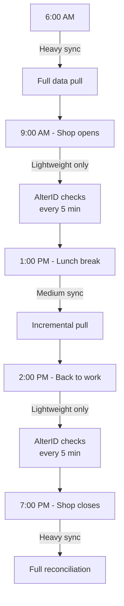
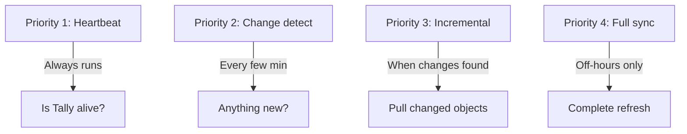

Your connector isn't the only one trying to talk to Tally. There's a billing clerk, maybe an accountant, possibly the owner checking reports. How do you share?

The answer depends entirely on whether the stockist has Silver or Gold licensing. (If you haven't read it yet, check out [Gold vs Silver](/tally-integartion/setup-operations/gold-vs-silver/) first.)

## Silver License: Taking Turns

On Silver, there's one seat at the table. Either the operator uses Tally, or your connector does. Not both.

### The Scheduling Dance

Here's a pattern that works well in practice:



### What "Lightweight" Means

During business hours, your connector should only run requests that complete in milliseconds:

**Safe during business hours:**
```xml
<!-- AlterID check: ~100ms -->
<TYPE>Function</TYPE>
<ID>$$MaxMasterAlterID</ID>
```

```xml
<!-- Heartbeat: ~50ms -->
<TYPE>Function</TYPE>
<ID>$$CmpLoaded</ID>
```

**Not safe during business hours:**
```xml
<!-- Full stock item export: 10-60s -->
<TYPE>Collection</TYPE>
<ID>StockItem</ID>
<!-- This will freeze the operator out -->
```

### The "Sync Now" Button

Give the operator control. Add a button in your sales app:

```
[Sync Now]
"Tap when you step away from Tally"
```

When the operator taps it, your connector does a quick burst of sync -- pull recent changes, push pending orders -- and finishes in 30-60 seconds. The operator sees a progress bar and knows when it's safe to go back to Tally.

:::tip
The "Sync Now" pattern is wildly popular with stockists. They feel in control instead of fighting an invisible background process for access to their own computer.
:::

### Timeout Strategy for Silver

```go
// Business hours: aggressive timeout
client := &http.Client{
    Timeout: 5 * time.Second,
}

// Off-hours: generous timeout
client := &http.Client{
    Timeout: 120 * time.Second,
}
```

If a request doesn't complete in 5 seconds during business hours, abort it. The operator's productivity matters more than your sync schedule.

## Gold License: Working in Parallel

Gold allows concurrent access, so your connector can hum along in the background. But "concurrent" doesn't mean "unlimited."

### Be a Good Neighbor

Even on Gold, large requests consume Tally's resources and slow things down for everyone:

| Connector Behavior | Operator Impact |
|---|---|
| Small, frequent requests | Barely noticeable |
| Medium requests every few minutes | Slight lag |
| One massive request | UI freezes for everyone |

### Recommended Gold Strategy

```
- Heartbeat every 60s
- AlterID check every 2 min
- Incremental pull when changes detected
- Batch size: max 2,000 objects
- Full reconciliation: weekly, off-hours
```

## Request Priority System

Your connector should have a priority queue:



Higher priority requests preempt lower ones. If you're mid-full-sync and business hours start, pause the sync and switch to lightweight mode.

## Detecting Operator Activity

You can infer whether the operator is active:

- **AlterID changing rapidly** -- someone is entering data right now
- **AlterID stable for 10+ minutes** -- operator might be idle or away
- **Company switches** -- operator is actively navigating

When AlterID is stable, it's a good time for slightly heavier operations. When it's changing rapidly, stick to heartbeats only.

## The Worst Case: Deadlock

On Silver, your connector can accidentally lock out the operator:

1. Connector sends a large request
2. Tally starts processing
3. Operator tries to enter data
4. Tally is busy -- operator waits
5. Operator gets frustrated, force-closes Tally
6. Connector loses connection

:::danger
Never let your connector hold a Silver-licensed Tally for more than 10 seconds during business hours. Set hard timeouts and abort gracefully.
:::

## Configuration Template

Your connector should expose these settings:

```yaml
sync:
  business_hours:
    start: "09:00"
    end: "19:00"
    max_request_timeout: 5s
    poll_interval: 5m
    allowed_operations:
      - heartbeat
      - alterid_check
  off_hours:
    max_request_timeout: 120s
    poll_interval: 1m
    allowed_operations:
      - heartbeat
      - alterid_check
      - incremental_pull
      - full_sync
      - reconciliation
```

Let the stockist customize business hours. A pharma shop that closes at 10pm has a different schedule than one that closes at 7pm.
