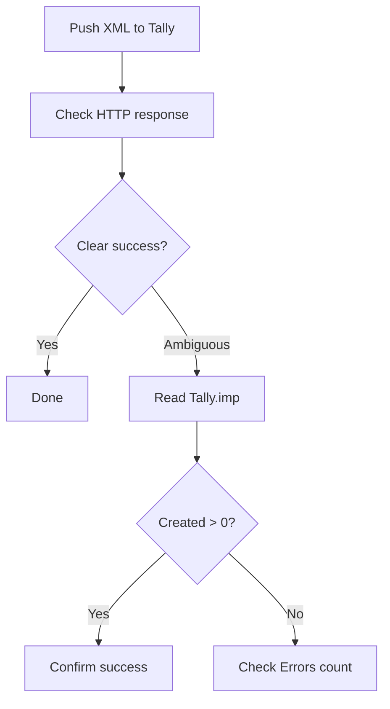

Tally ships with some genuinely useful developer tools that most people never discover. They're buried in menus, but once you find them, they'll save you hours of trial-and-error debugging.

## Tally Connector Tool

TallyPrime Developer includes a built-in tool for testing XML requests interactively. Think of it as Postman, but specifically for Tally.

### How to Access It

1. Open TallyPrime
2. Press **Ctrl+Alt+T** (or navigate via **Help > TDL & Add-on**)
3. Look for **Tally Connector** in the developer tools menu

### What It Does

- Lets you type or paste an XML request
- Sends it to Tally's internal engine (no HTTP needed)
- Shows the XML response immediately
- Highlights errors in your request

:::tip
Use the Tally Connector tool to prototype your XML requests before writing any connector code. It's much faster than the curl-test-fix-repeat cycle.
:::

## Convert to XML TDL

This utility converts Tally's internal data structures to XML format. It's useful for understanding what XML tags correspond to which Tally concepts.

### How to Use It

1. Navigate to any report in Tally (e.g., Stock Summary, Day Book)
2. Press **Ctrl+Alt+X** to trigger XML export
3. Tally generates the XML representation of the current view
4. Check the Export Path (configured in `tally.ini`) for the output file

The exported XML shows you the exact structure Tally uses, including all the tag names, nesting, and attributes. This is your Rosetta Stone for building XML requests.

## Convert to JSON TDL (TallyPrime 7.0+)

TallyPrime 7.0 and later support native JSON import/export. The conversion utility works the same way as XML:

1. Navigate to a report
2. Use the JSON export option
3. Compare the JSON structure with the XML equivalent

:::caution
JSON support is **only available in TallyPrime 7.0+**. Tally.ERP 9 and older TallyPrime versions are XML-only. Your connector should detect the version and use the appropriate format.
:::

## tallyhttp.log: Your Best Debugging Friend

This is the killer feature for debugging connector issues. When enabled, Tally logs every HTTP request and response to a file.

### Enabling HTTP Logging

**Method 1: Via tally.ini**

Add this to your `tally.ini`:

```ini
[Tally]
Log HTTP = Yes
```

Restart Tally. The log file appears in the Tally installation directory as `tallyhttp.log`.

**Method 2: Via Tally GUI**

1. Press **F1** (Help)
2. Go to **Settings** > **Advanced**
3. Enable **Log HTTP Requests**

### What the Log Contains

```
[2026-03-26 14:30:15] REQUEST:
POST / HTTP/1.1
Content-Type: text/xml
Content-Length: 245

<ENVELOPE>
  <HEADER>
    <TALLYREQUEST>Export</TALLYREQUEST>
    ...
  </HEADER>
</ENVELOPE>

[2026-03-26 14:30:15] RESPONSE:
HTTP/1.1 200 OK
Content-Type: text/xml

<ENVELOPE>
  <BODY>
    <DATA>...</DATA>
  </BODY>
</ENVELOPE>
```

Every request and response, with timestamps. This tells you:

- Exactly what your connector sent
- Exactly what Tally returned
- How long each request took
- Where things went wrong

:::tip
When debugging a failed import, the `tallyhttp.log` is the single best source of truth. It shows you the raw XML Tally received, which might be different from what your connector thought it sent (encoding issues, truncation, etc.).
:::

### Log File Management

The log grows fast with active connector traffic. A few things to keep in mind:

| Concern | Solution |
|---|---|
| File grows large | Rotate or truncate periodically |
| Performance impact | Disable in production |
| Sensitive data | Log contains all financial data |

Disable HTTP logging in production once your connector is stable. Keep it enabled during development and troubleshooting.

## Tally.imp: Import Result Log

Every XML import operation writes results to `Tally.imp` in the installation directory:

```
Created: 1
Altered: 0
Combined: 0
Cancelled: 0
Deleted: 0
Ignored: 0
Errors: 0
Last Voucher ID: 12345
```

Your connector can parse this file as a secondary confirmation after a push, especially when the HTTP response is ambiguous.



## Debugging Workflow

When something goes wrong, follow this order:

1. **Check `tallyhttp.log`** -- What did Tally actually receive and return?
2. **Check `Tally.imp`** -- Did the import succeed or fail?
3. **Use Tally Connector tool** -- Test the same XML interactively
4. **Check the Tally UI** -- Any error messages on screen?
5. **Check Windows Event Log** -- Tally crashes sometimes log here

## Useful Keyboard Shortcuts

| Shortcut | What It Does |
|---|---|
| Ctrl+Alt+T | Open TDL/Developer tools |
| Ctrl+Alt+X | Export current view as XML |
| Ctrl+Alt+I | Show system info |
| Ctrl+Alt+R | Recompile TDL |

## The TDL Management Report

You can query Tally via XML for a list of all loaded TDLs:

```xml
<ENVELOPE>
  <HEADER>
    <VERSION>1</VERSION>
    <TALLYREQUEST>Export</TALLYREQUEST>
    <TYPE>Data</TYPE>
    <ID>TDL Management</ID>
  </HEADER>
  <BODY><DESC>
    <STATICVARIABLES>
      <SVEXPORTFORMAT>
        $$SysName:XML
      </SVEXPORTFORMAT>
    </STATICVARIABLES>
  </DESC></BODY>
</ENVELOPE>
```

This returns every TDL/TCP file loaded in the current session, including built-in ones, user-configured ones, and account-level TDLs. Very handy for understanding what customizations are active.
