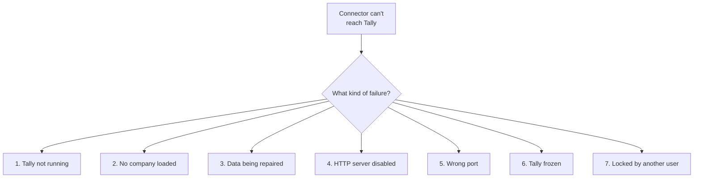
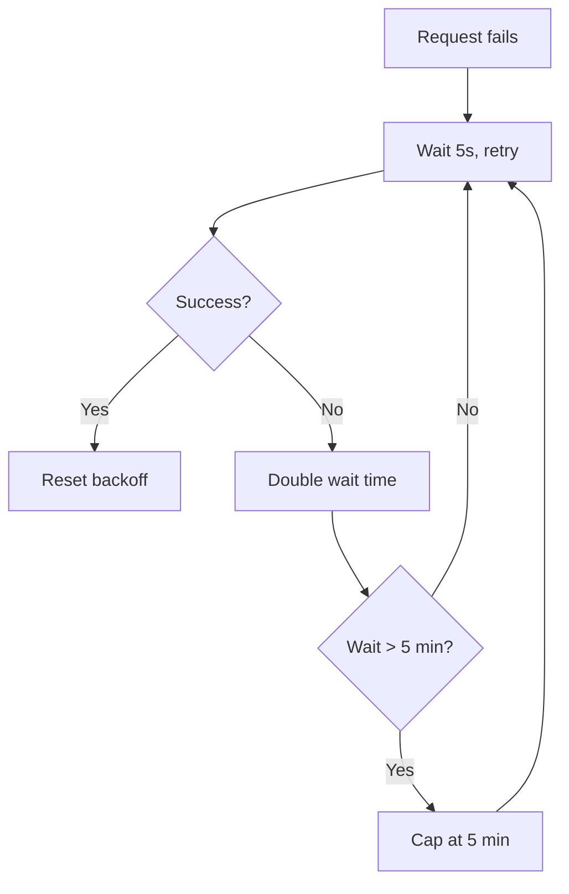
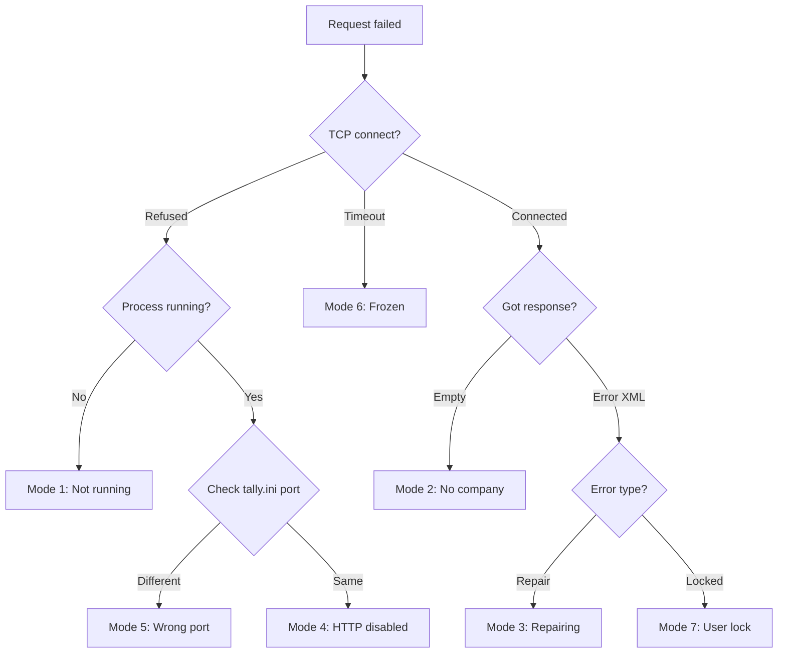

Tally will go down. Not "if" -- "when." Your connector's job is to handle every flavor of downtime gracefully, keep working from its local cache, and recover automatically when Tally comes back.

## The Seven Failure Modes



Let's walk through each one.

---

### 1. Tally Not Running

**Detection**: TCP connection refused on the configured port.

```
curl: (7) Failed to connect to
  localhost port 9000: Connection refused
```

**Common causes**:
- Operator closed Tally for the day
- Machine rebooted (power outage, Windows update)
- Tally crashed

**Recovery**: Retry with exponential backoff. There's nothing your connector can do to start Tally -- it requires a human.

---

### 2. No Company Loaded

**Detection**: TCP connects, but the response to `$$CmpLoaded` returns empty or the `List of Companies` shows zero entries.

**Common causes**:
- Operator is at the Gateway/company selection screen
- Company was just closed
- Tally is starting up and hasn't loaded data yet

**Recovery**: Poll every 30 seconds with the lightweight heartbeat. The operator will load a company soon.

---

### 3. Data Being Repaired

**Detection**: Tally responds but returns errors for data requests. The operator is running **Gateway > Data > Repair**.

**Common causes**:
- CA detected data corruption
- Tally recommended repair after a crash
- Routine maintenance

:::caution
After a data repair, **AlterIDs may reset**. If your stored watermark is higher than Tally's current max AlterID, trigger a full re-sync.
:::

**Recovery**: Wait for the repair to complete (can take 5-30 minutes for large companies). Monitor the heartbeat.

---

### 4. HTTP Server Disabled

**Detection**: TCP connection refused, but you know Tally is running (you can see the window or the process is active).

**Common causes**:
- Someone turned off the HTTP server in settings
- Tally was updated and settings reset
- A CA "secured" the installation by disabling connectivity

**Recovery**: This requires human intervention. Alert the stockist or IT support to re-enable the HTTP server.

---

### 5. Wrong Port

**Detection**: Connection refused on the expected port, but Tally might be listening elsewhere.

**Common causes**:
- Port changed during a Tally update
- IT team changed it to resolve a conflict
- Multiple Tally instances on different ports

**Recovery**: Try scanning ports 9000-9010. Parse `tally.ini` for the actual configured port. Alert if the port changed.

---

### 6. Tally Frozen

**Detection**: TCP connects, but the request hangs indefinitely with no response. Or response takes >5 minutes.

**Common causes**:
- A previous large export is still processing
- Data corruption causing infinite loop
- Tally ran out of memory
- Another application locked Tally's data files

**Recovery**: Wait up to 5 minutes. If still no response, log an alert. The operator may need to force-close and restart Tally.

:::danger
A frozen Tally can't be fixed remotely. Don't keep sending requests -- each one piles onto the backlog and makes things worse.
:::

---

### 7. Locked by Another User (Silver)

**Detection**: TCP connects, but requests return errors or hang. On Silver license, Tally can only serve one connection at a time.

**Common causes**:
- Operator is actively using Tally
- Another connector instance is running
- Backup software is accessing Tally files

**Recovery**: Back off immediately. Try again in 30-60 seconds with a lightweight request.

---

## The Retry Strategy

Use exponential backoff with a cap:

```
Attempt 1: Wait 5 seconds
Attempt 2: Wait 10 seconds
Attempt 3: Wait 20 seconds
Attempt 4: Wait 40 seconds
Attempt 5: Wait 80 seconds
Attempt 6+: Wait 300 seconds (5 min cap)
```



### Reset Conditions

Reset the backoff timer when:
- A request succeeds
- The failure mode changes (e.g., from "frozen" to "not running")
- The operator manually triggers a sync

## Alert Thresholds

| Duration | Action |
|---|---|
| < 5 min | Silent retry |
| 5-30 min | Log warning |
| > 30 min | Send alert to monitoring |
| > 2 hours | Escalate to support team |

:::tip
Don't alarm the stockist for brief interruptions. Tally going down for 5 minutes while someone restarts it is completely normal. Only alert when it's been unreachable for 30+ minutes.
:::

## Graceful Degradation

When Tally is down, your connector should still work -- just from its local cache.

### What Still Works
- Serving cached master data (stock items, ledgers)
- Serving cached stock positions (as of last sync)
- Queuing new orders locally for later push
- Displaying "last synced at" timestamp

### What Doesn't Work
- Real-time stock positions
- Pushing orders to Tally
- Pulling new transactions
- AlterID change detection

### Cache Freshness Indicator

Show users how stale the data is:

```
Stock data last synced: 2 hours ago
  ⚠ Tally is currently unreachable
  Orders will be queued and pushed
  when connection resumes.
```

## Detection Flowchart

When a request fails, walk through this diagnostic:



## The Recovery Burst

When Tally comes back online after downtime, don't slam it with a full sync immediately. Use a graduated recovery:

1. **Heartbeat** -- confirm it's really back
2. **AlterID check** -- how much changed?
3. **Small incremental pull** -- catch up gently
4. **Normal operations resume**

If the AlterID watermark shows a massive gap (or went backwards), schedule a full re-sync for off-hours rather than doing it right now.
