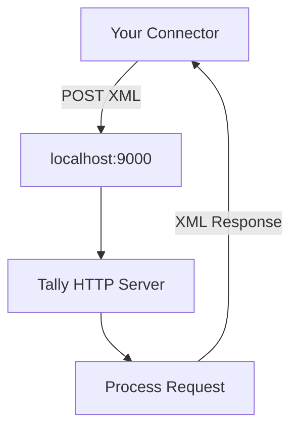

Before your connector can exchange a single byte with Tally, you need to flip a switch inside the application. Tally ships with an HTTP server built in -- it's just turned off by default.

Let's fix that.

## The Quick Version (TallyPrime)

1. Open **TallyPrime**
2. Press **F1** (Help menu)
3. Navigate to **Settings**
4. Select **Connectivity**
5. Go to **Client/Server Configuration**
6. Set **Enable HTTP Server** to **Yes**
7. Set the **Port** (default is `9000`)
8. Press **Ctrl+A** to save
9. **Restart Tally** for changes to take effect

```
F1 > Settings > Connectivity
  > Client/Server Configuration
    > Enable HTTP Server: Yes
    > Port: 9000
```

:::tip
The port must be between **9000 and 9999**. If you're unsure, stick with the default `9000` -- you can always change it later.
:::

## Older Versions (Tally.ERP 9)

If you're working with Tally.ERP 9, the path is slightly different:

1. Press **F12** (Configuration)
2. Select **Advanced Configuration**
3. Set **Enable ODBC Server** to **Yes**
4. Set the **Port** to `9000`
5. Save and **restart Tally**

```
F12 > Advanced Configuration
  > Enable ODBC Server: Yes
  > Port: 9000
```

## What Happens Under the Hood

Once enabled, Tally spins up a lightweight HTTP listener on the configured port. It accepts POST requests with XML payloads and responds with XML (or JSON on TallyPrime 7.0+).



## The Restart Requirement

:::caution
Tally does **not** hot-reload this setting. You must close and reopen Tally after enabling the HTTP server. If you skip the restart, your connector will get "connection refused" errors and you'll spend 30 minutes debugging something that isn't broken.
:::

## Verifying It Worked

After restarting, open a browser and navigate to:

```
http://localhost:9000
```

You should see a blank page or a basic Tally response -- not a "connection refused" error. If something else is already running on port 9000, check the [Port Conflicts](/tally-integartion/setup-operations/port-conflicts/) guide.

## Setting the Port via tally.ini

You can also configure the port directly in the `tally.ini` file without touching the GUI:

```ini
[Tally]
Port = 9000
```

This is useful for scripted deployments. See the [tally.ini Configuration](/tally-integartion/setup-operations/tally-ini-config/) guide for details.

## Quick Reference

| Setting | Value | Notes |
|---|---|---|
| HTTP Server | `Yes` | Must be enabled |
| Port | `9000` | Range: 9000-9999 |
| Restart required | Yes | Always |
