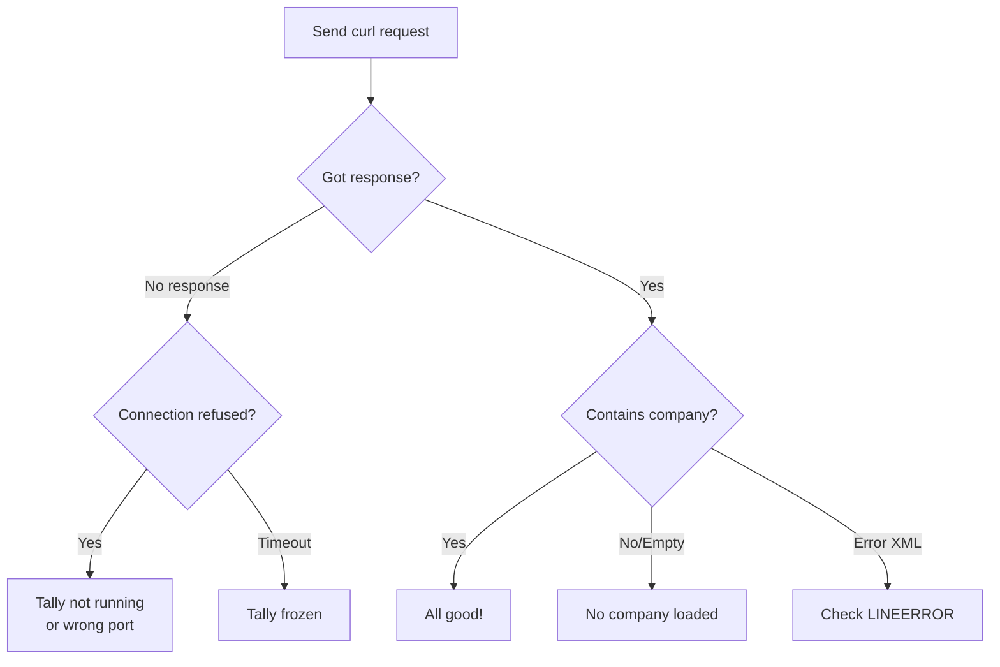

You've enabled the HTTP server. Tally is running. A company is loaded. Now let's make sure your connector can actually talk to it.

## The Simplest Possible Test

Open a terminal and paste this:

```bash
curl -s http://localhost:9000 \
  -d '<ENVELOPE>
  <HEADER>
    <VERSION>1</VERSION>
    <TALLYREQUEST>Export</TALLYREQUEST>
    <TYPE>Data</TYPE>
    <ID>List of Companies</ID>
  </HEADER>
  <BODY><DESC>
    <STATICVARIABLES>
      <SVEXPORTFORMAT>
        $$SysName:XML
      </SVEXPORTFORMAT>
    </STATICVARIABLES>
  </DESC></BODY>
</ENVELOPE>'
```

## What Success Looks Like

If everything works, you'll get an XML response listing the loaded companies:

```xml
<ENVELOPE>
  <BODY>
    <DATA>
      <COLLECTION>
        <COMPANY>
          <NAME>My Pharma Company</NAME>
        </COMPANY>
      </COLLECTION>
    </DATA>
  </BODY>
</ENVELOPE>
```

You should see at least one `<COMPANY>` entry. If you see your company name -- congratulations, you're connected!

:::tip
Save this curl command somewhere handy. It's the fastest way to check if Tally is alive and responding during development.
:::

## Common Failure Scenarios

### Connection Refused

```
curl: (7) Failed to connect to
  localhost port 9000: Connection refused
```

**What it means**: Nothing is listening on port 9000.

**Fix checklist**:
- Is Tally actually running?
- Did you restart Tally after enabling HTTP?
- Is the port set to 9000 (not something else)?
- Is another app hogging port 9000?

### Empty Response

```
curl: (52) Empty reply from server
```

**What it means**: Tally is listening but couldn't process your request.

**Fix checklist**:
- Is a company loaded in Tally?
- Is the operator at the company selection screen?
- Is Tally mid-operation (data repair, etc.)?

### Timeout

```
curl: (28) Operation timed out
```

**What it means**: Tally received the request but is taking forever to respond.

**Fix checklist**:
- Is Tally frozen? (Check the UI)
- Is a large report or operation running?
- Try a lighter request first

### Malformed XML Response

If you get XML back but it looks garbled or contains an error message, Tally is running but unhappy about something. Look for `<LINEERROR>` tags in the response -- they tell you what went wrong.

## A More Detailed Test: Heartbeat

This lightweight request confirms Tally is alive and tells you which company is loaded:

```bash
curl -s http://localhost:9000 \
  -d '<ENVELOPE>
  <HEADER>
    <VERSION>1</VERSION>
    <TALLYREQUEST>Export</TALLYREQUEST>
    <TYPE>Function</TYPE>
    <ID>$$CmpLoaded</ID>
  </HEADER>
  <BODY><DESC>
    <STATICVARIABLES>
      <SVEXPORTFORMAT>
        $$SysName:XML
      </SVEXPORTFORMAT>
    </STATICVARIABLES>
  </DESC></BODY>
</ENVELOPE>'
```

This returns just the company name -- tiny payload, near-instant response. It's perfect for health checks.

## Testing from Code

Here's the same request in a few languages:

**Python**:
```python
import requests
xml = '''<ENVELOPE><HEADER>
  <VERSION>1</VERSION>
  <TALLYREQUEST>Export</TALLYREQUEST>
  <TYPE>Data</TYPE>
  <ID>List of Companies</ID>
</HEADER><BODY><DESC>
  <STATICVARIABLES>
    <SVEXPORTFORMAT>
      $$SysName:XML
    </SVEXPORTFORMAT>
  </STATICVARIABLES>
</DESC></BODY></ENVELOPE>'''

r = requests.post(
    'http://localhost:9000',
    data=xml,
    headers={
        'Content-Type':
        'text/xml; charset=UTF-8'
    }
)
print(r.text)
```

**Go**:
```go
resp, err := http.Post(
    "http://localhost:9000",
    "text/xml; charset=UTF-8",
    strings.NewReader(xml),
)
```

## Decision Flowchart



## Next Steps

Now that you've confirmed connectivity, head over to [Company Loading](/tally-integartion/setup-operations/company-loading/) to understand how Tally manages loaded companies, or jump to [Developer Tools](/tally-integartion/setup-operations/developer-tools/) to explore Tally's built-in debugging utilities.
