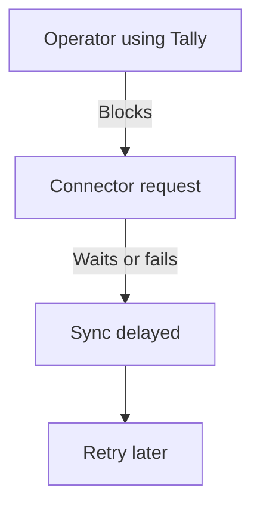
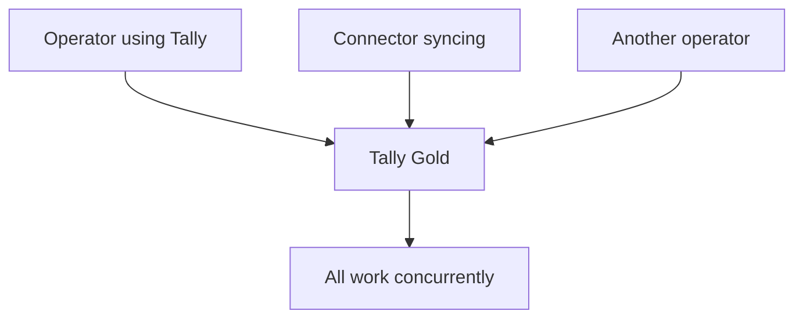

Tally comes in two flavors, and which one your stockist has will fundamentally shape how your connector behaves.

## The Two Licenses

| | Tally Silver | Tally Gold |
|---|---|---|
| Users | Single user | Multi-user |
| Price | Lower | Higher |
| Concurrent access | No | Yes |
| Connector impact | High | Low |

## Silver: Your Connector Competes with the Operator

With Tally Silver, only **one connection** can access Tally at a time. When the billing clerk is entering invoices, your connector's HTTP requests may fail, queue, or block the operator.

This is the big one. Most pharma stockists start with Silver because it's cheaper, and they don't think they need multi-user until someone tries to run a connector alongside their daily operations.



:::caution
On Silver, a long-running export request from your connector will **freeze the operator out** of Tally. And vice versa -- if the operator is running a large report, your connector's request will hang until they're done.
:::

### Practical Strategies for Silver

**Schedule heavy sync during off-hours:**
- Full data sync at night or during lunch
- Stock summary reconciliation on weekends
- Master data refresh early morning before the shop opens

**Keep business-hours requests lightweight:**
- Only check AlterID for changes (milliseconds)
- Don't pull large collections during the day
- Quick heartbeat checks, not full exports

**The "Sync Now" button pattern:**
Give the operator a button in your sales app that triggers sync when they step away from Tally. They know when they're idle -- let them tell you.

**Aggressive timeouts:**
Set short HTTP timeouts (5-10 seconds) during business hours. If the request doesn't complete fast, back off and try later. Never hold the connection.

## Gold: Concurrent Access, Happy Days

With Tally Gold, multiple users (and your connector) can access the data simultaneously. The operator enters invoices while your connector syncs in the background. Everyone's happy.



Gold doesn't mean unlimited though. Very large exports can still slow things down for everyone. Be a good citizen -- batch your requests even on Gold.

## Cost Considerations for Stockists

This is a real conversation you'll have with your deployment targets:

| Factor | Silver | Gold |
|---|---|---|
| Annual cost | ~18,000 INR | ~54,000 INR |
| Connector sync | Off-hours only | Anytime |
| Operator impact | Gets blocked | Minimal |
| Recommended for | Small shops | Active distributors |

:::tip
If a stockist processes more than 50 invoices per day, Gold pays for itself in operator productivity alone. The connector access is a bonus.
:::

## Detecting the License Type

You can detect Silver vs Gold through the company list response or the about/license information. The XML API response from a `List of Companies` request includes version details that hint at the license type.

Alternatively, just ask the stockist. They always know.

## The Upgrade Conversation

When deploying to a Silver-licensed stockist, you have two options:

1. **Work within the constraints** -- schedule carefully, keep requests tiny during business hours
2. **Recommend the Gold upgrade** -- frame it as an investment in automation

Most stockists choose option 1 initially and upgrade to Gold after they experience the value of real-time sync and realize the scheduling dance is annoying.

## Summary

```
Silver = Be polite, take turns, schedule wisely
Gold   = Work alongside everyone, sync freely
```

Your connector should detect the license type on first connection and adjust its sync behavior automatically. Heavy operations get scheduled for off-hours on Silver; real-time incremental sync is fine on Gold.
