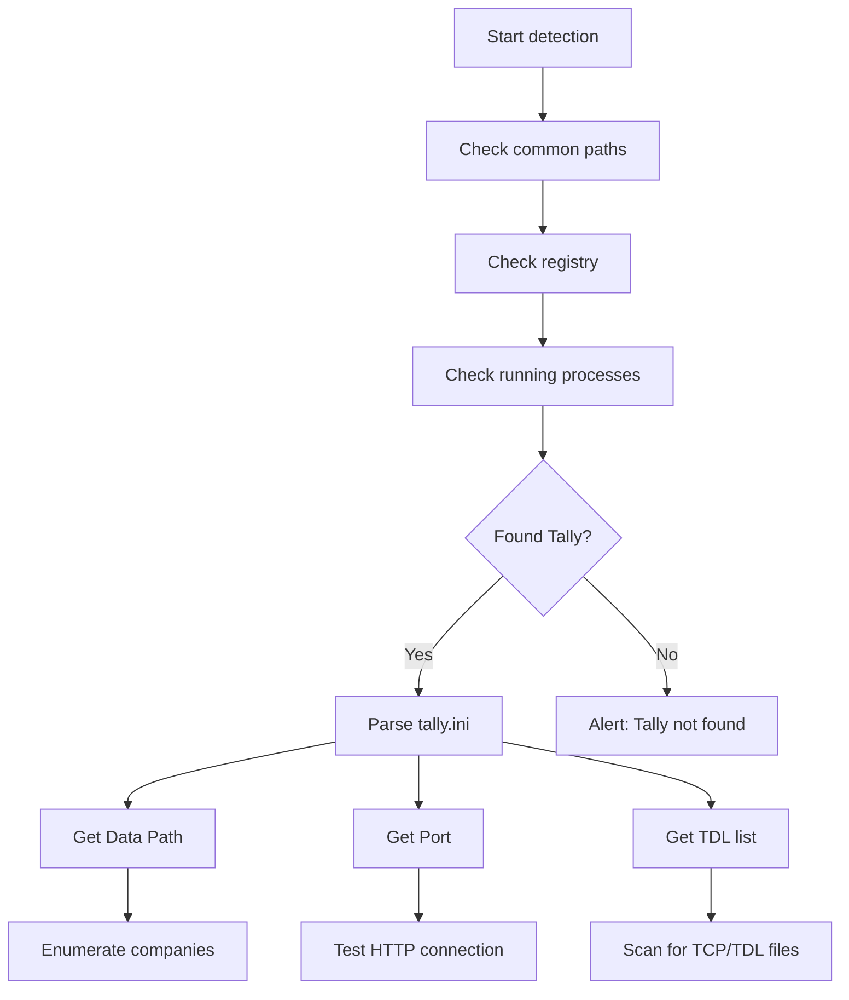

Your connector needs to find Tally before it can talk to it. On a typical Indian SMB's Windows machine, Tally could be installed in half a dozen different places depending on who set it up, when, and which version they started with.

Here's how to hunt it down programmatically.

## Common Installation Paths

Check these locations first -- they cover 90% of installations:

```
C:\TallyPrime\
C:\Tally.ERP9\
C:\Program Files\TallyPrime\
C:\Program Files (x86)\TallyPrime\
C:\Program Files\Tally.ERP9\
C:\Program Files (x86)\Tally.ERP9\
```

### Detection in Go

```go
candidates := []string{
    `C:\TallyPrime`,
    `C:\Tally.ERP9`,
    `C:\Program Files\TallyPrime`,
    `C:\Program Files (x86)\TallyPrime`,
    `C:\Program Files\Tally.ERP9`,
    `C:\Program Files (x86)\Tally.ERP9`,
}

for _, path := range candidates {
    if _, err := os.Stat(path); err == nil {
        // Found it!
    }
}
```

## Windows Registry Keys

Tally registers itself in the Windows registry during installation:

```
HKLM\SOFTWARE\Tally Solutions\Install
HKLM\SOFTWARE\WOW6432Node\Tally Solutions\Install
```

### Reading the Registry (Go)

```go
key, err := registry.OpenKey(
    registry.LOCAL_MACHINE,
    `SOFTWARE\Tally Solutions\Install`,
    registry.READ,
)
if err == nil {
    defer key.Close()
    installPath, _, _ := key.GetStringValue(
        "InstallPath",
    )
}
```

## Finding the Running Process

If Tally is currently running, you can find its path from the process list:

```powershell
Get-Process -Name "tallyprime" |
  Select-Object Path
```

Or for Tally.ERP 9:

```powershell
Get-Process -Name "tally" |
  Select-Object Path
```

The process name tells you which version is running:
- `tallyprime.exe` -- TallyPrime
- `tally.exe` -- Tally.ERP 9

## Version Detection

### From the Executable

Check the file version of the Tally executable:

```powershell
(Get-Item "C:\TallyPrime\tallyprime.exe")
  .VersionInfo.ProductVersion
```

### Via XML API

If Tally is running, the `List of Companies` response includes version info:

```xml
<TALLYVERSION>
  TallyPrime:Release 7.0
</TALLYVERSION>
```

Or for older versions:

```xml
<TALLYVERSION>
  Tally.ERP 9:Release 6.6.3
</TALLYVERSION>
```

### Version Feature Matrix

| Version | JSON API | Folder Format | Config |
|---|---|---|---|
| Tally.ERP 9 | No | 5-digit | tally.ini |
| TallyPrime < 7.0 | No | 5-digit | tally.ini |
| TallyPrime 7.0+ | Yes | 6-digit | tally.ini + config/ |

## Enumerating Company Folders

Company data lives under the Data Path (from `tally.ini`). Each company gets its own numbered folder.

### Folder Naming Convention

```
Data Path/
  ├── 10000/    ← Older format (5-digit)
  ├── 10001/    ← Second company
  ├── 10002/    ← Third company
  ├── 100000/   ← TallyPrime 3.0+ (6-digit)
  ├── 100001/
  └── ...
```

- **5-digit folders** (10000-99999): Tally.ERP 9 and older TallyPrime
- **6-digit folders** (100000-999999): TallyPrime 3.0+ after data migration

### Detecting Company Folders

```go
entries, _ := os.ReadDir(dataPath)
for _, entry := range entries {
    if !entry.IsDir() {
        continue
    }
    name := entry.Name()
    // Check if folder name is all digits
    // and 5-6 characters long
    if isCompanyFolder(name) {
        companies = append(companies, name)
    }
}

func isCompanyFolder(name string) bool {
    if len(name) < 5 || len(name) > 6 {
        return false
    }
    for _, c := range name {
        if c < '0' || c > '9' {
            return false
        }
    }
    return true
}
```

### Inside a Company Folder

Each company folder contains these key files:

```
10000/
  ├── Company.900     ← Company metadata
  ├── cmpsave.900     ← Company backup
  ├── manager.900     ← Master data
  ├── tranmgr.900     ← Transaction manager
  ├── linkmgr.900     ← Link manager
  ├── sumtran.900     ← Summary transactions
  └── *.tsf           ← Temp files (ignore)
```

:::caution
Never try to read `.900` files directly. They're in Tally's proprietary binary format. Always use the HTTP XML API to access data.
:::

## Scanning for TDL/TCP Files

TDL and TCP files reveal what customizations are installed:

```go
filepath.Walk(
    tallyDir,
    func(path string, info os.FileInfo,
         err error) error {
        ext := strings.ToLower(
            filepath.Ext(path),
        )
        if ext == ".tcp" || ext == ".tdl" {
            tdlFiles = append(tdlFiles, path)
        }
        return nil
    },
)
```

### What Filenames Tell You

TCP/TDL filenames hint at their purpose:

| Filename Pattern | Likely Purpose |
|---|---|
| `Medical*.tcp` | Pharma billing addon |
| `Barcode*.tcp` | Barcode scanning |
| `Salesman*.tcp` | Sales force tracking |
| `IMEI*.tcp` | Serial number tracking |

See the [Developer Tools](/tally-integartion/setup-operations/developer-tools/) guide for more on TDL detection.

## Full Discovery Flow



## Edge Cases

- **Portable installations**: Some CAs install Tally on a USB drive. The path could be any drive letter.
- **Network installations**: Tally data on a shared network drive. The Data Path in `tally.ini` will be a UNC path like `\\server\share\TallyData`.
- **Multiple installations**: Both Tally.ERP 9 and TallyPrime on the same machine. Check for both.
- **Custom install paths**: IT teams sometimes install to `D:\Software\Tally` or similar non-standard locations. Registry and process detection handle these cases.
