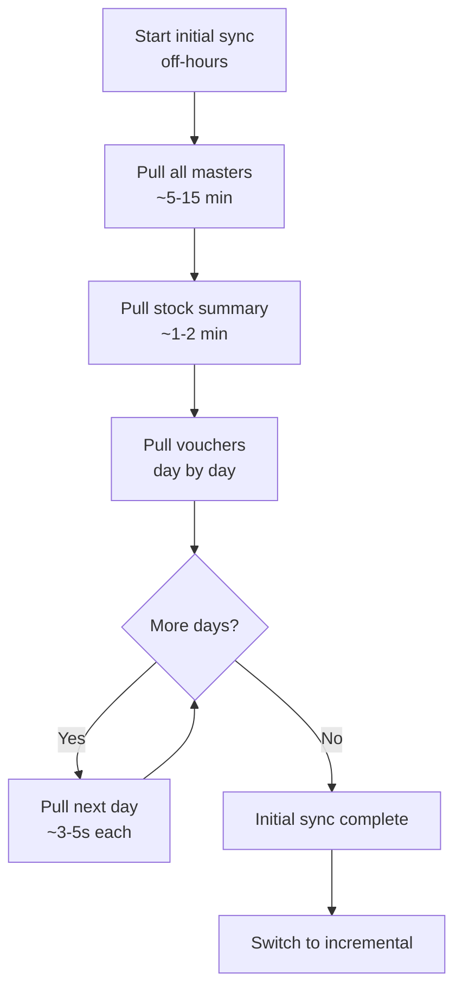

"How long will the sync take?" is the first question every stockist asks. Here are realistic numbers based on real-world testing so you can set expectations and design your batching strategy.

## Disclaimer

These benchmarks are approximations. Actual performance depends on hardware, data complexity, TDL customizations, and how many fields each object has. Use these as planning guidelines, not guarantees.

## Stock Item Export Times

How long it takes to pull stock items via XML API:

| Item Count | Slim Export | Full Export | Notes |
|---|---|---|---|
| 100 | < 1s | 1-2s | Tiny shop |
| 1,000 | 2-5s | 5-15s | Small distributor |
| 5,000 | 10-20s | 30-60s | Medium distributor |
| 10,000 | 20-40s | 1-3 min | Large distributor |
| 50,000 | 2-5 min | 5-15 min | Mega distributor |
| 100,000 | 5-10 min | 15-30 min | Rare, very large |

**Slim export** = only Name, GUID, AlterID, basic fields.
**Full export** = all fields including batches, rates, GST details, UDFs.

:::tip
Always use slim exports for change detection and incremental sync. Save full exports for the initial data load or weekly reconciliation.
:::

## Voucher Export Times

Vouchers are heavier than masters because they contain nested allocations, batch details, and accounting entries:

| Vouchers | One Day | One Week | One Month |
|---|---|---|---|
| Light (< 50/day) | < 2s | 5-10s | 15-30s |
| Medium (50-200/day) | 2-5s | 15-30s | 1-2 min |
| Heavy (200-500/day) | 5-15s | 30-90s | 3-5 min |
| Very heavy (500+/day) | 15-30s | 1-3 min | 5-15 min |

:::danger
Never try to export a full year of vouchers in a single request. For a busy distributor with 200 vouchers per day, that's 73,000 vouchers -- the response could be 200-500 MB. Tally will freeze for 10+ minutes and may crash.
:::

### Day-by-Day Batching Benchmarks

The recommended approach is to pull vouchers one day at a time:

```
Day 1: 150 vouchers → 3 seconds
Day 2: 200 vouchers → 4 seconds
Day 3: 180 vouchers → 3.5 seconds
...
Total for 30 days: ~100 seconds
```

Compare with pulling the whole month at once:

```
Month: 5,400 vouchers → 3-5 minutes
  (Tally frozen the entire time)
```

Day-by-day is slightly slower in total but **doesn't freeze Tally** and is **resumable** if interrupted.

## Memory Footprint

What your connector needs to handle:

| Data Set | Response Size | RAM Needed |
|---|---|---|
| 500 ledgers | 200-500 KB | Minimal |
| 5,000 stock items | 2-10 MB | Low |
| 1 month vouchers (busy) | 5-50 MB | Medium |
| 1 year vouchers | 100-500 MB | High (stream!) |
| Full company export | 500 MB - 2 GB | Must stream |

:::caution
For responses over 10 MB, use a streaming XML parser (`xml.Decoder` in Go, SAX in other languages). Loading a 500 MB XML document into a DOM tree will crash your connector.
:::

## Impact on Tally Responsiveness

What the operator experiences during different connector operations:

| Operation | Duration | UI Impact |
|---|---|---|
| Heartbeat | < 100ms | None |
| AlterID check | < 200ms | None |
| 100 items pull | 1-2s | Brief pause |
| 1,000 items pull | 5-10s | Noticeable lag |
| 5,000 items pull | 30-60s | Frozen |
| Day's vouchers | 2-5s | Brief pause |
| Month's vouchers | 3-5 min | Completely frozen |

## Recommendations by Company Size

### Small Shop (< 1,000 stock items, < 50 vouchers/day)

```yaml
initial_sync: ~2 minutes
daily_incremental: ~10 seconds
strategy: Pull everything; no batching needed
risk: Low
```

### Medium Distributor (1,000-10,000 items, 50-200 vouchers/day)

```yaml
initial_sync: ~15 minutes
daily_incremental: ~30 seconds
strategy: Day-by-day voucher batching
risk: Medium (schedule heavy sync off-hours)
```

### Large Distributor (10,000+ items, 200+ vouchers/day)

```yaml
initial_sync: ~1-2 hours
daily_incremental: ~1-2 minutes
strategy: >
  Day-by-day batching, slim exports,
  incremental AlterID sync only
  during business hours
risk: High (must schedule carefully)
```

## Initial Full Sync Strategy

For the very first sync when the connector is deployed:



### Making It Resumable

If the initial sync is interrupted (Tally closed, machine rebooted), your connector should:

1. Track which date range has been synced
2. Resume from the last incomplete day
3. Never re-pull days that completed successfully

```
Synced: 2026-01-01 through 2026-02-15
Resume from: 2026-02-16
Remaining: 39 days
ETA: ~3 minutes
```

## Optimization Tips

1. **Fetch only what you need** -- list specific fields in your request instead of pulling full objects
2. **Use AlterID filtering** -- after initial sync, only pull changed objects
3. **Compress where possible** -- Tally doesn't support gzip, but your connector can compress before storing
4. **Parallel processing** -- parse the previous response while the next request is in flight
5. **Local caching** -- SQLite for masters, only refresh on AlterID change
