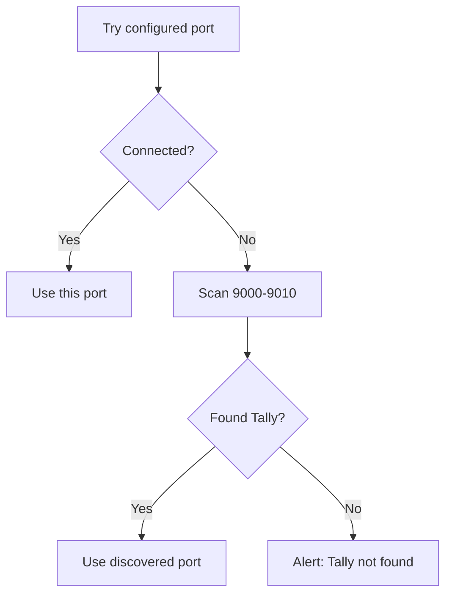

Port 9000 is popular. Tally uses it. So does SonarQube, PHP-FPM, some game servers, and that random Docker container you forgot about. When two applications fight over the same port, nobody wins.

## The Symptom

Your connector can't connect to Tally, but Tally is definitely running with HTTP enabled. The telltale sign:

```
curl: (7) Failed to connect to
  localhost port 9000: Connection refused
```

...even though Tally says the HTTP server is on. What gives?

## Detecting Port Conflicts

### Check What's Using Port 9000

On Windows (run as Administrator):

```powershell
netstat -ano | findstr :9000
```

This shows which process ID (PID) owns the port. Then find the process:

```powershell
tasklist /FI "PID eq 12345"
```

### Alternative: PowerShell One-Liner

```powershell
Get-NetTCPConnection -LocalPort 9000 |
  Select-Object OwningProcess |
  ForEach-Object {
    Get-Process -Id $_.OwningProcess
  }
```

### From Your Connector (Go)

```go
conn, err := net.DialTimeout(
    "tcp",
    "localhost:9000",
    2*time.Second,
)
if err != nil {
    // Port not available or not listening
}
```

## Fixing the Conflict

You have two options: move Tally, or move the other thing.

### Option 1: Change Tally's Port

1. Open TallyPrime
2. **F1** > **Settings** > **Connectivity**
3. Change port to an unused one (e.g., `9001`)
4. **Restart Tally**

Or edit `tally.ini` directly:

```ini
[Tally]
Port = 9001
```

:::tip
Pick a port in the **9000-9999** range. We recommend `9001` or `9100` as safe defaults when 9000 is taken.
:::

### Option 2: Move the Other Application

If the other application is less important (or you can configure it), change its port instead. Tally users expect 9000.

## Testing Port Availability

Before configuring a port, check if it's free:

```powershell
# Returns nothing if port is free
netstat -ano | findstr :9001
```

From your connector, try binding to the port briefly:

```go
listener, err := net.Listen("tcp", ":9001")
if err != nil {
    // Port is in use
} else {
    listener.Close() // It's free
}
```

## Firewall Considerations

Windows Firewall can block connections even to localhost in certain configurations.

### Check Windows Firewall

```powershell
netsh advfirewall firewall show rule
  name=all | findstr "9000"
```

### Add a Firewall Rule (if needed)

```powershell
netsh advfirewall firewall add rule
  name="Tally HTTP"
  dir=in
  action=allow
  protocol=tcp
  localport=9000
```

:::danger
Only add firewall rules for localhost access. Never open Tally's port to external network traffic. See [Security Hardening](/tally-integartion/setup-operations/security-hardening/) for why.
:::

## Common Port Conflicts

| Port | Common Occupant | Solution |
|---|---|---|
| 9000 | SonarQube, PHP-FPM | Move Tally to 9001 |
| 9001 | Portainer, Tor | Try 9100 |
| 9090 | Prometheus | Usually safe for Tally |

## Multi-Tally Scenarios

Some stockists run multiple Tally instances (different versions, different data). Each needs a unique port:

```
TallyPrime (current year)  → Port 9000
Tally.ERP 9 (old data)     → Port 9001
```

Your connector should be configurable to target any port.

## Port Scanning Strategy

When your connector starts and can't connect on the expected port, try a quick scan:



Send the "List of Companies" XML to each port. If you get a valid Tally response, you've found it.

:::caution
Don't scan too many ports -- it's slow and looks suspicious to security software. Stick to the 9000-9010 range unless the user has explicitly configured a different port.
:::
