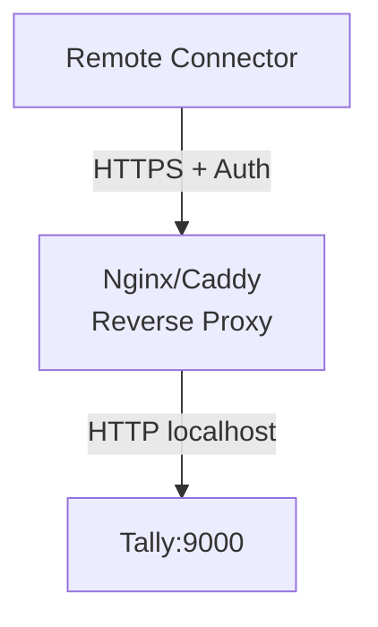

Let's talk about the elephant in the room: Tally's HTTP server has **no authentication**. Anyone who can reach port 9000 can read every transaction, every ledger, every bank balance. No username. No password. No API key. Nothing.

On localhost, that's manageable. On a network, it's a disaster waiting to happen.

## The Default State

Out of the box, when you enable Tally's HTTP server:

```
Who can connect: Anyone on the network
Authentication: None
Encryption: None (plain HTTP)
Authorization: Full read/write access
```

:::danger
If Tally's port is exposed to the LAN (or worse, the internet), **anyone** can extract complete financial data, customer lists, stock positions, and even push fraudulent transactions into the books.
:::

## Risk Assessment

| Scenario | Risk Level | Impact |
|---|---|---|
| Localhost only | Low | Only local apps can connect |
| Open on LAN | High | Any device on the network can read all data |
| Open to internet | Critical | Complete financial exposure |

## Mitigation Strategies

### 1. Bind to Localhost Only

The most important step. Ensure Tally only listens on `127.0.0.1`, not on all interfaces (`0.0.0.0`).

Tally binds to localhost by default, but verify this. Your connector should always connect to `localhost` or `127.0.0.1`, never to the machine's network IP.

```
GOOD: http://localhost:9000
GOOD: http://127.0.0.1:9000
BAD:  http://192.168.1.50:9000
```

### 2. Windows Firewall Rules

Block incoming connections to the Tally port from other machines:

```powershell
# Block port 9000 from all external sources
netsh advfirewall firewall add rule ^
  name="Block Tally External" ^
  dir=in ^
  action=block ^
  protocol=tcp ^
  localport=9000 ^
  remoteip=any

# Allow only localhost
netsh advfirewall firewall add rule ^
  name="Allow Tally Localhost" ^
  dir=in ^
  action=allow ^
  protocol=tcp ^
  localport=9000 ^
  remoteip=127.0.0.1
```

### 3. TallyVault Encryption

TallyVault encrypts the company data at rest. Even if someone accesses the data files directly, they can't read them without the TallyVault password.

```
Gateway > F1 > Settings > TallyVault
  > Enable TallyVault: Yes
  > Set password
```

:::caution
If TallyVault is enabled, the operator must enter the password every time the company is loaded. This adds friction but protects data if the machine is compromised.
:::

### 4. Tally User Access Controls

Tally supports user-level access controls:

```
Gateway > F1 > Settings > User Management
  > Create users with specific roles
  > Restrict access by voucher type
  > Limit date ranges
  > Read-only access for some users
```

However, the HTTP server bypasses user access controls. It operates with full admin privileges regardless of which user is logged in.

### 5. Reverse Proxy for Remote Access

If your connector runs on a different machine (not localhost), never expose the Tally port directly. Use a reverse proxy with HTTPS and authentication:



**Nginx example:**

```nginx
server {
    listen 443 ssl;
    server_name tally-proxy.local;

    ssl_certificate /path/to/cert.pem;
    ssl_certificate_key /path/to/key.pem;

    location / {
        auth_basic "Tally Access";
        auth_basic_user_file /etc/.htpasswd;
        proxy_pass http://127.0.0.1:9000;
    }
}
```

### 6. Network Segmentation

If the stockist has a basic network setup (common in small shops), recommend:

- Tally machine on a separate VLAN or subnet
- No Wi-Fi access to the Tally machine's subnet
- Router-level firewall rules blocking port 9000 from other subnets

## What NOT to Do

:::danger
**Never expose Tally's HTTP port to the internet.** Not through port forwarding, not through a VPN, not through any other mechanism unless there's a properly configured reverse proxy with authentication and HTTPS in front of it.
:::

Common mistakes we've seen:

- **Port forwarding 9000 on the router** -- "so the CA can access remotely"
- **No firewall** -- "it's just a small shop network"
- **Shared Wi-Fi** -- customers on the same network as the billing machine
- **TeamViewer as "security"** -- remote desktop doesn't protect the port

## Security Checklist

Before deploying your connector, verify:

```
[ ] Tally binds to localhost only
[ ] Windows Firewall blocks port externally
[ ] TallyVault enabled (recommended)
[ ] No port forwarding on the router
[ ] Connector connects via localhost
[ ] If remote: HTTPS reverse proxy with auth
[ ] Wi-Fi network segmented from Tally
```

## The Practical Reality

Most Indian SMB stockists don't have an IT department. Their "network" is a router from the ISP and a few PCs on the same subnet. In this environment:

1. **Keep Tally on localhost** -- connector runs on the same machine
2. **Enable Windows Firewall** -- even the basic default rules help
3. **Use TallyVault** -- especially if the machine is shared
4. **Educate the stockist** -- they need to know this data is sensitive

That's it. Don't over-engineer security for a small shop, but don't ignore it either.
