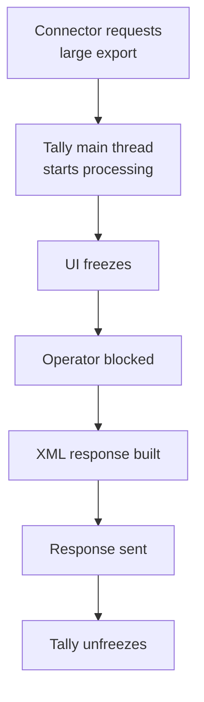
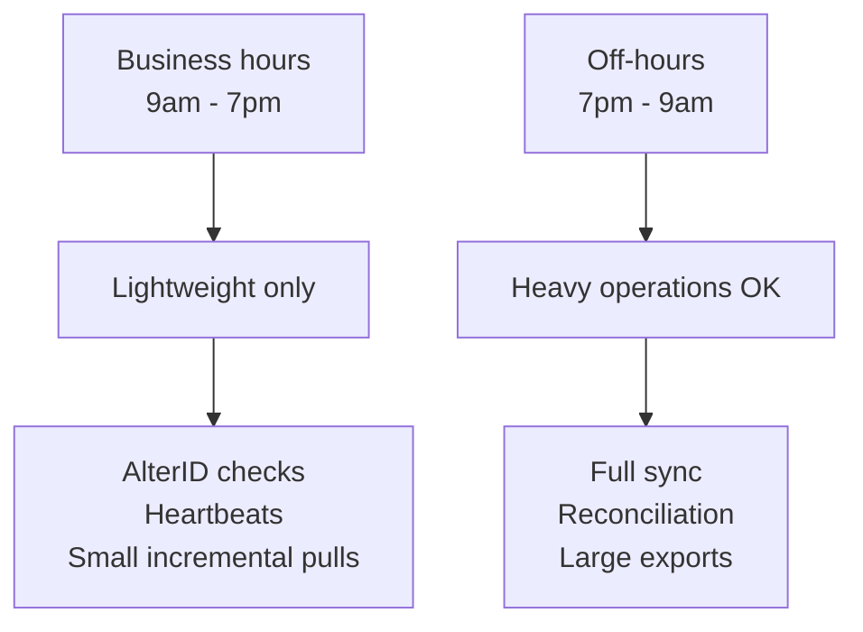

Here's the uncomfortable truth about Tally's HTTP server: when you ask for a lot of data, Tally stops everything else to give it to you. The UI freezes. The operator can't enter invoices. The billing counter grinds to a halt.

For a pharma stockist processing orders, every frozen minute is money lost.

## Why Does Tally Freeze?

Tally processes HTTP requests on its main thread. When your connector asks for 10,000 stock items or a month's worth of vouchers, Tally:

1. Stops accepting UI input
2. Starts building the XML response
3. Holds everything until the response is complete
4. Finally unfreezes and returns to normal



## The Numbers

Here's what to expect based on real-world testing:

| Request Size | Freeze Duration | Risk Level |
|---|---|---|
| < 500 objects | < 2 seconds | Low |
| 500-2,000 | 2-10 seconds | Medium |
| 2,000-5,000 | 10-60 seconds | High |
| > 5,000 objects | 1-5+ minutes | Dangerous |

:::danger
Requests over 5,000 objects can freeze Tally for **minutes**. During this time, the operator sees a completely unresponsive application. They may force-close Tally, which kills your request and potentially corrupts the response.
:::

## Symptoms

How to tell if your connector is freezing Tally:

- **The operator complains** that Tally "hangs" at random times (it's not random -- it's your sync schedule)
- **Response times spike** -- a request that usually takes 2 seconds suddenly takes 90
- **Tally's title bar** shows "(Not Responding)" in Windows
- **The operator force-closes Tally** -- and your connector loses the connection mid-transfer

## Prevention: Batch Everything

The single most important rule: **never request more than 5,000 objects at once**.

### Batch Vouchers by Date

Instead of pulling all vouchers for a month:

```xml
<!-- BAD: All of March -->
<FROMDATE>20260301</FROMDATE>
<TODATE>20260331</TODATE>
```

Pull them day by day:

```xml
<!-- GOOD: One day at a time -->
<FROMDATE>20260301</FROMDATE>
<TODATE>20260301</TODATE>
```

### Limit Collection Size

Use fetch limits in your collection requests:

```xml
<FETCH>
  <NAME/>
  <GUID/>
  <ALTERID/>
</FETCH>
```

Only request the fields you need. A full object export with all nested lists is 10x heavier than a slim collection with just names and IDs.

### Use AlterID Filtering

Instead of pulling everything, pull only what changed:

```xml
<FILTER>ALTERIDFILTER</FILTER>
<!-- Only objects altered after your watermark -->
```

This dramatically reduces response size after the initial sync.

## Business Hours vs Off-Hours

Structure your sync around the operator's workday:



### During Business Hours
- AlterID change detection (milliseconds)
- Individual object exports (seconds)
- Small collection pulls (< 500 items)

### During Off-Hours
- Full master data refresh
- Stock summary reconciliation
- Large voucher exports
- Initial data migration

## Performance Impact Table

| Operation | Approx. Time | Tally Impact |
|---|---|---|
| Heartbeat | < 100ms | None |
| AlterID check | < 200ms | None |
| 100 stock items | 1-2s | Minimal |
| 1,000 stock items | 5-10s | Noticeable |
| 5,000 vouchers | 30-60s | Freezes UI |
| 10,000 vouchers | 2-5 min | Operator blocked |

## What to Tell the Stockist

Be upfront about this limitation. The conversation goes something like:

> "During sync, Tally might pause briefly -- like 1-2 seconds. We've designed the connector to sync in small chunks to minimize this. For the initial full data load, we recommend running it after business hours."

Setting expectations prevents angry phone calls at 2pm when the billing clerk can't enter an invoice.

## Emergency: Tally is Stuck

If Tally freezes and doesn't recover after 5 minutes:

1. **Wait** -- it might still be processing
2. If the connector shows a timeout, the response was too large
3. **Don't force-close Tally** unless absolutely necessary (data corruption risk)
4. After recovery, reduce your batch size immediately
5. Check the `tallyhttp.log` for the request that caused it
