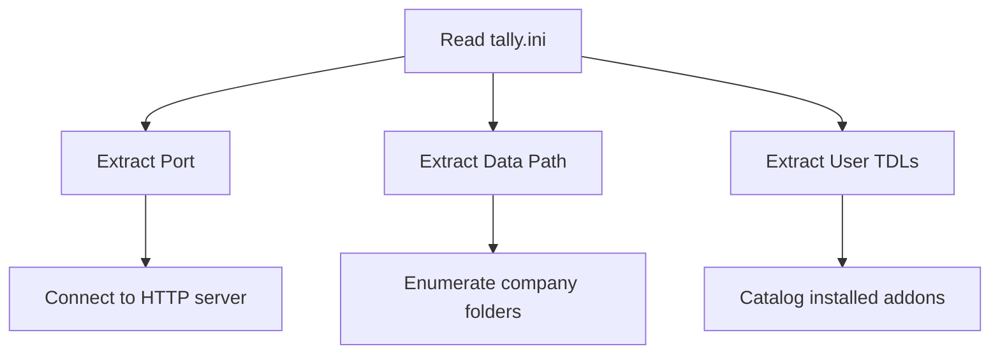

The `tally.ini` file is Tally's master configuration. It tells you everything you need to know about a Tally installation without even opening the application -- data paths, HTTP port, loaded TDLs, and more.

## Where Does It Live?

You'll find `tally.ini` in the Tally installation directory:

| Version | Typical Path |
|---|---|
| TallyPrime | `C:\TallyPrime\tally.ini` |
| TallyPrime (alt) | `C:\Program Files\TallyPrime\tally.ini` |
| Tally.ERP 9 | `C:\Tally.ERP9\tally.ini` |

:::tip
Not sure where Tally is installed? Check the running process path, or look in the Windows registry under `HKLM\SOFTWARE\Tally Solutions\Install`.
:::

## What's Inside

Here's a typical `tally.ini` with the fields you care about:

```ini
[Tally]
; Installation settings
Admin = Yes
Launch Browser = No

; Network -- THIS IS WHAT YOU WANT
Port = 9000
Connect = Yes
Port 2 = 9001

; Data paths
Data Path = C:\Users\Public\TallyPrime\Data
Export Path = C:\TallyPrime\Export
Log Path = C:\TallyPrime\Logs

; TDL configuration
TDL = Yes
Default TDL = tally.tdl
User TDL = Yes
User TDL0 = MedicalBilling.tcp
User TDL1 = SalesmanTracker.tcp
User TDL2 = C:\Custom\DiscountCalc.tdl
```

## Key Fields Reference

| Field | What It Means | Why You Care |
|---|---|---|
| `Port` | HTTP server port | Where to send requests |
| `Data Path` | Company data folder | Find company folders here |
| `User TDL0..N` | Loaded TDL/TCP files | Discover customizations |
| `Connect` | ODBC enabled | Alternative data access |

## The Data Path

This is the most important field for filesystem discovery. It points to the directory containing all company data folders:

```
C:\Users\Public\TallyPrime\Data\
  ├── 10000\    ← First company
  ├── 10001\    ← Second company
  ├── 100000\   ← TallyPrime 3.0+ format
  └── ...
```

Company folders use 5-digit names (`10000`, `10001`) in older versions and 6-digit names (`100000`, `100001`) in TallyPrime 3.0+.

:::caution
Never hardcode the data path. Always read it from `tally.ini`. Different installations use different paths, and CAs sometimes move data to a separate drive for backup convenience.
:::

## Discovering Loaded TDLs

TDLs are listed as numbered entries:

```ini
User TDL = Yes
User TDL0 = MedicalBilling.tcp
User TDL1 = SalesmanTracker.tcp
User TDL2 = C:\Custom\DiscountCalc.tdl
```

The numbering starts at `0` and increments. Paths can be relative (to the Tally install directory) or absolute.

These TDL files create the custom fields (UDFs) you'll find in XML exports. The filename often hints at the purpose:

```
MedicalBilling.tcp  → Pharma UDFs
SalesmanTracker.tcp → Salesman fields
DiscountCalc.tdl    → Discount structures
```

## Parsing tally.ini Programmatically

It's a standard INI file. Here's how to read it:

**Go**:
```go
// Simple key-value extraction
file, _ := os.Open(
    filepath.Join(tallyDir, "tally.ini"),
)
scanner := bufio.NewScanner(file)
for scanner.Scan() {
    line := strings.TrimSpace(scanner.Text())
    // Skip comments and section headers
    if strings.HasPrefix(line, ";") ||
       strings.HasPrefix(line, "[") {
        continue
    }
    parts := strings.SplitN(line, "=", 2)
    if len(parts) == 2 {
        key := strings.TrimSpace(parts[0])
        val := strings.TrimSpace(parts[1])
        // Store key-value pair
    }
}
```

**Python**:
```python
import configparser
config = configparser.ConfigParser()
config.read(r'C:\TallyPrime\tally.ini')
port = config.get('Tally', 'Port', fallback='9000')
data_path = config.get('Tally', 'Data Path')
```

## Fields to Extract at Startup

When your connector starts, grab these from `tally.ini`:



1. **Port** -- so you know where to connect
2. **Data Path** -- so you can enumerate companies on disk
3. **User TDL0..N** -- so you know what custom fields to expect
4. **Export Path** -- useful for debugging export files
5. **Log Path** -- where to find Tally logs

## TallyPrime 7.0+ Config Directory

Newer versions of TallyPrime also use a `config/` subdirectory for additional settings:

```
C:\TallyPrime\config\
  └── excelmaps\    ← Import mapping templates
```

The `tally.ini` remains the primary configuration file, but keep an eye on this directory for extra context.

## Quick Validation

After parsing, validate your extracted values:

```
Port in range 9000-9999?     ✓
Data Path exists on disk?     ✓
User TDL files exist?         ✓ (warn if missing)
```

If a TDL file referenced in `tally.ini` doesn't exist on disk, it might have been removed but not cleaned up from the config. Tally will log an error on startup but won't crash.
