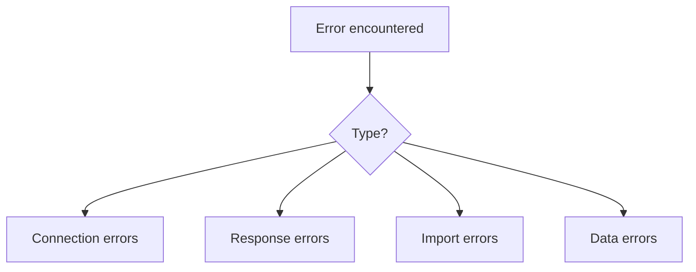
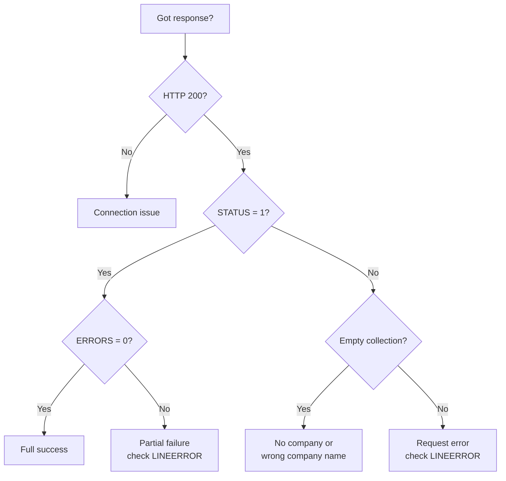

Things will go wrong. Tally's error messages range from helpful to cryptic to completely absent. This guide covers every common error and what to do about it.

## Error Categories at a Glance



---

## Connection Errors

### Connection Refused

```
curl: (7) Failed to connect to
  localhost port 9000: Connection refused
```

**Checklist:**
1. Is Tally running? (Check taskbar/Task Manager)
2. Is the HTTP server enabled? (F1 > Settings > Connectivity)
3. Did you restart Tally after enabling HTTP?
4. Is the port correct? (Check `tally.ini`)
5. Is another app using port 9000? (See [Port Conflicts](/tally-integartion/setup-operations/port-conflicts/))

### Connection Timeout

```
curl: (28) Operation timed out
  after 30000 milliseconds
```

**Likely causes:**
- Tally is frozen processing a large request
- Firewall is silently dropping packets
- Wrong IP address (using network IP instead of localhost)

**Fix:** Reduce your request size. Check if Tally UI says "(Not Responding)".

### Empty Response

```
curl: (52) Empty reply from server
```

**Likely causes:**
- No company is loaded in Tally
- Tally is in the middle of starting up
- The request XML is so malformed that Tally can't even generate an error

---

## Response Errors

### STATUS=0 in Response

This is Tally's way of saying "I understood your request, but something failed."

```xml
<ENVELOPE>
  <HEADER>
    <STATUS>0</STATUS>
  </HEADER>
</ENVELOPE>
```

Common causes:
- Company not loaded
- Invalid collection name
- Syntax error in your XML request
- Referenced object doesn't exist

:::tip
Always check the `<STATUS>` tag in Tally's response. `1` = success, `0` = failure. Never assume success just because you got an HTTP 200.
:::

### LINEERROR in Response

Tally returns detailed error information in `LINEERROR` tags:

```xml
<RESPONSE>
  <LINEERROR>
    Voucher Total does not tally
  </LINEERROR>
  <CREATED>0</CREATED>
  <ALTERED>0</ALTERED>
  <LASTVCHID>0</LASTVCHID>
  <LASTMID>0</LASTMID>
  <COMBINED>0</COMBINED>
  <IGNORED>0</IGNORED>
  <ERRORS>1</ERRORS>
</RESPONSE>
```

### Common LINEERROR Messages

| Error Message | What It Means | Fix |
|---|---|---|
| Voucher Total does not tally | Dr does not equal Cr | Recompute amounts; add round-off entry |
| No entries in Voucher! | All line items are zero-valued | Enable zero-valued transactions or remove zero lines |
| Company not loaded | Target company isn't open | Load the company in Tally |
| Cannot find Ledger | Referenced ledger doesn't exist | Create the ledger first |

### "Company Not Loaded" Error

This deserves its own section because it's so common:

```xml
<ENVELOPE>
  <BODY>
    <DATA>
      <COLLECTION></COLLECTION>
    </DATA>
  </BODY>
</ENVELOPE>
```

An empty `COLLECTION` tag usually means no company is loaded, or you specified the wrong company name in `SVCURRENTCOMPANY`.

---

## Import Errors

When you push data to Tally, the response tells you what happened:

```xml
<RESPONSE>
  <CREATED>3</CREATED>
  <ALTERED>1</ALTERED>
  <COMBINED>0</COMBINED>
  <CANCELLED>0</CANCELLED>
  <DELETED>0</DELETED>
  <IGNORED>2</IGNORED>
  <ERRORS>1</ERRORS>
  <LASTVCHID>12345</LASTVCHID>
</RESPONSE>
```

### Understanding the Counts

| Field | Meaning |
|---|---|
| `CREATED` | New objects successfully created |
| `ALTERED` | Existing objects updated |
| `COMBINED` | Objects merged with existing |
| `IGNORED` | Skipped (duplicate or no change) |
| `ERRORS` | Failed to import |

:::caution
If `ERRORS > 0`, some of your data didn't make it in. Check `Tally.imp` in the installation directory for details, and check the `LINEERROR` tags in the response.
:::

### Common Import Failures

**Duplicate voucher number:**
```
Voucher number already exists
```
The voucher number you pushed matches an existing one and "Prevent Duplicates" is enabled. Use a unique prefix or let Tally auto-number.

**Missing master:**
```
Cannot find Stock Item "Dolo 650"
```
The stock item doesn't exist in Tally. Create masters before pushing vouchers.

**Feature mismatch:**
```
Batch details required
```
The company has batches enabled but your voucher XML doesn't include `BATCHALLOCATIONS.LIST`. Match your XML to the company's feature flags.

---

## Data Errors

### Malformed XML

Tally is surprisingly tolerant of bad XML, but some things will break it:

**The ampersand problem** (the number one cause):
```xml
<!-- BAD: Tally will reject or crash -->
<LEDGERNAME>Patel & Sons</LEDGERNAME>

<!-- GOOD: Properly escaped -->
<LEDGERNAME>
  Patel &amp; Sons
</LEDGERNAME>
```

**Other characters to escape:**
```
&  →  &amp;
<  →  &lt;
>  →  &gt;
"  →  &quot;
'  →  &apos;
```

:::danger
The ampersand in ledger names is the **number one cause** of failed imports. Indian business names love `&` -- "M/s Patel & Sons", "R & D Expenses". Always escape your XML.
:::

### Encoding Issues

If you see garbled text in responses:

```xml
<!-- Garbled Hindi/Gujarati text -->
<NAME>पेरासिटामॉल</NAME>
```

**Fix:** Ensure your HTTP request includes the correct Content-Type:

```
Content-Type: text/xml; charset=UTF-8
```

Older Tally.ERP 9 installations may use Windows-1252 encoding. Detect and handle both.

### Amount Mismatch

```
Total of inventory entries does not
match accounting entries
```

The sum of inventory line amounts doesn't equal the accounting allocation. Common when GST rounding creates tiny differences.

**Fix:** Add a round-off entry (see the [research notes on round-off handling](/tally-integartion/setup-operations/troubleshooting-errors/#the-round-off-fix)).

#### The Round-Off Fix

```xml
<ALLLEDGERENTRIES.LIST>
  <LEDGERNAME>Rounded Off</LEDGERNAME>
  <ISDEEMEDPOSITIVE>No</ISDEEMEDPOSITIVE>
  <AMOUNT>0.50</AMOUNT>
</ALLLEDGERENTRIES.LIST>
```

Keep round-off within +-1.00 INR. If the difference is larger, something else is wrong.

---

## Debugging Checklist

When a request fails, work through this:

```
[ ] Check HTTP status code (200 = received)
[ ] Check STATUS tag (1 = success, 0 = fail)
[ ] Check LINEERROR tags for details
[ ] Check CREATED/ALTERED/ERRORS counts
[ ] Verify XML escaping (& < > " ')
[ ] Verify Content-Type charset
[ ] Check tally.imp for import results
[ ] Check tallyhttp.log for raw traffic
[ ] Test same XML in Tally Connector tool
[ ] Verify all referenced masters exist
[ ] Verify Dr = Cr balance
[ ] Verify feature flag compliance
```

## Error Response Quick Reference


