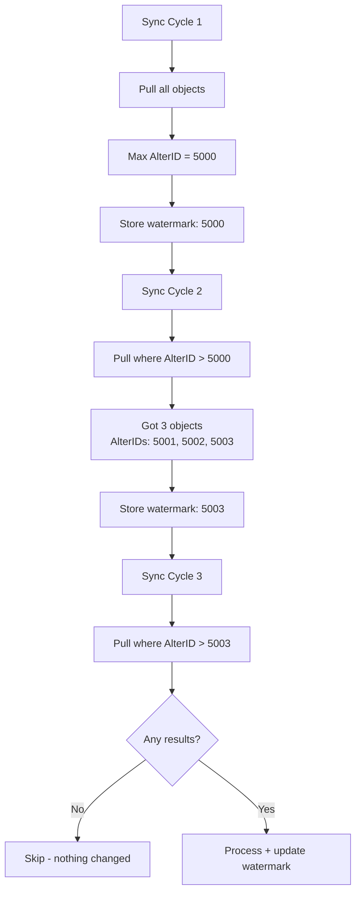
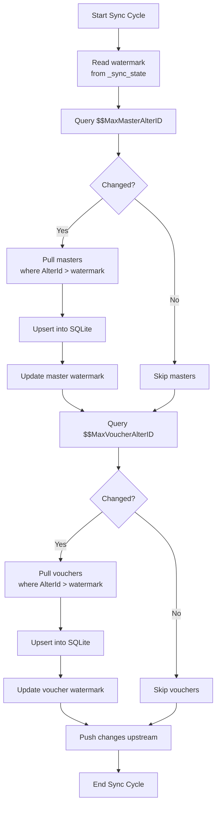

AlterID is the heartbeat of incremental sync. It's how Tally tells you "something changed" without you having to compare every single record. Get this right, and your connector is efficient. Get it wrong, and you're either missing changes or re-syncing everything every time.

## How AlterID Works in Tally

Every object in a Tally company -- whether it's a ledger master, a stock item, or a sales invoice -- has an `AlterID` field. Here's what you need to know:

1. **Global counter** -- There's one AlterID counter per company. It increments across ALL object types.
2. **Monotonically increasing** -- It only goes up. Creating a stock item might set AlterID to 5000. Creating a voucher a minute later sets it to 5001.
3. **Every mutation increments it** -- Create, alter, or delete any object, and the counter ticks up.
4. **Persists across restarts** -- AlterIDs are stored in the Tally data file, not in memory. Restarting Tally doesn't reset them.
5. **Separate from MasterID** -- MasterID is assigned on creation and never changes. AlterID changes on every modification.

## The Watermark Pattern

The concept is simple:

```
After sync: store max(AlterID) seen
Next sync:  request where AlterID > stored max
```



## Separate Watermarks for Masters and Vouchers

Here's an important subtlety: you should maintain **separate watermarks** for masters and vouchers.

Why? Because:

- Masters change infrequently (a few times a day, maybe)
- Vouchers change constantly (every few minutes during business hours)
- You want to poll vouchers more frequently than masters
- A master change shouldn't force a voucher re-scan

```sql
CREATE TABLE _sync_state (
    company_guid    TEXT PRIMARY KEY,
    company_name    TEXT NOT NULL,
    last_master_alter_id  INTEGER DEFAULT 0,
    last_voucher_alter_id INTEGER DEFAULT 0,
    last_full_sync  TIMESTAMP,
    last_incr_sync  TIMESTAMP,
    last_push_to_central TIMESTAMP,
    tally_host      TEXT DEFAULT 'localhost',
    tally_port      INTEGER DEFAULT 9000
);
```

Note the two watermark columns: `last_master_alter_id` and `last_voucher_alter_id`.

## Tally's Max AlterID Functions

Tally exposes two built-in functions to get the current max AlterID without pulling any actual data:

```
$$MaxMasterAlterID  -- highest AlterID among masters
$$MaxVoucherAlterID -- highest AlterID among vouchers
```

You can call these via a lightweight XML request:

```xml
<ENVELOPE>
  <HEADER>
    <VERSION>1</VERSION>
    <TALLYREQUEST>Export</TALLYREQUEST>
    <TYPE>Function</TYPE>
    <ID>$$MaxMasterAlterID</ID>
  </HEADER>
  <BODY>
    <DESC>
      <STATICVARIABLES>
        <SVCURRENTCOMPANY>
          ##CompanyName##
        </SVCURRENTCOMPANY>
      </STATICVARIABLES>
    </DESC>
  </BODY>
</ENVELOPE>
```

This returns just a number. Fast, cheap, no load on Tally.

## Filtered Export Using AlterID

Once you know changes exist, pull only the changed objects. This uses inline TDL with a FILTER:

```xml
<ENVELOPE>
  <HEADER>
    <VERSION>1</VERSION>
    <TALLYREQUEST>Export</TALLYREQUEST>
    <TYPE>Collection</TYPE>
    <ID>ModifiedStockItems</ID>
  </HEADER>
  <BODY>
    <DESC>
      <STATICVARIABLES>
        <SVCURRENTCOMPANY>
          ##CompanyName##
        </SVCURRENTCOMPANY>
      </STATICVARIABLES>
      <TDL><TDLMESSAGE>
        <COLLECTION
          NAME="ModifiedStockItems"
          ISMODIFY="No">
          <TYPE>StockItem</TYPE>
          <NATIVEMETHOD>
            Name, GUID, AlterId
          </NATIVEMETHOD>
          <FILTER>
            ModifiedFilter
          </FILTER>
        </COLLECTION>
        <SYSTEM
          TYPE="Formulae"
          NAME="ModifiedFilter">
          $$FilterGreater:$AlterId:5000
        </SYSTEM>
      </TDLMESSAGE></TDL>
    </DESC>
  </BODY>
</ENVELOPE>
```

Replace `5000` with your stored watermark. This tells Tally to only return stock items where `AlterId > 5000`. Server-side filtering means less data transferred and less parsing work.

:::tip
You can use the same pattern for any collection: Ledger, Godown, VoucherType, etc. Just change the `TYPE` in the collection definition.
:::

## The Watermark Lifecycle

Here's the full lifecycle for a sync cycle:



## Edge Cases

### AlterID Went Backwards

If `$$MaxMasterAlterID` returns a value *lower* than your watermark, someone restored an older backup. This is a critical situation:

```
Stored watermark: 5000
Tally reports:    4200
```

Your only safe option is a full sync. Log this event prominently -- it means data was restored and your local cache may have records that no longer exist in Tally.

:::danger
When AlterID goes backwards, do NOT simply reset the watermark. You must do a full reconciliation to detect records in your cache that were deleted by the restore. See [Weekly Reconciliation](/tally-integartion/sync-engine/weekly-reconciliation/).
:::

### AlterID Gaps

AlterIDs are not guaranteed to be sequential. If IDs 5001, 5002, and 5003 exist, there might not be a 5004 -- the next one could be 5010. Don't worry about gaps. Just always use `>` comparison, never `= watermark + 1`.

### AlterID After Deletion

When an object is deleted, the global AlterID counter still increments. But the deleted object no longer appears in collections. So your `AlterID > watermark` query will return fewer objects than the gap suggests. The "missing" AlterIDs belong to deleted objects.

This is why incremental sync alone can't detect deletions -- you need the reconciliation layer.

## Watermark Storage Best Practices

1. **Store per company** -- Each Tally company has its own AlterID space
2. **Update atomically** -- Update the watermark in the same transaction as the data upsert
3. **Log every update** -- Keep a history in `_sync_log` for debugging
4. **Never skip ahead** -- Only update to the max AlterID you actually processed, not the max Tally reported

```sql
-- Update watermark after successful sync
UPDATE _sync_state
SET last_master_alter_id = 5003,
    last_incr_sync = CURRENT_TIMESTAMP
WHERE company_guid = 'company-guid';
```

:::tip
If a sync cycle fails partway through, do NOT update the watermark. Let the next cycle retry from the same point. This is the beauty of idempotent upserts -- re-processing the same objects is harmless.
:::
