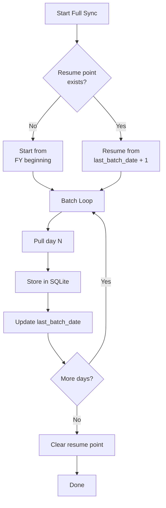

Here's a hard truth from the field: pull more than about 5,000 objects from Tally in a single HTTP request, and Tally may freeze. Not slow down. *Freeze*. As in, the stockist can't enter a single voucher until your request completes.

Batching is not optional. It's survival.

## Why Tally Freezes

Tally processes XML export requests on its main thread. While it's serializing 50,000 vouchers into XML, the entire application is blocked. The user sees a "Please wait" message (or worse, a hang with no message).

The tally-database-loader project explicitly warns:

> "Batch size > 5000 vouchers per HTTP request can freeze Tally indefinitely."

This isn't a theoretical concern. It happens every day at stockists running busy companies.

## Batching Strategies

### Strategy 1: Day-by-Day Batching

Set `SVFROMDATE` and `SVTODATE` to the same day, and iterate across all days in the range:

```xml
<!-- Day 1 -->
<SVFROMDATE>20260301</SVFROMDATE>
<SVTODATE>20260301</SVTODATE>

<!-- Day 2 -->
<SVFROMDATE>20260302</SVFROMDATE>
<SVTODATE>20260302</SVTODATE>

<!-- ... and so on -->
```

**Pros**: Each request is small, Tally stays responsive, easy to resume if interrupted.

**Cons**: More HTTP requests (365 for a full year), slightly more overhead.

This is the recommended approach for large companies.

### Strategy 2: Monthly Batching

Group by month instead of day:

```xml
<SVFROMDATE>20260301</SVFROMDATE>
<SVTODATE>20260331</SVTODATE>
```

**Pros**: Fewer requests (12 for a full year).

**Cons**: A busy month might still have 5,000+ vouchers.

Good for medium-sized companies where daily batching is overkill.

### Strategy 3: Single Pull

No batching. Pull the full date range in one request.

```xml
<SVFROMDATE>20250401</SVFROMDATE>
<SVTODATE>20260331</SVTODATE>
```

**Pros**: Simplest code.

**Cons**: Will freeze Tally for any non-trivial company.

Only appropriate for very small companies or testing.

## Recommendations by Company Size

| Company Size | Vouchers/Year | Strategy | Notes |
|---|---|---|---|
| Small | < 5,000 | Single pull | Safe in one request |
| Medium | 5K - 50K | Monthly | ~12 requests per year |
| Large | 50K - 200K | Daily | ~365 requests per year |
| Very Large | 200K+ | Daily + throttle | Add delays between requests |

```toml
[sync]
# "daily" | "monthly" | "single"
voucher_export_batch = "daily"
max_collection_size = 5000
# Delay between batch requests (ms)
inter_batch_delay_ms = 500
```

## Progress Reporting

When running a full sync with daily batching, your connector should report progress. The user (or monitoring system) needs to know it's working, not stuck.

```
[2026-03-25 10:00:01] Full sync started
[2026-03-25 10:00:01] Syncing masters... done (243 items)
[2026-03-25 10:00:03] Syncing vouchers: 2025-04-01... 42 vouchers
[2026-03-25 10:00:04] Syncing vouchers: 2025-04-02... 38 vouchers
...
[2026-03-25 10:05:42] Syncing vouchers: 2026-03-25... 67 vouchers
[2026-03-25 10:05:42] Voucher sync complete: 18,432 vouchers in 342 seconds
[2026-03-25 10:05:43] Syncing reports... done
[2026-03-25 10:05:44] Full sync complete
```

Key metrics to track per batch:

- Date being processed
- Number of vouchers in this batch
- Running total
- Elapsed time
- Estimated time remaining

## Resumability

What happens when a full sync is interrupted halfway through? Maybe Tally crashed, or the connector was restarted, or the network dropped.

**You need to be able to resume from where you left off.**

The simplest approach: track the last successfully synced date.

```sql
-- In _sync_state or a dedicated table
ALTER TABLE _sync_state
ADD COLUMN last_batch_date DATE;
```

On restart, check `last_batch_date`. If it's set and not at the end of the range, resume from the next day.



:::tip
Make each day's batch an atomic operation: pull, parse, upsert, then update the resume point. If any step fails, the resume point stays at the previous day, and you retry cleanly.
:::

## Throttling for Politeness

Even with daily batching, firing 365 HTTP requests back-to-back can overload Tally. Add a small delay between requests:

```toml
[sync]
inter_batch_delay_ms = 500
```

500ms between requests means a full year takes about 3 extra minutes but keeps Tally responsive throughout.

For very large companies, consider syncing during off-hours:

```toml
[sync]
# Only run full sync between 10 PM and 6 AM
full_sync_window_start = "22:00"
full_sync_window_end = "06:00"
```

:::caution
The inter-batch delay is a tradeoff. Shorter delays = faster sync but more Tally load. Longer delays = slower sync but happier stockists. Start with 500ms and adjust based on feedback.
:::

## Master Collection Batching

Masters typically don't need date-based batching (they're not date-filtered). But a company with 10,000+ stock items might hit the collection size limit.

For large master collections, use the same AlterID-based incremental approach. On full sync, you may need to paginate:

```xml
<!-- Pull first 5000 stock items -->
<COLLECTION NAME="StockBatch1">
  <TYPE>StockItem</TYPE>
  <FILTER>FirstBatch</FILTER>
</COLLECTION>
<SYSTEM TYPE="Formulae"
  NAME="FirstBatch">
  $$FilterLessEq:$MasterId:5000
</SYSTEM>
```

In practice, most stockists have fewer than 5,000 stock items, so this is rarely needed. But build the capability -- you'll encounter that one stockist with 15,000 SKUs.
