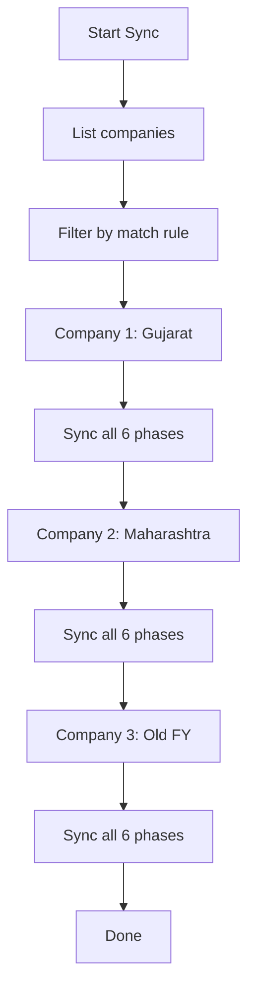

A single TallyPrime instance can have multiple companies loaded simultaneously. A pharma stockist with operations in multiple states might run separate companies for each GST registration. Your connector needs to discover them, figure out which ones it cares about, and sync them all.

## The Multi-Company Problem

Consider a stockist with three companies loaded in Tally:

```
TallyPrime Instance (port 9000)
├── "ABC Pharma Pvt Ltd - Gujarat"
│     GSTIN: 24ABCDE1234F1Z5
│     FY: 2025-04-01 to 2026-03-31
├── "ABC Pharma Pvt Ltd - Maharashtra"
│     GSTIN: 27ABCDE1234F1Z5
│     FY: 2025-04-01 to 2026-03-31
└── "ABC Pharma (Old FY 2024-25)"
      GSTIN: 24ABCDE1234F1Z5
      FY: 2024-04-01 to 2025-03-31
```

Each company is a **separate data universe**. It has its own masters, vouchers, GUIDs, and AlterIDs starting from 1. The connector must handle each independently.

## Listing All Companies

Use this inline TDL request to get all loaded companies:

```xml
<ENVELOPE>
  <HEADER>
    <VERSION>1</VERSION>
    <TALLYREQUEST>Export</TALLYREQUEST>
    <TYPE>Collection</TYPE>
    <ID>CompanyList</ID>
  </HEADER>
  <BODY>
    <DESC>
      <TDL><TDLMESSAGE>
        <COLLECTION
          NAME="CompanyList"
          ISMODIFY="No">
          <TYPE>Company</TYPE>
          <NATIVEMETHOD>
            Name, GUID, StartingFrom,
            BooksFrom
          </NATIVEMETHOD>
          <NATIVEMETHOD>
            MaintainBatchWiseDetails,
            MaintainMultipleGodowns
          </NATIVEMETHOD>
          <NATIVEMETHOD>
            UseTrackingNumbers,
            HasBillOfMaterials
          </NATIVEMETHOD>
        </COLLECTION>
      </TDLMESSAGE></TDL>
    </DESC>
  </BODY>
</ENVELOPE>
```

:::tip
Notice there's no `SVCURRENTCOMPANY` in this request. Without it, Tally returns data about ALL loaded companies.
:::

The response gives you each company's name, GUID, and feature flags. This is your discovery payload.

## Auto-Detecting Date Ranges

You can also use the simpler built-in request:

```xml
<ENVELOPE>
  <HEADER>
    <VERSION>1</VERSION>
    <TALLYREQUEST>Export</TALLYREQUEST>
    <TYPE>Data</TYPE>
    <ID>List of Companies</ID>
  </HEADER>
  <BODY>
    <DESC>
      <STATICVARIABLES>
        <SVEXPORTFORMAT>
          $$SysName:XML
        </SVEXPORTFORMAT>
      </STATICVARIABLES>
    </DESC>
  </BODY>
</ENVELOPE>
```

This response includes two critical date fields:

```xml
<COMPANY>
  <NAME>ABC Pharma Pvt Ltd</NAME>
  <STARTINGFROM>20250401</STARTINGFROM>
  <ENDINGAT>20260331</ENDINGAT>
</COMPANY>
```

- **STARTINGFROM** -- The earliest date with data (books beginning or first transaction)
- **ENDINGAT** -- The latest date with data (last voucher date or FY end)

These define the date range for voucher extraction. No guessing required.

## Matching Companies

Once you have the company list, you need to decide which ones to sync. Three strategies:

### Strategy 1: Explicit Configuration

The simplest. Hard-code the company name in config:

```toml
[tally]
company = "ABC Pharma Pvt Ltd - Gujarat"
```

Only this company is synced. Clean, predictable, but doesn't handle multi-company setups.

### Strategy 2: GSTIN Matching

Match companies by their GST registration number:

```toml
[tally]
company = ""  # blank = discover
match_by = "gstin"
match_values = [
  "24ABCDE1234F1Z5",
  "27ABCDE1234F1Z5"
]
```

The connector lists all companies, queries each for its GSTIN, and syncs any that match.

### Strategy 3: Name Prefix Matching

For stockists who use a consistent naming convention:

```toml
[tally]
company = ""
match_by = "name_prefix"
match_value = "ABC Pharma"
```

Any company whose name starts with "ABC Pharma" gets synced. This catches both the Gujarat and Maharashtra companies, plus the old FY company.

## Company Switching

Tally's XML API serves one company at a time per request. To query a specific company, include `SVCURRENTCOMPANY`:

```xml
<STATICVARIABLES>
  <SVCURRENTCOMPANY>
    ABC Pharma Pvt Ltd - Gujarat
  </SVCURRENTCOMPANY>
</STATICVARIABLES>
```

The connector must iterate through matched companies, setting `SVCURRENTCOMPANY` for each sync cycle:



Each company gets its own row in `_sync_state` with separate watermarks.

## Handling the Old FY Company

When a stockist splits their company at financial year boundaries (Pattern B), you'll see the old FY as a separate company. You should:

1. **Detect it** -- Same GSTIN but different date range
2. **Sync it once** -- Pull the full history for archival
3. **Mark it as archival** -- Don't poll it continuously since it won't change
4. **Flag if it changes** -- If someone edits old FY data (corrections), catch it during weekly reconciliation

```sql
-- In _sync_state, add a flag
UPDATE _sync_state
SET is_archival = 1
WHERE company_guid = 'old-fy-guid';
```

:::caution
Be careful with the "sync all companies" approach. If a stockist has 10 old FY companies loaded, you don't want to poll all of them every minute. Detect archival companies and sync them only during weekly reconciliation.
:::

## When Companies Change

Things that can happen mid-operation:

| Event | Impact | Handling |
|---|---|---|
| New company loaded | Not discovered yet | Re-run discovery periodically |
| Company closed/unloaded | Requests fail | Detect 404, mark inactive |
| Company renamed | `SVCURRENTCOMPANY` breaks | Match by GUID instead of name |
| FY split | New company appears, old one's data shrinks | Re-discover, handle as above |

The connector should re-run company discovery at least once per day (during the Profile phase) to catch these changes.
