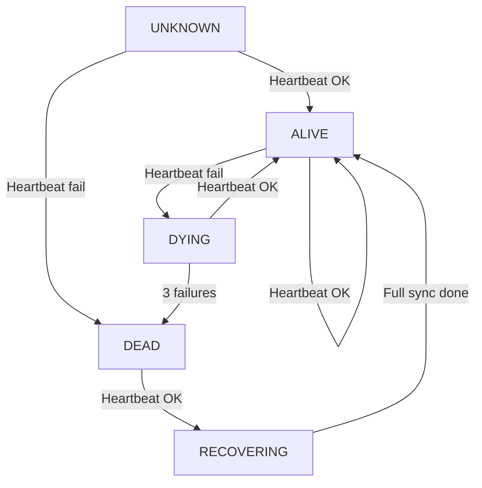
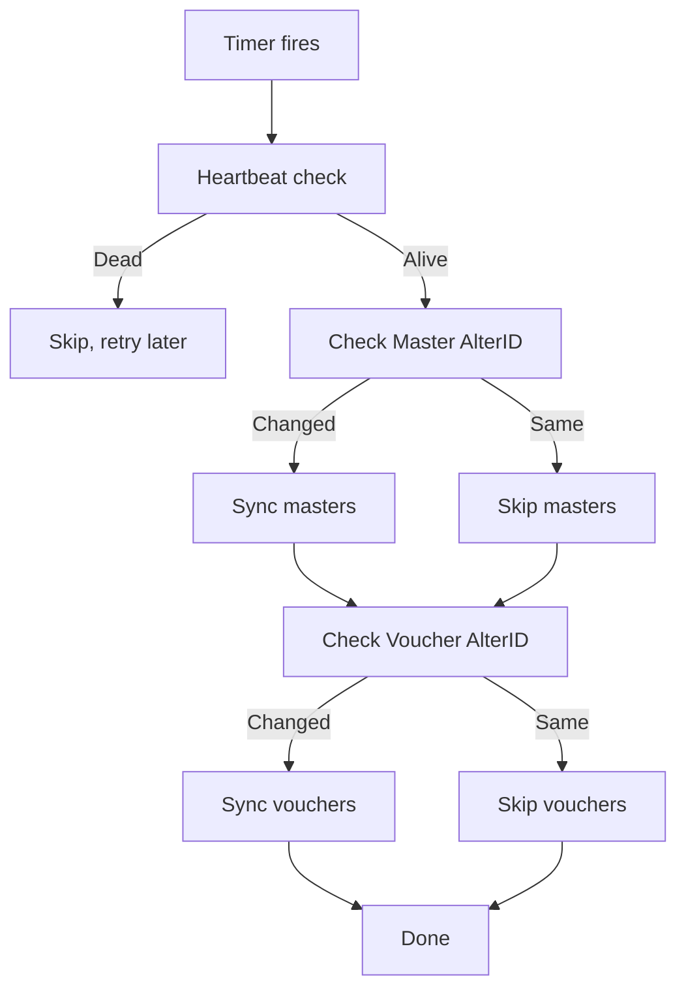

Before you sync, you need to know two things: Is Tally alive? And has anything changed? Answering these questions cheaply -- without pulling actual data -- is what heartbeat and change detection are for.

## The Heartbeat: Is Tally Alive?

Tally is a desktop application. It gets closed at the end of the day, crashes occasionally, and sometimes gets minimized to the taskbar and forgotten. Your connector needs to know whether it's worth attempting a sync.

### The $$CmpLoaded Function

The cheapest possible check. This function returns the name of the currently loaded company (or an error if nothing is loaded):

```xml
<ENVELOPE>
  <HEADER>
    <VERSION>1</VERSION>
    <TALLYREQUEST>Export</TALLYREQUEST>
    <TYPE>Function</TYPE>
    <ID>$$CmpLoaded</ID>
  </HEADER>
  <BODY>
    <DESC>
      <STATICVARIABLES>
        <SVEXPORTFORMAT>
          $$SysName:XML
        </SVEXPORTFORMAT>
      </STATICVARIABLES>
    </DESC>
  </BODY>
</ENVELOPE>
```

**Response when Tally is running with a company loaded:**
```xml
<ENVELOPE>
  <RESULT>ABC Pharma Pvt Ltd</RESULT>
</ENVELOPE>
```

**Response when Tally is running but no company loaded:**
```xml
<ENVELOPE>
  <RESULT></RESULT>
</ENVELOPE>
```

**No response (timeout):** Tally is not running or the port is unreachable.

### Heartbeat Interval

Poll every **60 seconds**. That's frequent enough to detect outages quickly without adding any meaningful load:

```toml
[sync]
heartbeat_interval_seconds = 60
```

### State Machine



Key transitions:

- **ALIVE -> DYING**: One missed heartbeat. Don't panic -- Tally might just be busy processing a large export.
- **DYING -> DEAD**: Three consecutive misses. Tally is down.
- **DEAD -> RECOVERING**: Tally came back. Trigger a reconciliation before resuming incremental sync (data may have been entered offline or a backup restored).

:::tip
Don't start syncing the instant Tally comes back online. Give it 10-15 seconds to finish loading the company and stabilize. A premature sync request might get an error or incomplete data.
:::

## Change Detection: Has Anything Changed?

Once you know Tally is alive, the next question is whether there's new data to sync. Pulling all stock items every 5 minutes "just in case" is wasteful. Instead, check the AlterID counters.

### The AlterID Functions

```xml
<!-- Check master changes -->
<ENVELOPE>
  <HEADER>
    <VERSION>1</VERSION>
    <TALLYREQUEST>Export</TALLYREQUEST>
    <TYPE>Function</TYPE>
    <ID>$$MaxMasterAlterID</ID>
  </HEADER>
  <BODY>
    <DESC>
      <STATICVARIABLES>
        <SVCURRENTCOMPANY>
          ##CompanyName##
        </SVCURRENTCOMPANY>
      </STATICVARIABLES>
    </DESC>
  </BODY>
</ENVELOPE>
```

Same pattern for `$$MaxVoucherAlterID`.

**Response:**
```xml
<ENVELOPE>
  <RESULT>5003</RESULT>
</ENVELOPE>
```

Compare this with your stored watermark:

```
Watermark: 5000
Current:   5003
→ 3 changes detected, trigger sync

Watermark: 5003
Current:   5003
→ No changes, skip sync
```

## Polling Intervals

Different data types need different polling frequencies:

| Data Type | Poll Interval | Rationale |
|---|---|---|
| Heartbeat | 60 seconds | Detect outages quickly |
| Voucher AlterID | 1-2 minutes | Vouchers change constantly during the workday |
| Master AlterID | 5 minutes | Masters change rarely |
| Reports | 15 minutes | Expensive to pull, OK to be slightly stale |

```toml
[sync]
heartbeat_interval_seconds = 60
voucher_interval_seconds = 60
master_interval_seconds = 300
report_interval_seconds = 900
```

### Why Not Shorter?

You might think: why not check every 10 seconds? Because:

1. **Tally overhead** -- Each function call is cheap but not free. 6 calls per minute (heartbeat + 2 AlterIDs per company) is fine. 60 calls per minute starts adding up.
2. **Network noise** -- On slow machines (and many stockists run Tally on modest hardware), frequent polling can cause noticeable slowdowns.
3. **Diminishing returns** -- The difference between 1-minute and 10-second detection is irrelevant for a system that's eventually consistent anyway.

### Why Not Longer?

The sales fleet needs near-real-time stock visibility. If a Purchase Invoice is entered at 10:00 AM and the stock update doesn't reach the central DB until 10:15, a salesman might sell stock that's actually available but not yet reflected.

1-minute voucher polling is the sweet spot: fast enough for practical real-time, gentle enough on Tally.

## Only Sync When Changed

This is the key optimization. The flow for a typical sync cycle:



On a quiet afternoon when no one is using Tally, this entire cycle is:

1. One heartbeat request (20ms)
2. One master AlterID check (20ms)
3. One voucher AlterID check (20ms)

Total: ~60ms, three tiny HTTP requests, zero data transferred. Your connector just confirmed "nothing changed" in less time than it takes to blink.

## Multi-Company Polling

If the connector manages multiple companies, poll them in sequence:

```
Check Company 1 AlterIDs
Check Company 2 AlterIDs
Check Company 3 AlterIDs
→ Sync only the ones that changed
```

This keeps the polling overhead linear with company count, but only triggers actual data sync where needed.

:::caution
Don't poll all companies in parallel. Tally processes requests sequentially anyway (single-threaded server), so parallel requests just queue up and add confusion.
:::
