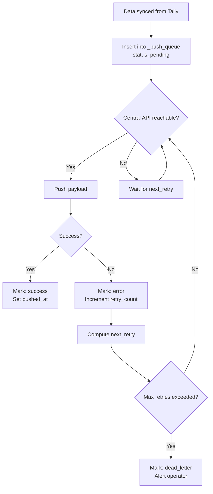

Your connector sits between two systems: Tally (reliable, local) and the central API (remote, sometimes unreachable). When the internet goes down, the connector can't push data upstream. But it shouldn't stop syncing from Tally. It should queue changes locally and push them when connectivity returns.

This is the push queue.

## Why You Need a Queue

Without a queue:
```
Tally → Connector → Central API
                      ↓
                   API down!
                      ↓
                   Data lost.
```

With a queue:
```
Tally → Connector → SQLite Queue
                      ↓
                   (retry later)
                      ↓
                   Central API ✓
```

The queue gives you **eventual consistency**. Data always flows from Tally to the local cache immediately. The push to central happens when it can.

## The _push_queue Table

```sql
CREATE TABLE _push_queue (
    id           INTEGER PRIMARY KEY
                   AUTOINCREMENT,
    entity_type  TEXT NOT NULL,
    entity_guid  TEXT NOT NULL,
    operation    TEXT NOT NULL,
    payload_json TEXT NOT NULL,
    created_at   TIMESTAMP
                   DEFAULT CURRENT_TIMESTAMP,
    pushed_at    TIMESTAMP,
    push_status  TEXT DEFAULT 'pending',
    retry_count  INTEGER DEFAULT 0,
    next_retry   TIMESTAMP,
    error_message TEXT
);

CREATE INDEX idx_push_status
  ON _push_queue(push_status);
CREATE INDEX idx_push_retry
  ON _push_queue(next_retry);
```

### Column Breakdown

| Column | Purpose |
|---|---|
| `entity_type` | What kind of thing: `mst_stock_item`, `trn_voucher`, etc. |
| `entity_guid` | Tally's GUID for this object |
| `operation` | `upsert` or `delete` |
| `payload_json` | The full serialized record |
| `push_status` | `pending`, `success`, `error`, `dead_letter` |
| `retry_count` | How many times we've tried |
| `next_retry` | When to try again |

## Queue Lifecycle



## Exponential Backoff

When a push fails, don't immediately retry. Use exponential backoff to avoid hammering a failing server:

```toml
[writeback]
max_retry = 5
retry_backoff_seconds = [5, 30, 120, 600, 3600]
```

| Attempt | Delay | Wall Clock |
|---|---|---|
| 1st retry | 5 seconds | Almost immediate |
| 2nd retry | 30 seconds | Half a minute |
| 3rd retry | 2 minutes | Intermittent issue? |
| 4th retry | 10 minutes | Serious outage |
| 5th retry | 1 hour | Prolonged downtime |
| Give up | -- | Mark as dead letter |

```sql
-- Compute next retry time
UPDATE _push_queue
SET next_retry = datetime(
  'now',
  '+' || retry_backoff_seconds || ' seconds'
),
retry_count = retry_count + 1
WHERE id = ?;
```

:::tip
Add a small random jitter (0-10%) to the backoff delay. If the central API comes back online and 50 connectors simultaneously retry, the thundering herd will knock it down again. Jitter spreads the load.
:::

## Deduplication

What happens when the same object changes twice before the first push succeeds? You get two queue entries for the same entity:

```
id=1: entity=stock_item, guid=ABC, operation=upsert
id=2: entity=stock_item, guid=ABC, operation=upsert
```

Pushing both wastes bandwidth. The second one overwrites the first anyway. Deduplicate before pushing:

```sql
-- Keep only the latest entry per entity
DELETE FROM _push_queue
WHERE id NOT IN (
  SELECT MAX(id)
  FROM _push_queue
  WHERE push_status = 'pending'
  GROUP BY entity_type, entity_guid
);
```

Or, simpler: when inserting a new entry, check if a pending entry for the same entity exists. If so, update its payload instead of inserting a new row:

```sql
INSERT INTO _push_queue
  (entity_type, entity_guid, operation,
   payload_json)
VALUES (?, ?, ?, ?)
ON CONFLICT (entity_type, entity_guid)
  WHERE push_status = 'pending'
DO UPDATE SET
  payload_json = excluded.payload_json,
  created_at = CURRENT_TIMESTAMP;
```

:::caution
Be careful with deduplication when the operations differ. If entry #1 is `upsert` and entry #2 is `delete`, you must NOT deduplicate them -- the delete should win. Always check the operation type.
:::

## Push Batching

Don't push one record at a time. Batch multiple queue entries into a single API call:

```json
{
  "batch": [
    {
      "type": "mst_stock_item",
      "op": "upsert",
      "data": { ... }
    },
    {
      "type": "trn_voucher",
      "op": "upsert",
      "data": { ... }
    }
  ]
}
```

Aim for batches of 50-100 records. This reduces HTTP overhead and lets the central API process them efficiently.

```toml
[central]
push_batch_size = 50
push_interval_seconds = 15
compression = true
```

Enable gzip compression for push payloads. A batch of 50 vouchers can be 100KB+ as JSON. Gzipped, it's 10-20KB.

## Monitoring the Queue

Keep an eye on queue depth. A growing queue means pushes are failing:

```sql
-- Queue health check
SELECT
  push_status,
  COUNT(*) as count,
  MIN(created_at) as oldest
FROM _push_queue
GROUP BY push_status;
```

| Status | Count | Oldest | Interpretation |
|---|---|---|---|
| pending | 5 | 2 min ago | Normal |
| pending | 500 | 3 hrs ago | API is down |
| error | 10 | 1 day ago | Persistent failures |
| dead_letter | 3 | 1 week ago | Needs manual intervention |

Set up alerts:
- **Warning**: Queue depth > 100 for > 15 minutes
- **Critical**: Queue depth > 1000 or oldest pending > 1 hour
- **Dead letters**: Any dead letter entry needs human attention

## Dead Letter Handling

When a push entry exhausts all retries, it becomes a dead letter. These need manual investigation:

```sql
SELECT
  entity_type, entity_guid,
  error_message, retry_count
FROM _push_queue
WHERE push_status = 'dead_letter';
```

Common causes:
- Central API schema changed (payload rejected)
- Entity references data that doesn't exist upstream
- Authentication expired
- Payload too large

:::danger
Never silently discard dead letters. They represent data that should be in the central database but isn't. Build a mechanism to retry dead letters after manual investigation (perhaps a CLI command or API endpoint).
:::
