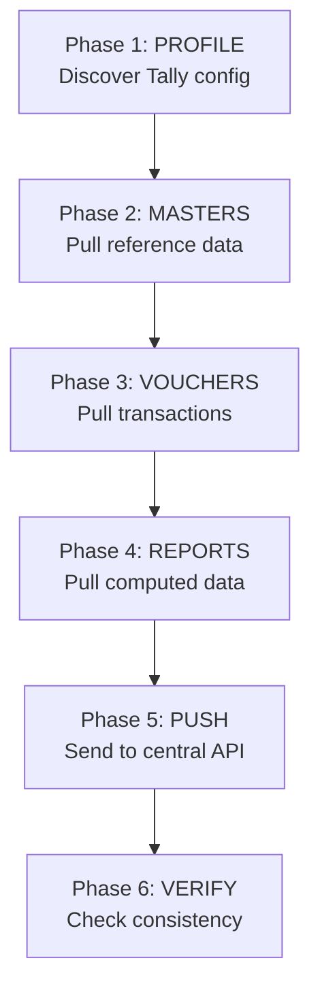

Every sync cycle follows six phases, executed in order. Each phase depends on the one before it. Skip a phase or run them out of order, and you'll get incomplete or incorrect data.

## The Pipeline



Let's walk through each one.

---

## Phase 1: Profile

**What it does**: Discovers the Tally environment -- version, features enabled, loaded TDLs, company date ranges, and UDFs.

**Data pulled**:
- Tally version (TallyPrime 7.0 vs Tally.ERP 9)
- Company list with GUID, name, date ranges
- Feature flags: multi-godown, batch tracking, cost centres, orders
- Loaded TDL/TCP files
- Custom voucher types

**Stored in**: `_tally_profile` table

**Dependencies**: None. This is the starting point.

**When it runs**: On first start, then periodically (every 24h) or when triggered manually.

**Error handling**:

| Error | Action |
|---|---|
| Tally not responding | Retry with backoff. Cannot proceed. |
| No company loaded | Wait and retry. Alert user. |
| Unknown Tally version | Log warning, proceed with XML-only mode |

:::tip
Profile is cheap -- a handful of XML requests that return small responses. Run it liberally. If the profile changes (new TDL loaded, feature toggled), your connector adapts automatically.
:::

---

## Phase 2: Masters

**What it does**: Pulls all master (reference) data from Tally. These are the relatively static entities that transactions reference.

**Data pulled**:
- Stock Items (with GST details, batch settings)
- Stock Groups and Stock Categories
- Godowns (warehouses/locations)
- Ledgers (parties, sales accounts, tax accounts)
- Units of Measure
- Voucher Types
- Currencies
- Price Lists / Standard Prices
- Bill of Materials (if BOM is enabled)

**Stored in**: `mst_*` tables in SQLite

**Dependencies**: Phase 1 (Profile). The profile tells us which features are enabled, so we know which masters to pull (e.g., skip BOM if `is_bom_enabled = false`).

**When it runs**: Every 5 minutes (configurable).

**Sync mode**: Incremental via AlterID watermark. Full on first run.

**Error handling**:

| Error | Action |
|---|---|
| Partial failure (some collections OK, some fail) | Store what succeeded, retry failed collections next cycle |
| Tally timeout on large collection | Reduce collection size, retry with pagination |
| Unknown XML fields (UDFs) | Store dynamically in `ext_udf_values` |

:::caution
Masters MUST complete before Vouchers. Vouchers reference masters by name (ledger names, stock item names). If a voucher references a ledger that's not in your cache, you can't resolve it. Always sync masters first.
:::

---

## Phase 3: Vouchers

**What it does**: Pulls all transaction data -- the high-volume, frequently-changing vouchers.

**Data pulled**:
- Voucher headers (`trn_voucher`)
- Accounting entries (`trn_accounting`)
- Inventory entries (`trn_inventory`)
- Batch allocations (`trn_batch`)
- Bill allocations (`trn_bill`)
- Cost centre allocations (`trn_cost_centre`)
- Bank allocations (`trn_bank`)

**Stored in**: `trn_*` tables in SQLite

**Dependencies**: Phase 2 (Masters). Stock item names, ledger names, and godown names in vouchers must resolve against cached masters.

**When it runs**: Every 1 minute (configurable).

**Sync mode**: Incremental via AlterID watermark. Date-batched for full sync.

**Error handling**:

| Error | Action |
|---|---|
| Tally freezes on large batch | Reduce batch size, retry day-by-day |
| Voucher references unknown master | Log warning, store voucher anyway, flag for reconciliation |
| XML parse error on specific voucher | Skip voucher, log error, continue with next batch |

This is the heaviest phase. For large companies, see [Batching Strategies](/tally-integartion/sync-engine/batching-strategies/) for how to break it into manageable chunks.

---

## Phase 4: Reports

**What it does**: Pulls Tally-computed reports that can't be derived from raw transactions alone.

**Data pulled**:
- Stock Summary (closing stock per item per godown)
- Batch Summary (stock per batch with expiry)
- Sales Order Outstanding
- Purchase Order Outstanding
- Reorder Status
- Bills Receivable / Payable

**Stored in**: `stock_positions`, `stock_batches`, and report-specific tables

**Dependencies**: Phases 2 and 3. Reports make more sense when you have the underlying masters and vouchers for cross-referencing.

**When it runs**: Every 10-15 minutes (configurable).

**Why not just compute from vouchers?**

:::danger
**Never compute stock position from vouchers.** Tally's Stock Summary accounts for opening balances, valuation methods (FIFO, LIFO, Weighted Average), corrections, and adjustments that your voucher-based computation will miss. See [Stock Position Truth](/tally-integartion/sync-engine/stock-position-truth/) for the full explanation.
:::

**Error handling**:

| Error | Action |
|---|---|
| Report returns empty | May be valid (no stock). Log and proceed. |
| Report format unexpected | Parse what you can, log anomalies |
| Tally timeout on large report | Narrow date range, retry |

---

## Phase 5: Push

**What it does**: Sends accumulated changes to the central API server. Also pushes write-back data (Sales Orders, new Ledgers) from the central system into Tally.

**Data pushed**:
- Changed/new masters (upstream to central API)
- Changed/new vouchers (upstream to central API)
- Report data (upstream to central API)
- Pending Sales Orders (downstream from central API into Tally)
- New party ledgers (downstream into Tally)

**Stored in**: `_push_queue` for upstream, `write_orders` for downstream

**Dependencies**: Phases 2-4 for upstream push. Central API availability for both directions.

**When it runs**: Every 15-30 seconds (configurable).

**Error handling**:

| Error | Action |
|---|---|
| Central API unreachable | Queue locally, retry with exponential backoff |
| Central API rejects payload | Log error, mark as failed, alert |
| Tally rejects write-back | Parse error response, log, retry with adjusted XML |

See [Push Queue](/tally-integartion/sync-engine/push-queue/) for the full queue implementation.

---

## Phase 6: Verify

**What it does**: Compares the connector's state with Tally's state to detect drift, missing records, or inconsistencies.

**Checks performed**:
- Compare master GUIDs: are all Tally masters in our cache?
- Compare stock positions: does our cached Stock Summary match a fresh pull?
- Check AlterID consistency: has the watermark gone backwards?
- Validate outstanding orders: do our tracked orders match Tally's outstanding report?

**Dependencies**: All previous phases. This is the final sanity check.

**When it runs**: During weekly reconciliation. Also triggered when anomalies are detected.

**Error handling**:

| Error | Action |
|---|---|
| GUIDs in cache not in Tally | Mark as deleted, push deletion upstream |
| Stock position mismatch | Tally wins. Update cache from report. |
| AlterID decreased | Trigger full sync. Alert. |

:::tip
Phase 6 is your safety net. Phases 2-4 can miss things (deletions, bulk operations, restores). Phase 6 catches them. It's the reason you can trust incremental sync for the other 167 hours of the week.
:::

---

## Phase Ordering Matters

A quick summary of why the order is strict:

```
Profile  → Tells us WHAT to sync
Masters  → Gives us the REFERENCE data
Vouchers → Gives us the TRANSACTION data
Reports  → Gives us the TRUTH (computed by Tally)
Push     → Sends it all UPSTREAM
Verify   → Makes sure it's all CORRECT
```

Skip Profile and you might pull data for disabled features. Skip Masters and voucher references won't resolve. Skip Reports and your stock positions will be wrong. Skip Verify and drift will accumulate silently.

Run them in order. Every time.
