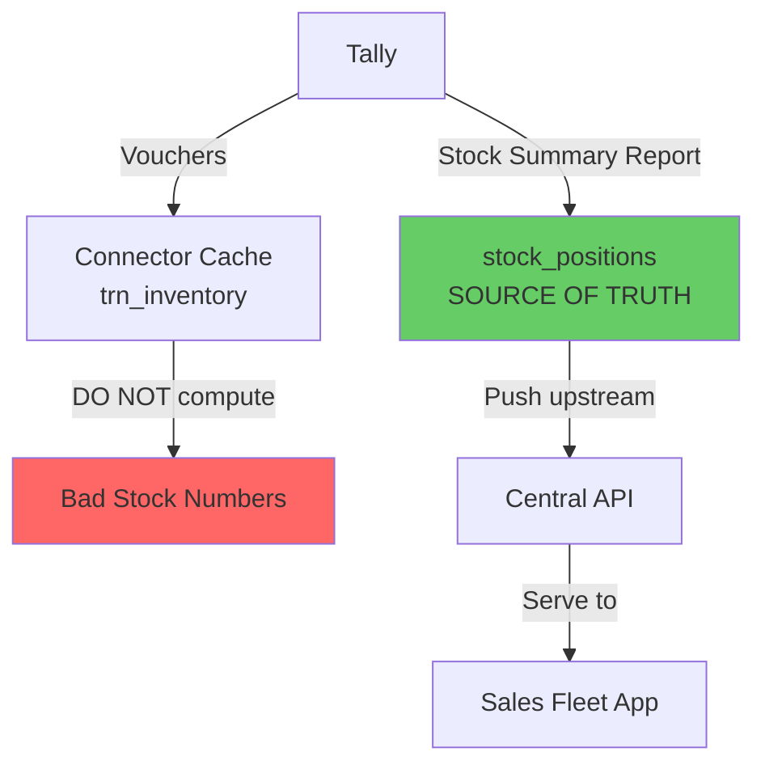

This might be the single most important page in this entire guide. If you take away one thing from our documentation, let it be this:

:::danger
**NEVER compute stock positions from vouchers.** Always pull stock positions from Tally's Stock Summary report. Always. No exceptions.
:::

Let's talk about why.

## The Temptation

It seems logical, right? You have all the vouchers in your database. Each one tells you what stock moved in or out. Just add them up:

```sql
-- DON'T DO THIS
SELECT
  item,
  SUM(quantity) as computed_stock
FROM trn_inventory
JOIN trn_voucher v ON trn_inventory.guid = v.guid
WHERE v.is_order_voucher = 0
  AND v.is_cancelled = 0
GROUP BY item;
```

Simple. Elegant. **Wrong.**

## Why Voucher-Based Computation Fails

### Reason 1: Opening Balances

Every stock item in Tally can have an opening balance set in its master record:

```xml
<STOCKITEM NAME="Paracetamol 500mg">
  <OPENINGBALANCE>500 Strip</OPENINGBALANCE>
  <OPENINGVALUE>-25000.00</OPENINGVALUE>
</STOCKITEM>
```

This opening balance represents stock that existed *before* the first voucher in the current financial year. If you only sum voucher movements, you're missing this anchor.

"Fine," you say, "I'll add the opening balance." Sure. But do you know which financial year's opening balance to use? What if the stockist changed it mid-year? What if it was imported from a previous company split?

### Reason 2: Valuation Methods

Tally supports multiple stock valuation methods:

- **FIFO** (First In, First Out)
- **LIFO** (Last In, First Out)
- **Weighted Average**
- **Specific Identification**
- **Standard Cost**

The stock *quantity* might be the same across methods, but the stock *value* varies significantly. Tally's Stock Summary uses the valuation method configured for each item. Your SQL query has no idea which method to apply.

### Reason 3: Stock Journal Corrections

Accountants use Stock Journals to make corrections:

- Physical stock count adjustment
- Damage write-offs
- Free sample allocations
- Manufacturing entries

These show up as vouchers, but they're not "regular" transactions. They're corrections to make Tally's books match physical reality. If your voucher parsing misclassifies even one of these, your computation drifts.

### Reason 4: Multi-Godown Transfers

Stock Journal transfers between godowns don't change the total stock -- they just move it. But if your query doesn't handle the transfer correctly (item goes out of Godown A, into Godown B), you might double-count or miss the movement.

### Reason 5: Credit/Debit Notes with Stock

When a customer returns goods (Credit Note) or the stockist returns to supplier (Debit Note), stock moves. But the flag combinations (`is_inventory_voucher`, stock impact) can be tricky. Miss one case, and your count drifts.

### Reason 6: Order Vouchers

If you forget to filter `is_order_voucher = 0`, Sales Orders and Purchase Orders get included in your sum. These represent commitments, not actual stock movement. A single mistake here can show thousands of phantom units.

## The Solution: Trust Tally's Reports

Tally's Stock Summary report is computed by Tally's own engine, which handles ALL of the above correctly. It's the same number the stockist sees when they open the Stock Summary in Tally.

### Pulling the Stock Summary

```xml
<ENVELOPE>
  <HEADER>
    <VERSION>1</VERSION>
    <TALLYREQUEST>Export</TALLYREQUEST>
    <TYPE>Data</TYPE>
    <ID>Stock Summary</ID>
  </HEADER>
  <BODY>
    <DESC>
      <STATICVARIABLES>
        <SVCURRENTCOMPANY>
          ##CompanyName##
        </SVCURRENTCOMPANY>
        <SVEXPORTFORMAT>
          $$SysName:XML
        </SVEXPORTFORMAT>
        <SVFROMDATE>20250401</SVFROMDATE>
        <SVTODATE>20260331</SVTODATE>
      </STATICVARIABLES>
    </DESC>
  </BODY>
</ENVELOPE>
```

This returns the closing stock position per item, accounting for everything: opening balances, all voucher types, valuation methods, corrections.

### The stock_positions Table

```sql
CREATE TABLE stock_positions (
    id            UUID PRIMARY KEY,
    tenant_id     UUID NOT NULL,
    stock_item_id UUID NOT NULL,
    godown        TEXT NOT NULL
                    DEFAULT 'Main Location',
    closing_qty   DECIMAL NOT NULL,
    closing_value DECIMAL NOT NULL,
    closing_rate  DECIMAL,
    sales_order_pending_qty
                  DECIMAL DEFAULT 0,
    purchase_order_pending_qty
                  DECIMAL DEFAULT 0,
    available_qty DECIMAL GENERATED ALWAYS
      AS (closing_qty
        - COALESCE(
            sales_order_pending_qty, 0
          )) STORED,
    as_of_date    DATE NOT NULL,
    synced_at     TIMESTAMPTZ DEFAULT now(),
    UNIQUE(
      tenant_id, stock_item_id,
      godown, as_of_date
    )
);
```

Notice the `available_qty` computed column. It subtracts pending sales orders from closing stock to give you the *actually available* quantity. This is what the sales fleet should see.

## The Correct Architecture



The voucher data (`trn_inventory`) is still valuable -- you need it for transaction history, audit trails, batch tracking, and movement analysis. But for answering "how much stock do we have right now?" the answer comes exclusively from the Stock Summary report stored in `stock_positions`.

## When to Pull Stock Positions

Stock positions should be refreshed:

| Trigger | Frequency |
|---|---|
| After voucher sync detects changes | Every 1-5 minutes |
| Scheduled refresh | Every 15 minutes |
| Weekly reconciliation | Weekly |
| On-demand (API request) | As needed |

The report pull is moderately expensive (Tally has to compute it), so don't do it every 30 seconds. Every 15 minutes is a good default, with an extra pull when you know vouchers changed.

## What Voucher Data IS Good For

Don't throw away voucher-level inventory data. It serves different purposes:

| Use Case | Data Source |
|---|---|
| Current stock levels | `stock_positions` (report) |
| "What did we sell today?" | `trn_inventory` (vouchers) |
| "Which batches went where?" | `trn_batch` (vouchers) |
| Movement analysis | `trn_inventory` (vouchers) |
| Demand forecasting | `trn_inventory` (vouchers) |
| Available-to-promise | `stock_positions` (report) |

:::tip
Think of it this way: `stock_positions` tells you WHERE YOU ARE. `trn_inventory` tells you HOW YOU GOT THERE. Both are valuable. But when someone asks "do we have stock?", always answer from `stock_positions`.
:::

## The Exception That Proves the Rule

There's exactly one scenario where you might compute stock from vouchers: when Tally's Stock Summary report is unavailable (Tally is down) and you need an estimate. In that case, your last known `stock_positions` plus any vouchers synced since then gives you an approximation.

But mark it clearly as an estimate, not a fact. And replace it with the real report data the moment Tally comes back online.
