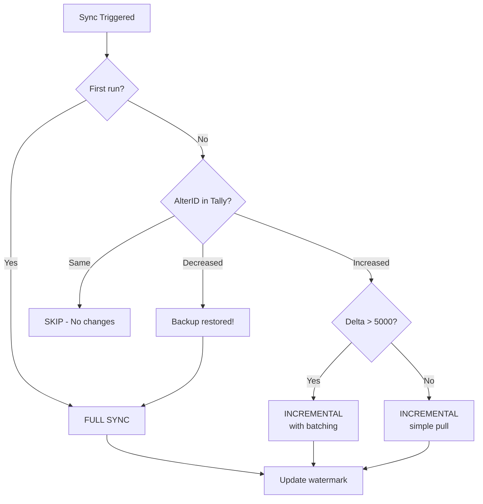

Your connector needs two gears: a slow, thorough one and a fast, efficient one. Full sync is the bulldozer. Incremental sync is the scalpel. Knowing when to use each is the difference between a connector that freezes Tally for hours and one that hums along unnoticed.

## Full Sync

A full sync pulls **everything** from Tally. All masters, all vouchers, all reports. It's slow, it's heavy, and it's absolutely necessary in certain situations.

### When to Full Sync

- **First run** -- There's no local cache yet. You need everything.
- **After data repair** -- If the stockist restored a backup, re-entered deleted vouchers, or had their CA "fix" things, your local cache may be stale.
- **Weekly reconciliation** -- Even with perfect incremental sync, drift happens. A weekly full sync catches what incremental missed.
- **AlterID went backwards** -- If the max AlterID in Tally is *lower* than your watermark, someone restored an older backup. Your cache is ahead of Tally. Full sync is the only safe recovery.

### How Full Sync Works

```
1. Pull ALL masters
   (stock items, godowns, ledgers, units, etc.)
2. Pull ALL vouchers
   (batched by date range)
3. Store everything in SQLite
   (upsert by GUID)
4. Record max(alter_id) as watermark
5. Mark any local records NOT in Tally
   as deleted
```

### The Cost

For a typical stockist with 20,000 vouchers:

| Metric | Value |
|---|---|
| Time | 5-15 minutes |
| Tally impact | Moderate (UI sluggish) |
| Network | 50-200 MB XML |

For a large stockist with 200,000+ vouchers:

| Metric | Value |
|---|---|
| Time | 1-3 hours |
| Tally impact | Heavy (may freeze UI) |
| Network | 500 MB - 2 GB XML |

:::caution
Full sync on large companies MUST use day-by-day batching. Pulling a full year's vouchers in one request can freeze Tally indefinitely. See [Batching Strategies](/tally-integartion/sync-engine/batching-strategies/).
:::

## Incremental Sync

Incremental sync pulls only what changed since the last sync. It relies on Tally's AlterID mechanism -- a monotonically increasing counter that tracks every change.

### When to Incremental Sync

- **Every sync cycle after the first** -- This is your default mode.
- **When AlterID increased** -- If the max AlterID in Tally is higher than your watermark, changes exist.
- **When AlterID is unchanged** -- Skip the sync entirely. Nothing changed.

### How Incremental Sync Works

```
1. Check Tally's current max AlterID
2. Compare with stored watermark
3. If unchanged → skip (nothing changed)
4. If increased → pull objects where
   AlterID > watermark
5. Upsert changed records into SQLite
6. Update watermark
7. Push deltas to central API
```

### The Cost

| Metric | Value |
|---|---|
| Time | 1-30 seconds |
| Tally impact | Negligible |
| Network | 1-100 KB XML |

That's the beauty of incremental sync. On a quiet day with no changes, it's literally a single HTTP request that returns "no changes."

## Decision Tree

Use this to decide which sync mode to run:



## The Hybrid Approach

In practice, you want both running on different schedules:

| Sync Type | Frequency | Purpose |
|---|---|---|
| Incremental (vouchers) | Every 1 min | Near-real-time |
| Incremental (masters) | Every 5 min | Catch edits |
| Full reconciliation | Weekly | Drift detection |
| Full sync | On demand | Recovery |

The incremental sync runs continuously during the workday. The full reconciliation runs on Sunday night (or whenever the stockist isn't using Tally). On-demand full sync is triggered manually when something looks wrong.

## When Incremental Fails

There are known scenarios where incremental sync can miss things:

1. **Deletions** -- Tally doesn't have a "deleted objects" collection. If someone deletes a voucher, the AlterID for other objects increases, but the deleted object simply vanishes. Your incremental pull won't see it.

2. **Bulk operations** -- If the stockist does a "Delete All" or "Alter All" operation that touches thousands of records, incremental might be slower than a fresh full sync.

3. **Company restore** -- If the Tally company data is restored from a backup, AlterIDs can go backwards or reset. Your watermark becomes invalid.

:::tip
This is why weekly reconciliation is non-negotiable. Incremental sync is an optimization. Full sync is the source of truth. See [Weekly Reconciliation](/tally-integartion/sync-engine/weekly-reconciliation/) for how we catch what incremental misses.
:::

## Configuration

```toml
[sync]
# Default mode: "incremental" or "full"
default_mode = "incremental"

# Force full sync on first start
full_sync_on_start = true

# Weekly full reconciliation
full_reconcile_interval = "168h"

# Incremental intervals
master_interval_seconds = 300
voucher_interval_seconds = 60
```

The connector should log which mode it's using and why. If it falls back from incremental to full, that's worth an alert -- something unusual happened in Tally.
