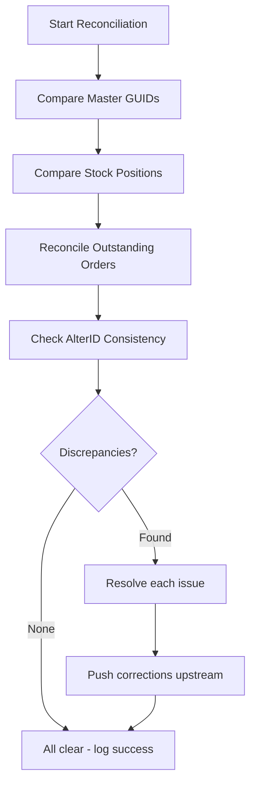
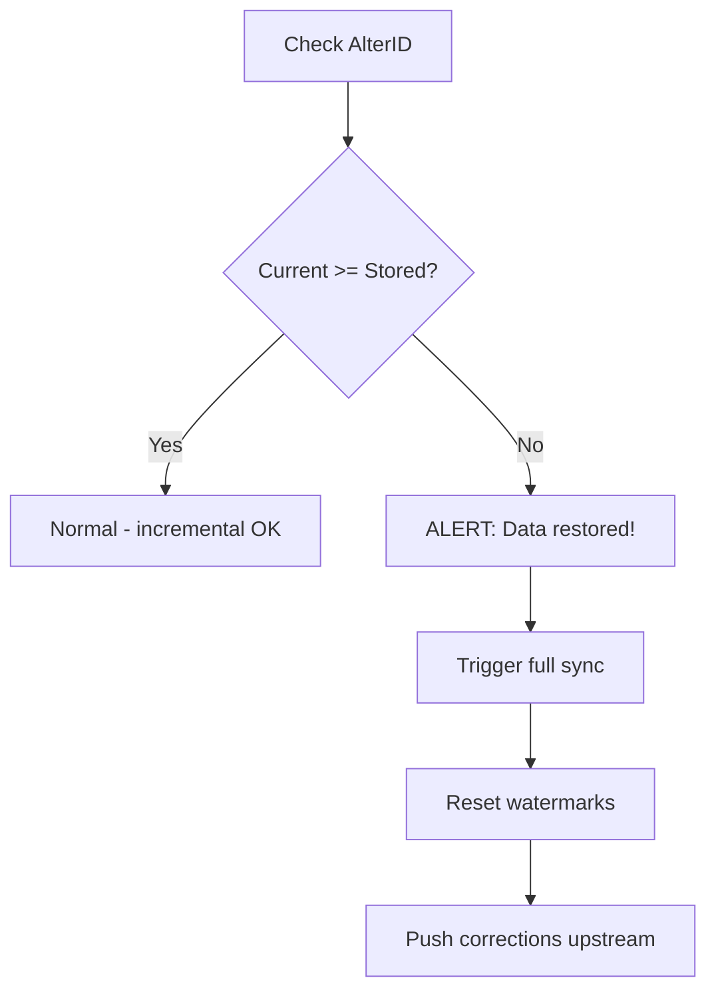

Incremental sync is fast and efficient, but it has a blind spot: **deletions**. When someone deletes a voucher or master in Tally, there's no tombstone, no "deleted" flag, no notification. The object simply vanishes. Your incremental sync, which only looks for objects with AlterID > watermark, will never notice it's gone.

That's why we reconcile.

## What Weekly Reconciliation Does

Once a week (or more often for high-value data), the connector runs a thorough comparison between its local cache and Tally's current state:



Let's go through each check.

## Check 1: Master GUID Comparison

Pull the complete list of GUIDs for each master type from Tally, then compare against your local cache.

```
Tally has:   {A, B, C, D, E}
Local cache: {A, B, C, F}

New in Tally:     {D, E}  → pull and store
Deleted in Tally: {F}     → mark deleted locally
```

The request to get all GUIDs is lightweight -- you only need Name and GUID, not the full object:

```xml
<COLLECTION NAME="AllStockGUIDs">
  <TYPE>StockItem</TYPE>
  <NATIVEMETHOD>Name, GUID</NATIVEMETHOD>
</COLLECTION>
```

### What to do with discrepancies

| Scenario | Action |
|---|---|
| GUID in Tally, not in cache | Pull full object, store locally |
| GUID in cache, not in Tally | Mark as deleted, push deletion upstream |
| GUID in both but name changed | Update local record (item was renamed) |

:::tip
Master renames are sneaky. Tally keeps the same GUID when a stock item or ledger is renamed, but the `Name` field changes. Your GUID comparison will catch that the object still exists, but a name comparison will flag the rename. Track both.
:::

## Check 2: Stock Position Verification

Pull Tally's Stock Summary report and compare with your cached stock positions.

```sql
-- Your cached position
SELECT item, godown, closing_qty
FROM stock_positions
WHERE as_of_date = '2026-03-25';

-- Compare with fresh Tally report
-- Any mismatch means drift
```

Mismatches can happen because:

- A voucher was deleted (stock moved back/forward)
- A voucher was altered (quantity changed)
- An opening balance was corrected
- Your voucher-based computation diverged from Tally's

:::danger
**Tally's Stock Summary always wins.** When there's a mismatch, update your cached position from the report. Never trust your own computation over Tally's reported values. See [Stock Position Truth](/tally-integartion/sync-engine/stock-position-truth/).
:::

## Check 3: Outstanding Order Reconciliation

Pull Tally's Sales Order Outstanding report and compare with your tracked orders.

```
Tally says outstanding: {SO-001, SO-003, SO-005}
We track as open:       {SO-001, SO-002, SO-003}

Fulfilled in Tally:     {SO-002} → mark as fulfilled
New in Tally:           {SO-005} → pull and track
```

This is especially important for write-back scenarios. If someone fulfilled an order directly in Tally (not through the connector), you need to catch that.

## Check 4: AlterID Consistency

Compare your stored watermarks with Tally's current max AlterIDs:

```
Stored master watermark:  5000
Tally max master AlterID: 5200
→ Normal: 200 changes since last full sync

Stored voucher watermark: 12000
Tally max voucher AlterID: 11500
→ ALERT: AlterID went backwards!
```

When AlterID decreases, it means someone restored a Tally backup. This is a critical event:

1. **Log it prominently** -- This is an anomaly worth investigating
2. **Trigger full sync** -- Your cache may have data that no longer exists in Tally
3. **Reset watermarks** -- After full sync, store the new (lower) watermarks
4. **Alert the operator** -- They should know their Tally data was restored



## The Reconciliation Schedule

```toml
[sync]
# Full reconciliation interval
full_reconcile_interval = "168h"  # weekly

# Or use a cron-like schedule
# reconcile_schedule = "0 2 * * 0"  # Sunday 2 AM
```

Run reconciliation when Tally is least busy -- typically Sunday night or early morning before the stockist starts work.

For high-value data (stock positions, outstanding orders), you might reconcile daily instead of weekly:

| Data Type | Reconcile Frequency |
|---|---|
| Master GUIDs | Weekly |
| Stock positions | Daily |
| Outstanding orders | Daily |
| AlterID consistency | Every sync cycle |

:::caution
Reconciliation is heavier than incremental sync because it pulls complete datasets for comparison. Don't run it during business hours if the company is large. Schedule it for off-peak times.
:::

## Reconciliation Log

Every reconciliation run should produce a summary:

```sql
INSERT INTO _sync_log (
  sync_type, entity_type,
  records_pulled, status, error_message
) VALUES (
  'reconciliation', 'masters',
  243, 'success',
  'Found: 2 new, 1 deleted, 0 renamed'
);
```

Over time, this log tells you how much drift your incremental sync misses. If you're finding lots of discrepancies every week, something is wrong with incremental -- maybe your watermark logic has a bug, or the stockist is doing unusual bulk operations.

## When to Force a Full Sync Instead

Sometimes reconciliation reveals so many discrepancies that it's faster to just do a fresh full sync:

```
if discrepancies > 10% of total records:
    trigger_full_sync()
else:
    resolve_individually()
```

This is a judgment call. A few missing records can be patched individually. Hundreds of mismatches mean your cache is fundamentally stale.
