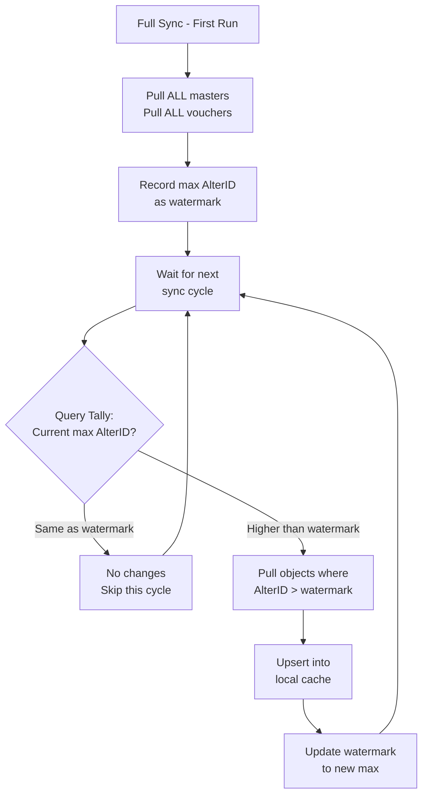
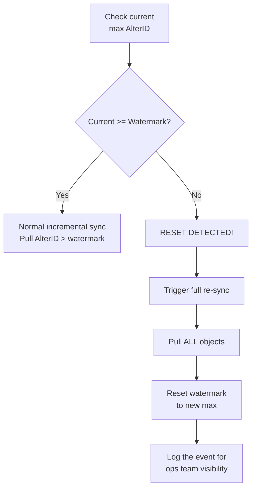

If there's one thing that makes incremental sync with Tally possible, it's the AlterID. It's deceptively simple — a single integer that goes up every time anything changes — but using it correctly requires understanding its quirks.

## What Is AlterID?

Every object in Tally — every ledger, stock item, voucher, godown, unit, group — has an `AlterID`. It's a **monotonically increasing integer** that's shared across **all objects in a company**.

Think of it as a global version counter for the entire company database.

```
Event                        AlterID
─────────────────────────────────────
Create Stock Item "Aspirin"     → 1001
Create Ledger "ABC Medical"     → 1002
Alter Stock Item "Aspirin"      → 1003
Create Voucher (Sales)          → 1004
Delete Ledger "Old Supplier"    → 1005
Create Stock Item "Ibuprofen"   → 1006
```

Notice:
- Every operation increments the counter
- Creates, alters, AND deletes all bump it
- It spans all object types (masters + vouchers share the same counter)
- It never goes down (under normal circumstances)

## AlterID vs MasterID

Don't confuse these two — they serve different purposes:

| Property | AlterID | MasterID |
|----------|---------|----------|
| **Changes on** | Every create, alter, or delete of ANY object | Only assigned once, on creation |
| **Scope** | Global across all objects in the company | Per-object, unique within type |
| **Purpose** | Change detection | Object identification |
| **Survives rename** | Gets a new AlterID | Same MasterID |
| **Resets** | After data repair (see below) | Never (under normal use) |

## The Watermark Pattern

AlterID is the foundation of incremental sync. The pattern is elegant:



### Querying the Current Max AlterID

Tally provides two built-in functions to check the current maximum:

- `$$MaxMasterAlterID` — highest AlterID among all master objects
- `$$MaxVoucherAlterID` — highest AlterID among all voucher objects

You can query these via XML:

```xml
<ENVELOPE>
  <HEADER>
    <VERSION>1</VERSION>
    <TALLYREQUEST>Export</TALLYREQUEST>
    <TYPE>Function</TYPE>
    <ID>$$MaxMasterAlterID</ID>
  </HEADER>
  <BODY>
    <DESC>
      <STATICVARIABLES>
        <SVCURRENTCOMPANY>
          Stockist Pharma Pvt Ltd
        </SVCURRENTCOMPANY>
      </STATICVARIABLES>
    </DESC>
  </BODY>
</ENVELOPE>
```

This returns the current counter value. Compare it to your stored watermark:

```
Stored watermark:    5042
Current AlterID:     5042  → No changes
Current AlterID:     5089  → 47 changes since last sync
```

### Pulling Changed Objects

Once you know changes exist, pull only the modified objects:

```xml
<COLLECTION NAME="ModifiedStock"
            ISMODIFY="No">
  <TYPE>StockItem</TYPE>
  <FETCH>
    Name, Parent, GUID,
    MasterId, AlterId
  </FETCH>
  <FILTER>RecentlyModified</FILTER>
</COLLECTION>
<SYSTEM TYPE="Formulae"
        NAME="RecentlyModified">
  $$FilterGreater:$AlterId:5042
</SYSTEM>
```

This tells Tally: "Give me only stock items whose AlterID is greater than 5042." Efficient — only changed objects travel over the wire.

## Storing the Watermark

Keep your watermarks in a sync state table:

```sql
CREATE TABLE _sync_state (
  company_guid          TEXT PRIMARY KEY,
  company_name          TEXT NOT NULL,
  last_master_alter_id  INTEGER DEFAULT 0,
  last_voucher_alter_id INTEGER DEFAULT 0,
  last_full_sync        TIMESTAMP,
  last_incr_sync        TIMESTAMP
);
```

:::tip
Store separate watermarks for masters and vouchers. Masters change infrequently (a few times a day). Vouchers change constantly (every sale, purchase, receipt). This lets you poll vouchers more aggressively without re-checking masters every time.
:::

## The AlterID Reset Problem

Here's the gotcha that catches everyone eventually:

:::danger
When a CA runs **Gateway > Data > Repair** to fix data corruption, Tally can **reset or reassign AlterIDs**. Your watermark becomes meaningless. Objects that were at AlterID 5000 might now be at AlterID 3000.
:::

Similarly, AlterIDs reset when:
- A company is **restored from backup**
- A company is **split** (new companies get fresh counters)
- Data files are **repaired** after corruption

### Detecting the Reset

How do you know AlterIDs have reset? The current max AlterID is **lower** than your stored watermark:

```
Stored watermark:    5042
Current AlterID:     2891  → RESET DETECTED!
```



### Handling the Reset

When you detect a reset:

1. **Trigger a full re-sync** — pull everything
2. **Reset your watermark** to the new max
3. **Log the event** — this is operationally significant
4. **Diff against your cache** to detect deletions

:::caution
The tally-database-loader project explicitly warns that incremental sync is "not stable" due to AlterID resets and edge cases. **Always run a full reconciliation periodically** (weekly is a good cadence) as a safety net, even if incremental sync is working fine.
:::

## Deletion Detection

AlterID doesn't directly tell you about deletions. When an object is deleted:
- The AlterID counter increments (something changed)
- But the deleted object isn't in the response anymore

To catch deletions, periodically do a full master ID comparison:

```
Step 1: Pull all current MasterIDs from Tally
Step 2: Compare against MasterIDs in your cache
Step 3: IDs in cache but NOT in Tally = deleted
Step 4: Mark deleted in cache, push to central
```

This is cheaper than a full data sync since you're only pulling IDs, not full objects.

## Polling Strategy

How often should you check for changes?

| Object Type | Recommended Interval | Why |
|------------|---------------------|-----|
| **Vouchers** | Every 1-2 minutes | Sales/purchases happen frequently during business hours |
| **Masters** | Every 5-10 minutes | Ledgers and stock items change infrequently |
| **Full reconciliation** | Weekly | Safety net against AlterID resets, undetected deletions, data repairs |

:::tip
The AlterID check itself is extremely lightweight — a single XML request that returns one integer. You can poll it every 30 seconds without any performance impact on Tally. Only trigger the heavier "pull changed objects" request when the counter has actually moved.
:::

## Key Invariants

Let's wrap this up with the rules that must never be broken:

1. **AlterID is globally monotonic per company** — it increments across ALL object types
2. **It persists across Tally restarts** — it's stored in the data file, not in memory
3. **It resets after data repair/restore** — always detect and handle this
4. **It doesn't tell you WHAT changed** — only that something did. You still need to query for the changed objects.
5. **Deleted objects don't show up in filtered queries** — you need a separate deletion detection mechanism
