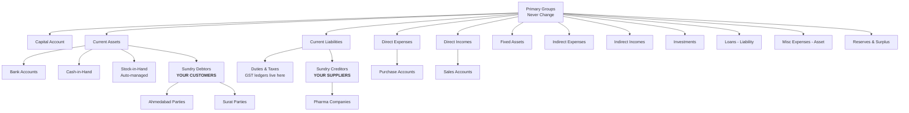

Tally's Chart of Accounts is a tree. Everything in accounting — every customer, supplier, bank account, tax ledger, and expense head — lives somewhere in this tree. Understanding the hierarchy is the key to knowing what you're looking at when you pull ledger data.

## The Primary Group Hierarchy

Tally ships with a fixed set of **primary groups**. CAs never change these — they're baked into Tally's DNA. They create sub-groups underneath them.



## The Two Groups That Matter Most

For inventory integration, two groups are your bread and butter:

| Group | What Lives Here | Your Mapping |
|-------|----------------|-------------|
| **Sundry Debtors** | Customers (medical shops, retailers) | Parties you **sell to** |
| **Sundry Creditors** | Suppliers (pharma companies, distributors) | Parties you **buy from** |

:::tip[The Golden Rule]
To identify customers, filter ledgers where `PrimaryGroup = "Sundry Debtors"`. To identify suppliers, filter `PrimaryGroup = "Sundry Creditors"`. CAs almost universally follow this convention.
:::

## Sub-Group Patterns

CAs love organising things into sub-groups. The most common pattern is **territory-based grouping** under Sundry Debtors:

```
Sundry Debtors
├── Ahmedabad Parties
│   ├── Raj Medical Store - Ahmedabad
│   ├── City Pharmacy - Ahmedabad
│   └── New Life Medical - Ahmedabad
├── Surat Parties
│   ├── Diamond Medical - Surat
│   └── Ring Road Pharmacy - Surat
└── Baroda Parties
    ├── Alkapuri Medical - Baroda
    └── ...
```

Similarly, Sundry Creditors might be grouped by type:

```
Sundry Creditors
├── Pharma Companies
│   ├── Cipla Ltd
│   ├── Sun Pharma
│   └── Dr. Reddy's
└── FMCG Suppliers
    ├── Hindustan Unilever
    └── ...
```

:::caution
Don't hardcode sub-group names. They vary wildly between stockists. Some use city names, some use routes ("Route 1 Parties"), some use salesman names ("Amit's Parties"). Always traverse the hierarchy dynamically.
:::

## The "Both Sundry" Problem

Here's an edge case that trips up many integrators: a party ledger under **Sundry Debtors** can have a **credit balance**.

How? Simple — the medical shop overpaid, or you issued a credit note. Now the customer temporarily owes you nothing; instead, you owe *them*. The ledger balance flips to credit.

This does **not** mean the party is a supplier. They're still under Sundry Debtors. The group placement defines the **relationship**, not the current balance.

Similarly, a supplier under Sundry Creditors can have a debit balance (you overpaid them, or they owe you a refund).

:::danger
Never re-classify a party based on their balance sign. A customer with a credit balance is still a customer. Use the `PrimaryGroup` field, not the balance, to determine the relationship.
:::

## The "Inventory Values Are Affected" Flag

This one is subtle but important. Every ledger in Tally has a flag called `"Inventory values are affected"`. It appears on Purchase Accounts and Sales Accounts.

| Flag Setting | Behaviour |
|-------------|-----------|
| `Yes` | Transactions through this ledger update stock |
| `No` | Transactions through this ledger are accounting-only — stock is NOT touched |

A stockist might create a "Purchase Account" ledger with this flag set to `No` (maybe for expense purchases that aren't inventory). If you're computing stock movement from vouchers, you need to check this flag on the associated ledger.

```xml
<LEDGER NAME="Purchase Account">
  <PARENT>Purchase Accounts</PARENT>
  <AFFECTSSTOCK>Yes</AFFECTSSTOCK>
</LEDGER>
```

The `<AFFECTSSTOCK>` tag in XML maps to this flag. Always read it.

## GST Tax Ledger Setup

Under `Duties & Taxes`, CAs create GST ledgers. The naming is... creative:

```
Duties & Taxes
├── Output CGST 9%
├── Output SGST 9%
├── Output IGST 18%
├── Output CGST 6%
├── Output SGST 6%
├── Output IGST 12%
├── Input CGST 9%
├── Input SGST 9%
├── Input IGST 18%
└── ... (one per rate per type)
```

:::caution
Tax ledger names vary between stockists. One might use "Output CGST 9%", another "CGST on Sales @9%", yet another "GST-CGST-9%". **Never assume ledger names.** Always query and match by the ledger's tax rate and type attributes.
:::

## Ledger Schema Reference

Here's what your connector should store for each ledger:

| Field | Type | Notes |
|-------|------|-------|
| `guid` | VARCHAR(64) | Primary key, survives renames |
| `name` | TEXT | Display name, **can change** |
| `parent` | TEXT | Immediate parent group |
| `primary_group` | TEXT | Top-level ancestor group |
| `opening_balance` | DECIMAL | Balance at FY start |
| `gstin` | TEXT | Party's GST number |
| `credit_period` | INTEGER | Payment terms in days |

## Common CA Practices That Break Things

CAs are the gods of Tally data. They routinely do things that can surprise your connector:

| CA Action | What Happens | Your Response |
|-----------|-------------|---------------|
| **Renames a ledger** | Same GUID, new name | Match by GUID, update name in cache |
| **Merges two ledgers** | Vouchers move, GUIDs change | Full re-sync recommended |
| **Moves ledger to different group** | `Parent` and `PrimaryGroup` change | Re-evaluate group-based filtering |
| **Creates sub-groups** | New hierarchy level | Your tree traversal must handle arbitrary depth |

:::tip
**GUID is king.** Always use the Tally GUID as your primary identifier for ledgers. Names change when CAs rename things for clarity ("ABC Medical" becomes "ABC Medical Store, Ahmedabad"). GUIDs never change.
:::

## Querying the Hierarchy

To pull the full ledger group tree from Tally, use a Collection export:

```xml
<ENVELOPE>
  <HEADER>
    <VERSION>1</VERSION>
    <TALLYREQUEST>Export</TALLYREQUEST>
    <TYPE>Collection</TYPE>
    <ID>LedgerGroupCollection</ID>
  </HEADER>
  <BODY>
    <DESC>
      <TDL><TDLMESSAGE>
        <COLLECTION
          NAME="LedgerGroupCollection"
          ISMODIFY="No">
          <TYPE>Group</TYPE>
          <FETCH>
            Name, Parent, GUID,
            MasterId, AlterId
          </FETCH>
        </COLLECTION>
      </TDLMESSAGE></TDL>
    </DESC>
  </BODY>
</ENVELOPE>
```

Build the tree in your local cache, then use it to resolve any ledger's `PrimaryGroup` by walking up the parent chain.
