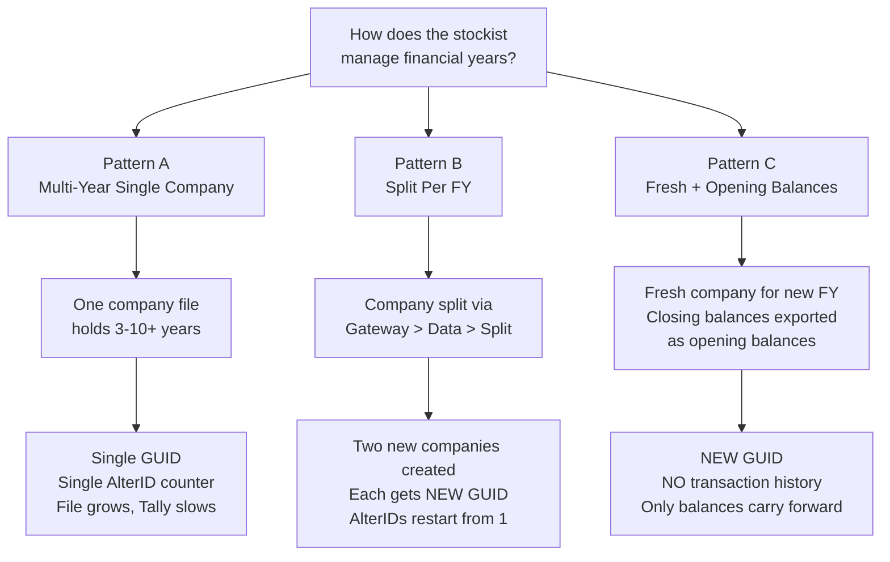
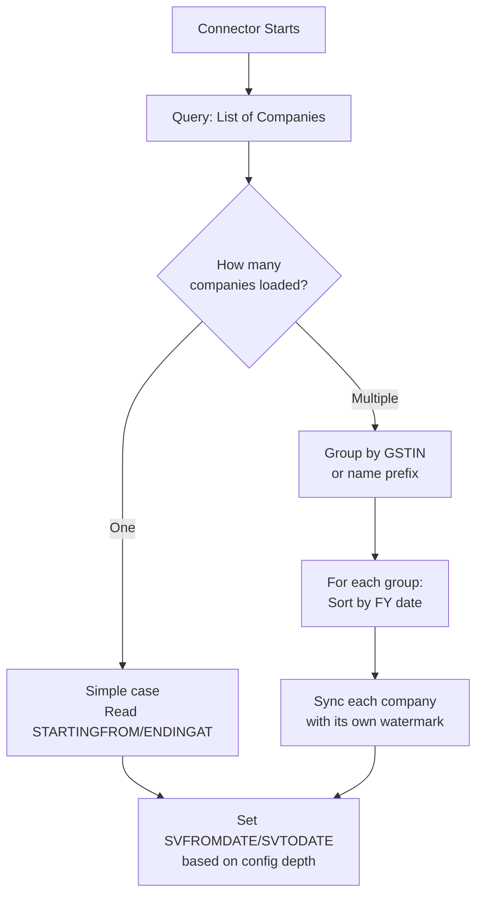

Before you pull a single voucher from Tally, you need to understand how companies work. This is the foundation everything else sits on — get it wrong and you'll be chasing phantom data for days.

## What Is a Tally Company?

A Tally company is a **self-contained data universe**. It has its own masters (ledgers, stock items, godowns), its own vouchers, its own AlterID counter, and its own GUID. Think of it as a separate database.

Every company has two critical dates:

| Date | What It Means |
|------|---------------|
| **Financial Year Beginning** | Usually 1-Apr in India (configurable) |
| **Books Beginning From** | Can differ from FY start if the business started mid-year |

And two critical identifiers:

| ID | Purpose |
|----|---------|
| **GUID** | Globally unique, survives renames |
| **GSTIN** | Tax registration, ties to real-world entity |

## The Three Financial Year Patterns

Here's where things get interesting. Indian businesses handle financial years in three very different ways, and your connector needs to handle all of them.



### Pattern A — Multi-Year Single Company

One company file holds years of data. Common for small stockists who just keep going. The file grows, Tally slows down, but they live with it.

**For your connector**: This is the easiest case. Widen your date range and you get everything. Single GUID, single AlterID stream.

### Pattern B — Split Per Financial Year

After the CA finalises the books, the company is split using `Gateway > Data > Split`. This creates **two entirely new companies** — the old one essentially ceases to exist.

:::caution
Each split company is a completely separate data universe. New GUID, AlterIDs starting from 1, independent master hierarchies. Your connector must treat them as different companies that happen to belong to the same business.
:::

### Pattern C — Fresh with Opening Balances

A new company is created for each FY. The CA exports closing balances as XML, imports them as opening balances in the new company. Transaction history does **not** carry forward.

**For your connector**: You only see the current year's transactions. Historical analysis requires connecting to older company files.

## Detecting Date Ranges

You don't have to guess the date range. Tally tells you. Query the company list and look at `STARTINGFROM` and `ENDINGAT`:

```xml
<ENVELOPE>
  <HEADER>
    <VERSION>1</VERSION>
    <TALLYREQUEST>Export</TALLYREQUEST>
    <TYPE>Data</TYPE>
    <ID>List of Companies</ID>
  </HEADER>
  <BODY>
    <DESC>
      <STATICVARIABLES>
        <SVEXPORTFORMAT>
          $$SysName:XML
        </SVEXPORTFORMAT>
      </STATICVARIABLES>
    </DESC>
  </BODY>
</ENVELOPE>
```

The response includes per-company metadata:

```xml
<COMPANY>
  <NAME>Stockist Pharma Pvt Ltd</NAME>
  <STARTINGFROM>20230401</STARTINGFROM>
  <ENDINGAT>20260331</ENDINGAT>
</COMPANY>
```

`STARTINGFROM` is the `BooksFrom` date. `ENDINGAT` is the last voucher date (or FY end). This gives you the full transaction date range without guessing.

## Multi-Company Support

A single running Tally instance can have **multiple companies loaded** simultaneously. This is common:

- Pharma distributors often maintain two companies — one for "Ethical" (prescription drugs) and one for "OTC/FMCG"
- Split per Drug License Number
- Separate companies for different GSTINs (multi-state operations)

Your connector must:

1. **List all loaded companies** on startup
2. **Identify which ones belong to the same business** (match by GSTIN or name prefix)
3. **Sync each independently** — each has its own AlterID watermark

## GSTIN Mapping

GSTIN is the bridge between a Tally company and the real-world business entity. A stockist with branches in multiple states will have:

- Separate GSTINs per state
- Possibly separate Tally companies per GSTIN
- Or separate registrations within one company

:::tip
Use GSTIN as the grouping key when correlating multiple Tally companies to a single business entity. Company names are unreliable — they get renamed, abbreviated, or suffixed with the FY.
:::

## How Deep Should You Sync?

This is the million-rupee question. Here's the trade-off matrix:

| Depth | Sync Time | Stock Accuracy | Use Case |
|-------|-----------|----------------|----------|
| **Current FY** | Minutes | Depends on opening balances | Day-to-day ops |
| **Current + Previous FY** | 10-30 min | Better traceability | Demand patterns, credit assessment |
| **All History** | Hours | Best possible | Multi-year trend analysis |

:::tip[Our Recommendation]
**Default to Current FY + Previous FY.** This gives the sales fleet enough history for demand patterns, gives CRM enough for credit assessment, and keeps the sync footprint manageable. Make it configurable.
:::

```toml
[sync]
# Options: "current_fy"
#        | "current_plus_previous"
#        | "all"
#        | "custom"
historical_depth = "current_plus_previous"

# Only used if historical_depth = "custom"
custom_from_date = "2023-04-01"
```

## The Company Discovery Phase

For Pattern B and C (split companies), your connector needs a discovery phase at startup:



:::danger
Never assume there's only one company. Always query the company list first. A connector that hardcodes a single company name will break the moment the stockist loads their second company file.
:::

## Company Schema Reference

Here's what your local cache should store for each company:

| Field | Type | Notes |
|-------|------|-------|
| `guid` | VARCHAR(64) | Primary key, never changes |
| `name` | TEXT | Display name, can change |
| `gstin` | TEXT | Tax ID, grouping key |
| `financial_year_from` | DATE | FY start |
| `financial_year_to` | DATE | FY end |
| `books_from` | DATE | Actual data start |
| `is_inventory_on` | BOOLEAN | Whether inventory module is active |

The `guid` is your anchor. Names change when CAs rename things. GUIDs don't.
