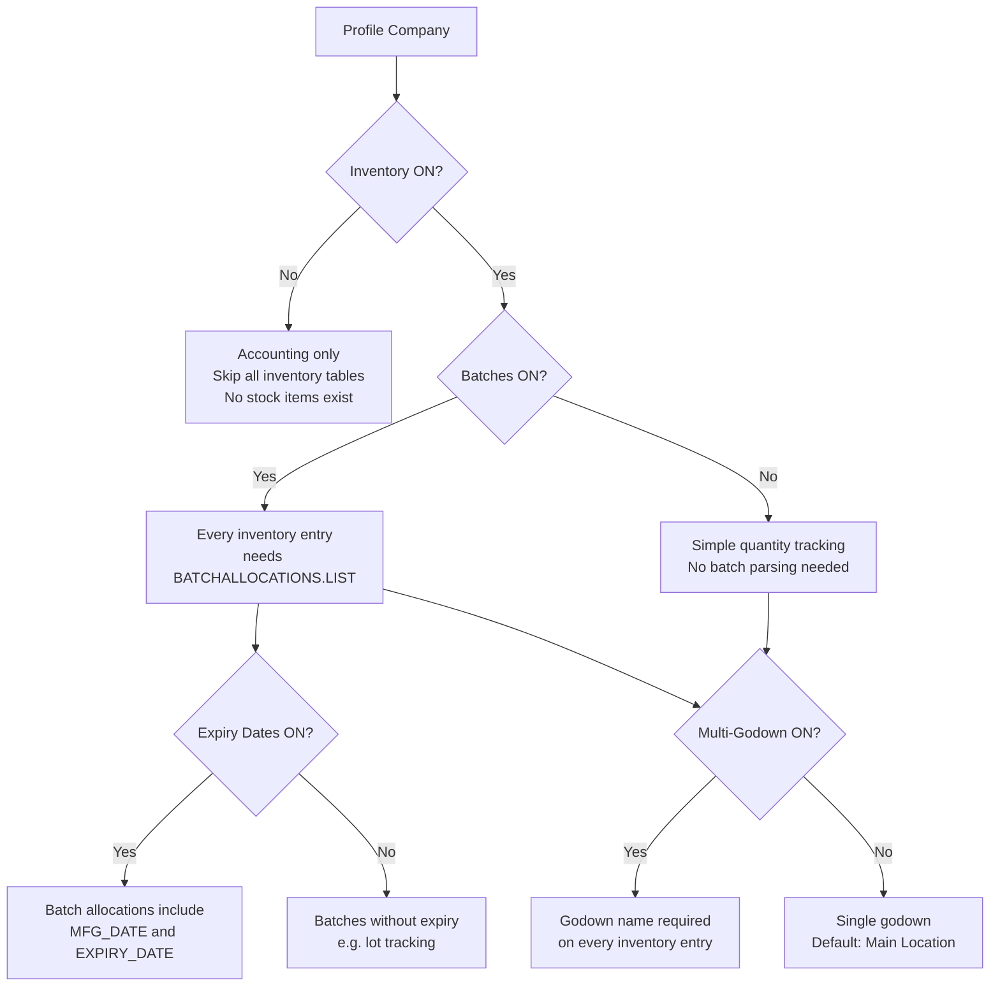

Tally companies are not all created equal. A pharma distributor has batches and expiry tracking turned on. A textile trader might use cost centres instead. A CA-managed service firm has no inventory at all.

Before your connector does anything meaningful, it needs to know **what features are enabled**. This isn't optional — it's the difference between a working integration and silent data corruption.

## Why Feature Flags Matter

Here's the punchline, up front:

:::danger
If you push a voucher with batch allocation data to a company that doesn't have batches enabled, Tally will **silently ignore** the batch data. No error. No warning. Your inventory tracking just became wrong, and you won't know until someone does a physical stock count.
:::

The reverse is equally bad: if a company **has** batches enabled and you push a voucher **without** batch allocations, the import fails outright.

Feature flags are a contract. Your connector must read it and honour it.

## The Complete Feature Flag Table

| Feature | XML Tag | Values | Impact When Enabled |
|---------|---------|--------|---------------------|
| Inventory Mode | `<ISINVENTORYON>` | `Yes` / `No` | Stock items, godowns, inventory vouchers exist. Without this, it's pure accounting. |
| Batch Tracking | `<ISMAINTAINBATCHWISE>` | `Yes` / `No` | Every inventory entry needs `BATCHALLOCATIONS.LIST`. Mandatory for pharma. |
| Multi-Godown | `<ISMULTIGODOWNON>` | `Yes` / `No` | Godown allocation required on every inventory entry. Single godown = "Main Location". |
| Expiry Dates | `<ISEXPDATEON>` | `Yes` / `No` | Batch allocations include expiry date fields. Critical for pharma compliance. |
| Order Processing | `<ISORDERON>` | `Yes` / `No` | Purchase Orders and Sales Orders voucher types exist. |
| Bill-wise Details | `<ISBILLWISEON>` | `Yes` / `No` | Sundry Debtors/Creditors tracked bill-by-bill for ageing. |
| Cost Centres | `<ISCOSTCENTRESON>` | `Yes` / `No` | Voucher entries can have cost centre allocations. |
| Cost Tracking | `<ISCOSTTRACKINGON>` | `Yes` / `No` | Advanced cost tracking across categories. |
| Bill of Materials | `<ISBOMON>` | `Yes` / `No` | BOM definitions exist. Manufacturing Journal uses them. |
| Tracking Numbers | `<ISTRACKINGON>` | `Yes` / `No` | Delivery Notes/Receipt Notes get tracking numbers linking to invoices. |

## How to Detect Feature Flags

Query the company object to pull its configuration. The flags live in the company master data:

```xml
<ENVELOPE>
  <HEADER>
    <VERSION>1</VERSION>
    <TALLYREQUEST>Export</TALLYREQUEST>
    <TYPE>Data</TYPE>
    <ID>List of Companies</ID>
  </HEADER>
  <BODY>
    <DESC>
      <STATICVARIABLES>
        <SVEXPORTFORMAT>
          $$SysName:XML
        </SVEXPORTFORMAT>
      </STATICVARIABLES>
    </DESC>
  </BODY>
</ENVELOPE>
```

The response gives you the feature flags per company. Store them in your Tally Profile table on first connect.

:::tip
Always profile Tally on first connect. Detect version, features, loaded TDLs, and UDFs **before** attempting any sync. This one-time cost saves you from a universe of debugging pain later.
:::

## Feature Flag Decision Tree

Use this flow to determine what your connector needs to handle for a given company:



## Impact on Push Operations

This is where feature flags become critical. When pushing data **into** Tally (like a Sales Order from your field app), the XML structure must match the company's enabled features exactly.

### Batches Enabled

If `ISMAINTAINBATCHWISE = Yes`, your voucher XML **must** include batch allocations:

```xml
<ALLINVENTORYENTRIES.LIST>
  <STOCKITEMNAME>
    Paracetamol 500mg Strip/10
  </STOCKITEMNAME>
  <ACTUALQTY>100 Strip</ACTUALQTY>
  <AMOUNT>5000.00</AMOUNT>
  <BATCHALLOCATIONS.LIST>
    <GODOWNNAME>Main Location</GODOWNNAME>
    <BATCHNAME>Primary Batch</BATCHNAME>
    <AMOUNT>5000.00</AMOUNT>
    <ACTUALQTY>100 Strip</ACTUALQTY>
  </BATCHALLOCATIONS.LIST>
</ALLINVENTORYENTRIES.LIST>
```

Without the `BATCHALLOCATIONS.LIST`, the import fails.

### Multi-Godown Enabled

If `ISMULTIGODOWNON = Yes`, every batch allocation (or inventory entry, if batches are off) needs a godown name:

```xml
<BATCHALLOCATIONS.LIST>
  <GODOWNNAME>Main Location</GODOWNNAME>
  <!-- ... -->
</BATCHALLOCATIONS.LIST>
```

:::caution
If multi-godown is disabled (single godown mode), and you still include a `GODOWNNAME`, use `"Main Location"` — that's Tally's default. Sending a random godown name here will cause a silent failure.
:::

### Orders Enabled

If `ISORDERON = No`, you simply cannot push Sales Orders or Purchase Orders. The voucher types don't exist. Your connector must check this before attempting any order push.

## Vertical Patterns

Different business types enable different feature combinations. Knowing the vertical helps you anticipate what to expect:

| Vertical | Inventory | Batches | Expiry | Multi-Godown | Orders | Cost Centres |
|----------|-----------|---------|--------|--------------|--------|-------------|
| Pharma Distributor | Yes | Yes | Yes | Yes | Yes | Rare |
| Textile Trader | Yes | Rare | No | Yes | Yes | Sometimes |
| Electronics Dealer | Yes | Rare | No | Sometimes | Yes | Rare |
| Manufacturer | Yes | Sometimes | Sometimes | Yes | Yes | Yes |
| Services / CA-managed | No | N/A | N/A | N/A | No | Sometimes |

:::tip
For pharma — your primary target — expect **everything** to be turned on. Batches and expiry dates are non-negotiable for Drug License compliance.
:::

## Storing the Profile

Store the discovered feature flags locally so your connector doesn't have to re-query them on every sync cycle:

```sql
CREATE TABLE _tally_profile (
  company_guid     TEXT PRIMARY KEY,
  is_inventory_on  BOOLEAN,
  is_batch_enabled BOOLEAN,
  is_multi_godown  BOOLEAN,
  is_expiry_on     BOOLEAN,
  is_order_enabled BOOLEAN,
  is_billwise_on   BOOLEAN,
  is_cost_centres  BOOLEAN,
  is_bom_enabled   BOOLEAN,
  last_profiled_at TIMESTAMP
);
```

Re-profile periodically (weekly or on config change detection) since a CA might enable or disable features during setup changes.
