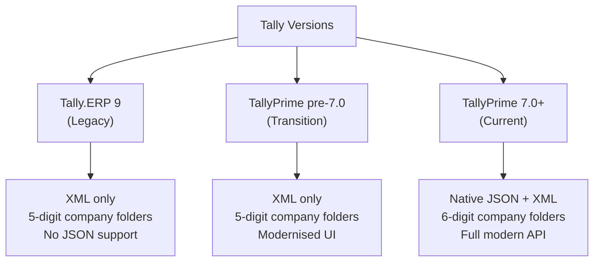
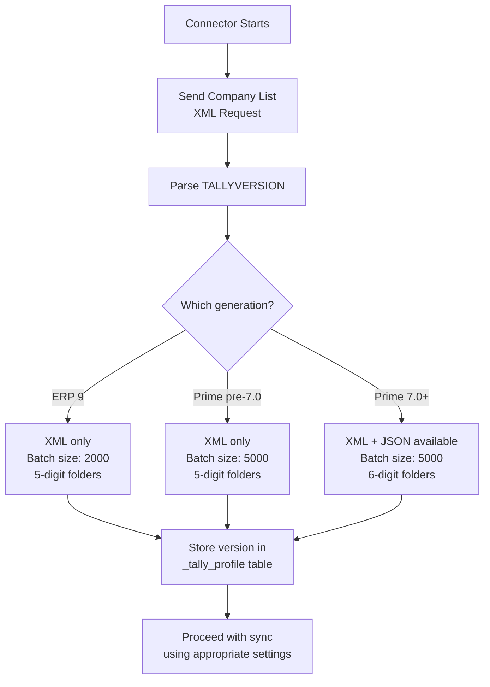

Not every Tally out there is the same version. You'll encounter machines running software from three distinct generations, each with different capabilities. Your connector needs to know which one it's talking to — and adapt accordingly.

## The Three Generations



### Tally.ERP 9 (Legacy)

The workhorse that ran Indian accounting for over a decade. Still found in the wild, especially at smaller businesses or those managed by conservative CAs who haven't pushed the upgrade.

- **API**: XML-over-HTTP only. No JSON whatsoever.
- **Company folders**: 5-digit naming (`10000`, `10001`, ...)
- **Config**: `tally.ini` only
- **TDL management**: Via `F12 > Product Features`
- **e-Invoicing**: Requires add-on TDL
- **Max objects per response**: ~2,000 (lower than TallyPrime)

### TallyPrime pre-7.0 (Transition)

The UI overhaul. Same data engine, modernised interface. Most stockists are on some version of TallyPrime at this point.

- **API**: XML-over-HTTP only. Still no native JSON.
- **Company folders**: 5-digit naming (`10000`, `10001`, ...)
- **Config**: `tally.ini` only
- **TDL management**: Via `F1 > TDLs & Add-ons`
- **e-Invoicing**: Built-in
- **Max objects per response**: ~5,000

### TallyPrime 7.0+ (Current)

The big one for integrators. Native JSON support finally arrived.

- **API**: XML **and** JSON on the same HTTP endpoint
- **Company folders**: 6-digit naming (`100000`, `100001`, ...)
- **Config**: `tally.ini` + `config/` folder
- **TDL management**: Via `F1 > TDLs & Add-ons`
- **e-Invoicing**: Built-in (enhanced)
- **Max objects per response**: ~5,000
- **Import from JSON**: Yes (not just export)

## Feature Comparison Table

| Feature | Tally.ERP 9 | TallyPrime pre-7.0 | TallyPrime 7.0+ |
|---------|:-----------:|:-------------------:|:----------------:|
| XML API | Yes | Yes | Yes |
| JSON API | No | No | Yes (native) |
| ODBC | Yes | Yes | Yes |
| JSON Import | No | No | Yes |
| JSON Export | Limited (TDL) | Limited (TDL) | Native |
| HTTP Response | XML only | XML only | XML or JSON |
| Company Folder | 5-digit | 5-digit | 6-digit |
| Data Files | `.900` | `.900` | `.900` / `.1800` |
| Config | `tally.ini` | `tally.ini` | `tally.ini` + `config/` |
| TDL Menu | F12 | F1 | F1 |
| e-Invoicing | Add-on | Built-in | Built-in+ |
| Max Export Size | ~2,000 obj | ~5,000 obj | ~5,000 obj |

## Detecting the Version

You can detect which Tally version you're talking to with a single XML request — the company list query:

```xml
<ENVELOPE>
  <HEADER>
    <TALLYREQUEST>Export</TALLYREQUEST>
    <TYPE>Data</TYPE>
    <ID>List of Companies</ID>
  </HEADER>
  <BODY>
    <DESC>
      <STATICVARIABLES>
        <SVEXPORTFORMAT>
          $$SysName:XML
        </SVEXPORTFORMAT>
      </STATICVARIABLES>
    </DESC>
  </BODY>
</ENVELOPE>
```

The response includes a version tag:

```xml
<!-- TallyPrime 7.0+ -->
<TALLYVERSION>
  TallyPrime:Release 7.0
</TALLYVERSION>

<!-- Tally.ERP 9 -->
<TALLYVERSION>
  Tally.ERP 9:Release 6.6.3
</TALLYVERSION>

<!-- TallyPrime pre-7.0 -->
<TALLYVERSION>
  TallyPrime:Release 4.1
</TALLYVERSION>
```

Parse the version string to determine capabilities:

```go
func detectVersion(v string) TallyGen {
  if strings.Contains(v, "Tally.ERP 9") {
    return ERP9
  }
  if strings.Contains(v, "TallyPrime") {
    ver := extractRelease(v) // "7.0"
    if ver >= 7.0 {
      return PrimeModern  // JSON support
    }
    return PrimeLegacy    // XML only
  }
  return Unknown
}
```

## What This Means for Your Connector

### Always Use XML as the Baseline

XML works on every version. It's the universal language of Tally integration. Your connector should:

1. Default to XML for all requests
2. Detect the Tally version on first connect
3. Optionally upgrade to JSON if TallyPrime 7.0+ is detected

:::tip
Even if you detect TallyPrime 7.0+, don't rush to switch everything to JSON. The XML API is battle-tested by the entire ecosystem. JSON is newer and the community has less collective experience with edge cases. Use XML as your reliable path and JSON as an optimisation for specific use cases.
:::

### Handle Different Response Limits

Tally.ERP 9 chokes on large exports earlier than TallyPrime does:

| Version | Safe Batch Size |
|---------|----------------|
| Tally.ERP 9 | ~2,000 objects |
| TallyPrime | ~5,000 objects |

Adjust your batching strategy based on the detected version.

### Company Folder Detection

If your connector does filesystem scanning (for TDL discovery, data path validation), the folder naming tells you the era:

```
C:\Users\Public\TallyPrime\Data\
├── 10000\    ← 5-digit: ERP 9 or older Prime
├── 10001\    ← 5-digit: same era
├── 100000\   ← 6-digit: TallyPrime 3.0+
└── 100001\   ← 6-digit: modern
```

:::caution
A 6-digit folder doesn't guarantee TallyPrime 7.0+ — it just means TallyPrime 3.0 or later. Always use the `TALLYVERSION` XML tag for definitive version detection, not filesystem heuristics.
:::

## The `tally.ini` Across Versions

The structure is mostly the same, but location and extras differ:

```ini
; Common to all versions
[Tally]
Data Path = C:\Users\Public\TallyPrime\Data
Port = 9000
TDL = Yes
User TDL = Yes
User TDL0 = MedicalBilling.tcp
```

TallyPrime 7.0+ adds a `config/` directory alongside `tally.ini` for additional configuration like Excel import mappings and advanced settings.

## Practical Connector Strategy



Store the detected version in your profile table so you don't have to re-detect it every cycle:

```sql
UPDATE _tally_profile
SET tally_version = 'TallyPrime:Release 7.0',
    is_json_supported = true
WHERE company_guid = ?;
```

## The Silver vs Gold Factor

One more version-adjacent concern: **Tally Silver** vs **Tally Gold**.

| Edition | Users | Connector Impact |
|---------|-------|-----------------|
| **Silver** | Single user | Only ONE connection at a time. If the operator is in Tally, your HTTP requests may queue or fail. |
| **Gold** | Multi-user | Multiple concurrent connections. Connector and human operators coexist happily. |

:::caution
For Silver installations, schedule heavy sync operations during off-hours. Use lightweight, fast requests during business hours. Never hold an HTTP connection open for long — Silver will block the human operator.
:::

Detection isn't straightforward via API, but you can infer it: if your connector's requests fail intermittently during business hours with timeouts, you're likely dealing with Silver.
