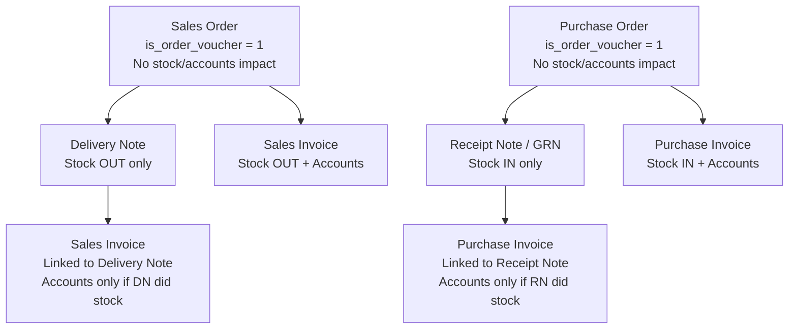

Vouchers are the transactions of Tally — every sale, purchase, stock transfer, and order is a voucher. But not all vouchers are created equal. Some affect stock. Some affect accounts. Some affect both. And some — the sneaky order vouchers — affect **neither**.

Understanding voucher types is non-negotiable for a correct integration.

## The Complete Voucher Type Table

Here are all 15 inventory-relevant voucher types that ship with Tally:

| Voucher Type | Stock Impact | Accounts Impact | Nature |
|-------------|-------------|-----------------|--------|
| **Purchase** | IN | Yes | Goods received with invoice |
| **Sales** | OUT | Yes | Goods sold with invoice |
| **Purchase Order** | None | None | Commitment to buy |
| **Sales Order** | None | None | Commitment to sell |
| **Receipt Note (GRN)** | IN | None | Goods received, pending invoice |
| **Delivery Note** | OUT | None | Goods dispatched, pending invoice |
| **Stock Journal** | IN/OUT | None | Inter-godown transfer, manufacturing |
| **Manufacturing Journal** | IN/OUT | None | BOM-based production |
| **Physical Stock** | Adjustment | None | Reconciliation with physical count |
| **Rejections In** | IN | None | Return from customer |
| **Rejections Out** | OUT | None | Return to supplier |
| **Debit Note** | Optional | Yes | Purchase return with accounting |
| **Credit Note** | Optional | Yes | Sales return with accounting |
| **Material Out** | OUT | None | Job work outward |
| **Material In** | IN | None | Job work inward |

## The Critical `is_order_voucher` Flag

This is the single most important thing to understand about voucher types:

:::danger
**Purchase Orders and Sales Orders are orders, NOT transactions.** They do not affect stock. They do not affect accounts. They are commitments — promises of future action.

If you include order vouchers in your stock calculations, your numbers will be wrong. Period.
:::

The `is_order_voucher` flag tells you whether a voucher is a real transaction or just a commitment:

```
is_order_voucher = 0  →  Real transaction
                         (affects stock and/or accounts)

is_order_voucher = 1  →  Order/commitment only
                         (affects NOTHING in stock or accounts)
```

Always filter on this flag when computing stock levels or financial impacts:

```sql
-- Stock-affecting vouchers only
SELECT * FROM trn_voucher
WHERE is_order_voucher = 0
  AND is_inventory_voucher = 1;
```

## The Order-to-Invoice Flow

Orders become real transactions through a fulfillment chain:



Sales Orders appear in:
- **Sales Order Outstanding** report (pending fulfillment)
- **Stock Summary** as "on order" quantity (committed but not dispatched)

They can be partially fulfilled across multiple Delivery Notes or Invoices.

## Custom Voucher Types

Here's where it gets spicy. Tally allows users to create **custom voucher types** that inherit from the built-in ones. For example:

```
Sales Order (built-in)
├── Field Sales Order (custom)
├── Phone Order (custom)
└── WhatsApp Order (custom)

Sales (built-in)
├── Cash Sales (custom)
├── Credit Sales (custom)
└── Counter Sales (custom)
```

Custom types:
- **Inherit** the parent type's behaviour (stock/accounts impact)
- Can have their own **numbering series**
- Appear in XML as `<VOUCHERTYPENAME>Field Sales Order</VOUCHERTYPENAME>`
- The `<PARENT>` tag tells you the base type

:::danger[Never Hardcode Voucher Type Names]
A stockist might use "Field Sales Order" instead of "Sales Order", or "Cash Sales" instead of "Sales". If you hardcode `WHERE voucher_type = 'Sales'`, you'll miss all the custom variants.

**Always check the `PARENT` hierarchy** to determine if something is a Sales Order variant, Purchase variant, etc.
:::

## Detecting Custom Voucher Types

Query the voucher type master to build your hierarchy:

```xml
<ENVELOPE>
  <HEADER>
    <VERSION>1</VERSION>
    <TALLYREQUEST>Export</TALLYREQUEST>
    <TYPE>Collection</TYPE>
    <ID>VoucherTypeCollection</ID>
  </HEADER>
  <BODY>
    <DESC>
      <TDL><TDLMESSAGE>
        <COLLECTION
          NAME="VoucherTypeCollection"
          ISMODIFY="No">
          <TYPE>VoucherType</TYPE>
          <FETCH>
            Name, Parent,
            NumberingMethod,
            GUID, MasterId, AlterId
          </FETCH>
        </COLLECTION>
      </TDLMESSAGE></TDL>
    </DESC>
  </BODY>
</ENVELOPE>
```

Store the results and build a lookup:

```
"Field Sales Order"  → parent: "Sales Order"
"Sales Order"        → parent: (built-in)
```

When you encounter a voucher with type "Field Sales Order", walk up the parent chain to determine it's a Sales Order variant — and therefore `is_order_voucher = true`.

## Voucher Numbering Chaos

Indian SMBs use wildly inconsistent voucher numbering. Brace yourself:

| Style | Example | Notes |
|-------|---------|-------|
| **Automatic** | `1`, `2`, `3` | Resets per FY |
| **Manual** | `INV/2024-25/1001` | User types anything |
| **Multi-user Auto** | Gaps appear | Each user gets a series |
| **Custom prefix** | `AHM/SO/001` | City-based or branch-based |

:::caution
When pushing vouchers, use a **unique prefix** that can never collide with manual numbering: `FIELD/{UUID-fragment}` or `API/{timestamp}`. If Tally's numbering is set to "Manual" with "Prevent Duplicates = No", it will happily create duplicate-numbered vouchers. That's accounting havoc.
:::

## Invoice View vs Accounting View

One more crucial detail: the same voucher type can be entered in two different "views" in Tally, and this changes the XML structure:

| View | XML Tag | Inventory Tags |
|------|---------|---------------|
| **Invoice View** | `PERSISTEDVIEW = "Invoice Voucher View"` | `ALLINVENTORYENTRIES.LIST` with nested `ACCOUNTINGALLOCATIONS.LIST` |
| **Accounting View** | `PERSISTEDVIEW = "Accounting Voucher View"` | `INVENTORYENTRIES.LIST` (different tag name!) |

Your parser must handle **both** tag variants. Traders frequently use Accounting View for sales, while pharma distributors typically use Invoice View.

## The Voucher Type Hierarchy in Your Cache

Store voucher types with their parent chain:

```sql
CREATE TABLE mst_voucher_type (
  guid       VARCHAR(64) PRIMARY KEY,
  name       TEXT NOT NULL,
  parent     TEXT,  -- NULL for built-in types
  is_active  BOOLEAN,
  alter_id   INTEGER
);
```

Then build a helper function that resolves any custom type to its root built-in type. This is how you correctly set `is_order_voucher`, `is_inventory_voucher`, and `is_accounting_voucher` on every synced voucher.
