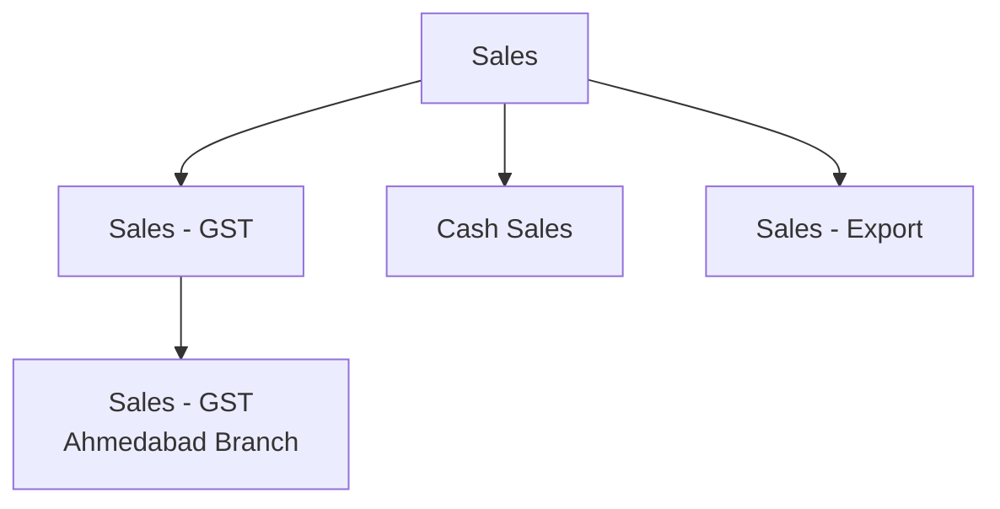

Tally ships with standard voucher types like "Sales", "Purchase", "Receipt", and "Payment". But in the real world? You'll almost never see those raw names.

## The Customisation Pattern

Stockists (often guided by their CAs) create custom voucher types that **inherit** from the standard ones:

| Custom Type | Parent Type |
|---|---|
| Sales - GST | Sales |
| Sales - Export | Sales |
| Purchase - Local | Purchase |
| Purchase Return - Local | Debit Note |
| Credit Note - GST | Credit Note |
| Cash Sales | Sales |
| Sales Order - Field | Sales Order |

These aren't just labels. Each custom type can have its own:
- Numbering series
- Print format
- Default ledger allocations
- UDF fields (via TDL)

## Never Hardcode Type Names

:::danger
If you filter vouchers with `WHERE voucher_type = 'Sales'`, you will miss "Sales - GST", "Cash Sales", and every other custom variant. Your data will be incomplete.
:::

The correct approach is to always check the **parent hierarchy**.

## How Parent Types Work

Every voucher type in Tally has a `PARENT` field that traces back to one of the standard types. The chain can be multiple levels deep:



Your connector must walk up the parent chain to find the **root** standard type.

## Detection via XML

When you export voucher types, each one reveals its lineage:

```xml
<VOUCHERTYPE NAME="Sales - GST">
  <PARENT>Sales</PARENT>
  <NUMBERINGMETHOD>Automatic</NUMBERINGMETHOD>
  <ISDEEMEDPOSITIVE>Yes</ISDEEMEDPOSITIVE>
  <ISACTIVE>Yes</ISACTIVE>
</VOUCHERTYPE>
```

And for deeper hierarchies:

```xml
<VOUCHERTYPE
  NAME="Sales - GST Ahmedabad">
  <PARENT>Sales - GST</PARENT>
</VOUCHERTYPE>
```

To resolve this, you walk: `Sales - GST Ahmedabad` -> `Sales - GST` -> `Sales` (standard).

## The Standard Parent Types

These are Tally's built-in voucher types. Everything custom traces back to one of these:

| Standard Type | Purpose |
|---|---|
| Sales | Revenue transactions |
| Purchase | Procurement transactions |
| Receipt | Money received |
| Payment | Money paid |
| Journal | Adjustments |
| Contra | Bank/cash transfers |
| Credit Note | Sales returns |
| Debit Note | Purchase returns |
| Sales Order | Customer orders |
| Purchase Order | Supplier orders |
| Delivery Note | Goods dispatched |
| Receipt Note | Goods received |

## Mapping Custom Types to Standard Behavior

Build a lookup table during the profiling phase:

```python
# During company profiling
type_map = {}
for vtype in tally_voucher_types:
    root = resolve_parent(vtype, all_types)
    type_map[vtype.name] = root

# resolve_parent walks up the chain
def resolve_parent(vtype, all_types):
    STANDARD = {
        "Sales", "Purchase", "Receipt",
        "Payment", "Journal", "Contra",
        "Credit Note", "Debit Note",
        "Sales Order", "Purchase Order",
        "Delivery Note", "Receipt Note"
    }
    current = vtype
    while current.parent not in STANDARD:
        current = all_types[current.parent]
    return current.parent
```

Then when processing vouchers:

```python
# Don't do this
if voucher.type == "Sales":
    process_sale(voucher)

# Do this instead
root = type_map[voucher.type]
if root == "Sales":
    process_sale(voucher)
```

## What About Vouchers on the Voucher Itself?

Each voucher's XML includes its type name:

```xml
<VOUCHER VCHTYPE="Sales - GST">
  <VOUCHERTYPENAME>
    Sales - GST
  </VOUCHERTYPENAME>
  <DATE>20260315</DATE>
  ...
</VOUCHER>
```

Your connector reads `VOUCHERTYPENAME`, looks it up in `type_map`, and routes to the correct handler.

## E-Commerce Addon Voucher Types

E-commerce TDLs are particularly prolific at creating custom types:

- "Amazon Sale"
- "Flipkart Sale"
- "Marketplace Return"
- "Channel Credit Note"

These all map to standard `Sales`, `Sales`, `Credit Note`, `Credit Note` respectively. Without parent resolution, your connector would have no idea what they are.

:::tip
Export the full list of voucher types during your [company profiling phase](/tally-integartion/architecture/tally-profile-detection/). Build the `type_map` once and cache it. Re-build only when a TDL changes or the CA restructures voucher types.
:::
