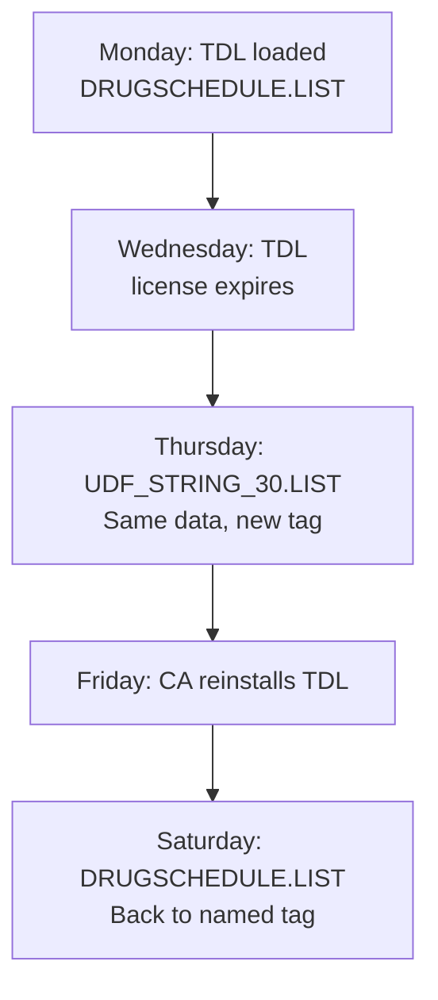

This is the single most important UDF concept for connector developers. Get this wrong and you'll lose data silently.

## The Two Faces of a UDF

The **same** UDF produces **different** XML depending on whether its defining TDL addon is loaded.

### When the TDL IS loaded

The UDF appears with its friendly, human-readable name:

```xml
<DRUGSCHEDULE.LIST Index="30">
  <DRUGSCHEDULE>H1</DRUGSCHEDULE>
</DRUGSCHEDULE.LIST>
```

### When the TDL is NOT loaded

The data is still there, but the name is gone. Tally falls back to a generic indexed name:

```xml
<UDF_STRING_30.LIST Index="30">
  <UDF_STRING_30>H1</UDF_STRING_30>
</UDF_STRING_30.LIST>
```

Same data. Same index. Different tag name.

## Why Does This Happen?

TDL addons **define** UDF names at runtime. When the TDL is loaded, Tally knows that Index 30 is called "DrugSchedule". When it's not loaded -- maybe the license expired, or the CA uninstalled it, or Tally was reinstalled -- the definition is gone. The **data** persists in the company file, but Tally can only refer to it by its raw index.

:::danger
If your parser only looks for `<DRUGSCHEDULE.LIST>`, you will silently miss the field the moment the TDL is unloaded. The data is right there in `<UDF_STRING_30.LIST>` -- you just aren't looking for it.
:::

## The Index Is Your Anchor

The `Index` attribute is the **only** stable identifier across both states:

| State | Tag Name | Index |
|---|---|---|
| TDL loaded | `DRUGSCHEDULE.LIST` | `30` |
| TDL unloaded | `UDF_STRING_30.LIST` | `30` |

Your parser must key on `Index`, not tag name.

## Detection Logic

Here's how to handle both cases in your parser:

```
For each *.LIST element in XML:
  1. Check for "Index" attribute
  2. If present -> this is a UDF
  3. Extract the Index value (integer)
  4. Check your UDF registry for this index
  5. If found -> use registry name
  6. If NOT found -> use tag name as-is
  7. Store value keyed by index
```

### Pseudocode

```python
def parse_udf(element, registry):
    idx = element.get("Index")
    if idx is None:
        return None  # Not a UDF

    idx = int(idx)
    tag = element.tag.replace(".LIST", "")

    # Is this a named or indexed tag?
    if tag.startswith("UDF_STRING_"):
        # TDL not loaded -- generic name
        name = registry.get(idx, tag)
    else:
        # TDL loaded -- friendly name
        name = tag
        # Update registry with name
        registry[idx] = name

    value = element.find(tag).text
    return (idx, name, value)
```

## The Type Variants

It's not just strings. The generic fallback name reflects the UDF type:

| UDF Type | Named Tag | Indexed Tag |
|---|---|---|
| String | `DRUGSCHEDULE` | `UDF_STRING_30` |
| Number | `PACKOF` | `UDF_NUMBER_31` |
| Amount | `DISCOUNTAMT` | `UDF_AMOUNT_32` |
| Date | `FOLLOWUPDATE` | `UDF_DATE_33` |

The pattern is always `UDF_{TYPE}_{INDEX}`.

## Real-World Scenario

Here's a timeline that actually happens:



Your connector must handle **every** transition in this cycle without losing or duplicating data.

## Best Practices

1. **Always store UDF values by index**, not by name
2. **Keep a name-to-index mapping** in your UDF registry
3. **Update the registry** whenever you see a named UDF (it confirms the mapping)
4. **Accept generic-named UDFs** gracefully -- don't log errors, just resolve via index
5. **Re-run discovery** periodically to catch TDL state changes
