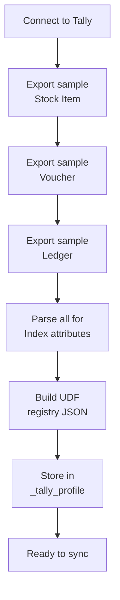

Before you sync a single record, you need to know what custom fields exist. UDF discovery is not optional -- skip it and you'll miss critical business data like drug schedules, manufacturer names, or salesman assignments.

## Why Discovery Must Come First

UDFs are **invisible** until you ask for them. A standard field-filtered export won't include them. You need to pull **full objects** and scan for the telltale signs.

Here's the 4-step algorithm.

## Step 1: Export Full Objects

Request a complete object export for each master type -- **without** field filtering. The key is the full object dump, not a filtered collection.

```xml
<ENVELOPE>
  <HEADER>
    <TALLYREQUEST>Export</TALLYREQUEST>
    <TYPE>Object</TYPE>
    <SUBTYPE>Stock Item</SUBTYPE>
    <ID>##ANY_ITEM_NAME##</ID>
  </HEADER>
  <BODY><DESC><STATICVARIABLES>
    <SVEXPORTFORMAT>
      $$SysName:XML
    </SVEXPORTFORMAT>
    <EXPLODEFLAG>Yes</EXPLODEFLAG>
  </STATICVARIABLES></DESC></BODY>
</ENVELOPE>
```

:::tip
You only need **one** sample object per type. Pick any Stock Item, any Voucher, any Ledger. The UDF tags will appear on all objects of that type.
:::

Repeat this for:
- **Stock Item** (product-level UDFs)
- **Voucher** (transaction-level UDFs)
- **Ledger** (party-level UDFs)

## Step 2: Parse for UDF Tags

Standard Tally tags don't have an `Index` attribute. UDF tags **always** do. That's your signal.

```xml
<!-- Standard tag -- no Index attribute -->
<GSTDETAILS.LIST>
  ...
</GSTDETAILS.LIST>

<!-- UDF tag -- has Index attribute -->
<DRUGSCHEDULE.LIST Index="30">
  <DRUGSCHEDULE>H1</DRUGSCHEDULE>
</DRUGSCHEDULE.LIST>
```

Scan every `*.LIST` element. If it has an `Index` attribute, it's a UDF.

## Step 3: Build the UDF Registry

Map each discovered UDF by its object type, tag name, and index:

```json
{
  "stock_item": [
    {
      "name": "DrugSchedule",
      "index": 30,
      "type": "String"
    },
    {
      "name": "Manufacturer",
      "index": 31,
      "type": "String"
    },
    {
      "name": "StorageTemp",
      "index": 32,
      "type": "String"
    },
    {
      "name": "PackOf",
      "index": 33,
      "type": "Number"
    }
  ],
  "voucher": [
    {
      "name": "SalesmanName",
      "index": 30,
      "type": "String"
    }
  ],
  "ledger": [
    {
      "name": "Territory",
      "index": 30,
      "type": "String"
    },
    {
      "name": "Route",
      "index": 31,
      "type": "String"
    }
  ]
}
```

:::caution
The `index` is the **stable identifier**. The `name` can change if the TDL is unloaded. Always key your storage on `index`, not `name`. See [Named vs Indexed](/tally-integartion/tdl-custom-fields/named-vs-indexed/) for the full story.
:::

## Step 4: Store in the Tally Profile

Persist the registry in your `_tally_profile` table under a `discovered_udfs` column (JSON):

```sql
UPDATE _tally_profile
SET discovered_udfs = '{"stock_item":[...]}'
WHERE company_guid = ?;
```

This registry tells every subsequent sync operation:
- Which extra fields to expect in XML
- What index to look for if the tag name changes
- What type to cast the value to

## The Discovery Flow



## When to Re-Run Discovery

Discovery isn't one-and-done. Re-run it when:

- A new TDL is loaded (detected via `tally.ini` change)
- A TDL is removed (UDF names will shift to indexed form)
- After a Tally upgrade
- After a data repair operation
- Periodically (weekly) as a safety net
