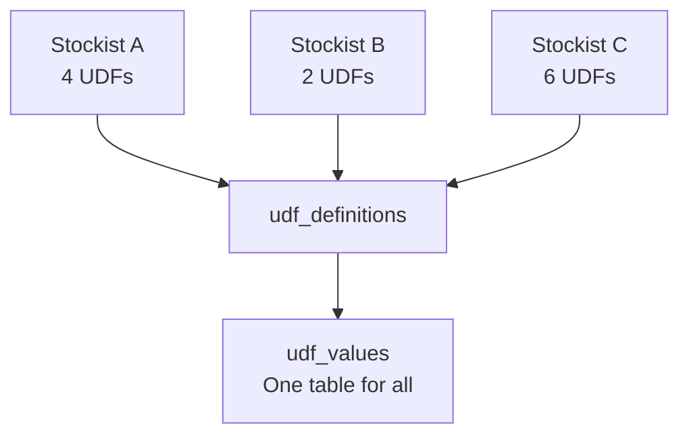

You've discovered the UDFs. You've parsed them from XML. Now where do you put them?

The challenge: every stockist has a **different** set of UDFs. One has DrugSchedule and Manufacturer. Another has SalesmanName and Territory. A third has all four plus BarcodeValue. You can't add columns to your schema for every new stockist.

## The Dynamic Key-Value Approach

Instead of per-stockist schema changes, use two central tables.

### UDF Definitions Table

Stores the **registry** of known UDF definitions across all stockists:

```sql
CREATE TABLE udf_definitions (
  id            INTEGER PRIMARY KEY,
  company_guid  TEXT NOT NULL,
  object_type   TEXT NOT NULL,
  udf_index     INTEGER NOT NULL,
  udf_name      TEXT NOT NULL,
  udf_type      TEXT NOT NULL,
  discovered_at DATETIME DEFAULT NOW,

  UNIQUE(
    company_guid,
    object_type,
    udf_index
  )
);
```

| Column | Purpose |
|---|---|
| `object_type` | `stock_item`, `voucher`, `ledger` |
| `udf_index` | The stable Index from XML |
| `udf_name` | Friendly name (or generic) |
| `udf_type` | `String`, `Number`, `Amount`, `Date` |

### UDF Values Table

Stores the **actual data** as key-value pairs:

```sql
CREATE TABLE udf_values (
  id           INTEGER PRIMARY KEY,
  object_type  TEXT NOT NULL,
  object_guid  TEXT NOT NULL,
  udf_index    INTEGER NOT NULL,
  udf_name     TEXT NOT NULL,
  udf_type     TEXT NOT NULL,
  udf_value    TEXT,

  UNIQUE(
    object_type,
    object_guid,
    udf_index
  )
);
```

:::tip
We store `udf_value` as `TEXT` regardless of type. Cast at query time. This keeps the schema uniform and avoids NULL column sprawl.
:::

## Example Data

For a Stock Item with medical billing UDFs:

| object_type | object_guid | udf_index | udf_name | udf_type | udf_value |
|---|---|---|---|---|---|
| stock_item | abc-123 | 30 | DrugSchedule | String | H1 |
| stock_item | abc-123 | 31 | Manufacturer | String | Micro Labs |
| stock_item | abc-123 | 32 | StorageTemp | String | Room Temp |
| stock_item | abc-123 | 33 | PackOf | Number | 10 |

For a Voucher with salesman tracking:

| object_type | object_guid | udf_index | udf_name | udf_type | udf_value |
|---|---|---|---|---|---|
| voucher | def-456 | 30 | SalesmanName | String | Amit Kumar |

## Why This Design Works



- **No schema migrations** when onboarding a new stockist
- **No empty columns** for UDFs that don't exist on a given company
- **Self-documenting** -- the definitions table tells you what each index means
- **Flexible** -- adding a new UDF type is just an INSERT, not an ALTER TABLE

## Querying UDFs Efficiently

### Get all UDFs for a Stock Item

```sql
SELECT udf_name, udf_value
FROM udf_values
WHERE object_type = 'stock_item'
  AND object_guid = ?;
```

### Get a specific UDF across all items

```sql
SELECT object_guid, udf_value
FROM udf_values
WHERE object_type = 'stock_item'
  AND udf_index = 30;
```

### Join UDFs with master data

```sql
SELECT
  s.name,
  s.hsn_code,
  u.udf_value AS drug_schedule
FROM mst_stock_item s
LEFT JOIN udf_values u
  ON u.object_type = 'stock_item'
  AND u.object_guid = s.guid
  AND u.udf_index = 30;
```

### Index Recommendations

```sql
CREATE INDEX idx_udf_values_lookup
  ON udf_values(
    object_type,
    object_guid
  );

CREATE INDEX idx_udf_values_by_field
  ON udf_values(
    object_type,
    udf_index,
    udf_value
  );
```

The first index optimizes "get all UDFs for an object." The second optimizes "find all objects with a specific UDF value" (e.g., all Schedule H drugs).

## Handling Name Changes

Remember, UDF names can flip between friendly and generic forms. When you see a UDF during sync:

1. Look up the `udf_index` in `udf_definitions`
2. If the name changed, **update** the definition
3. **Also update** existing `udf_values` rows for consistency

```sql
-- Name changed from generic to friendly
UPDATE udf_definitions
SET udf_name = 'DrugSchedule'
WHERE company_guid = ?
  AND object_type = 'stock_item'
  AND udf_index = 30;

UPDATE udf_values
SET udf_name = 'DrugSchedule'
WHERE object_type = 'stock_item'
  AND udf_index = 30;
```

:::caution
The `udf_index` is your join key and your source of truth. Never use `udf_name` as a primary lookup -- it's there for human readability, not for data integrity.
:::

## Cleanup and Maintenance

Over time, UDFs may be removed (TDL uninstalled permanently). Run periodic cleanup:

```sql
-- Find UDF definitions with no values
SELECT d.*
FROM udf_definitions d
LEFT JOIN udf_values v
  ON v.object_type = d.object_type
  AND v.udf_index = d.udf_index
WHERE v.id IS NULL;
```

Don't auto-delete these -- flag them for review. The TDL might come back.
