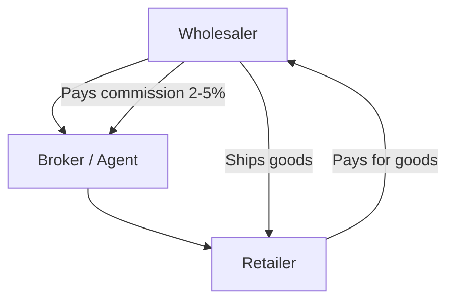

In Indian garment wholesale, the **broker** (dalal/agent) is a key player. Brokers connect buyers with sellers, facilitate deals, and earn commission on each transaction. If your connector doesn't capture broker data, you're missing a significant chunk of the business picture.

## How Brokers Work



The broker is **not the buyer or seller**. They're the intermediary who:
- Brings the retailer to the wholesaler (or vice versa)
- Negotiates terms
- Earns 2-5% commission on the deal
- May handle some logistics

The invoice is between the wholesaler and the retailer. The broker is a third party tracked alongside the transaction.

## Commission Rates

| Deal Type | Typical Commission |
|----------|-------------------|
| Regular orders | 2-3% |
| Large/bulk orders | 1-2% |
| New party introduction | 3-5% |
| Seasonal/clearance | 1-2% |

Commission is usually calculated on the **net invoice value** (before tax, after discounts).

## Tracking Pattern 1: Cost Centre Allocation

The more structured approach. Each broker is a Cost Centre, and sales voucher entries are allocated to them.

### Setup in Tally

```
Cost Centre Category: Brokers
  ├── Ramesh Shah
  ├── Mahesh Jain
  ├── Sunil Agarwal
  └── Direct (no broker)
```

### In Voucher XML

```xml
<VOUCHER VCHTYPE="Sales">
  <PARTYLEDGERNAME>Retailer ABC</PARTYLEDGERNAME>
  <ALLLEDGERENTRIES.LIST>
    <LEDGERNAME>Sales Account</LEDGERNAME>
    <AMOUNT>50000.00</AMOUNT>
    <COSTCENTREALLOCATIONS.LIST>
      <NAME>Ramesh Shah</NAME>
      <AMOUNT>50000.00</AMOUNT>
    </COSTCENTREALLOCATIONS.LIST>
  </ALLLEDGERENTRIES.LIST>
</VOUCHER>
```

### Detection

```
1. Check for Cost Centre category named
   "Broker", "Agent", "Dalal", "Commission"
2. Sample vouchers for CC allocations
3. If found → Pattern 1 confirmed
```

## Tracking Pattern 2: UDF on Voucher

A simpler approach where the broker name and commission percentage are UDFs on the voucher header.

### In Voucher XML

```xml
<VOUCHER VCHTYPE="Sales">
  <PARTYLEDGERNAME>Retailer ABC</PARTYLEDGERNAME>
  <BROKERNAME.LIST TYPE="String" Index="35">
    <BROKERNAME>Ramesh Shah</BROKERNAME>
  </BROKERNAME.LIST>
  <BROKERCOMMISSIONPCT.LIST TYPE="Number" Index="36">
    <BROKERCOMMISSIONPCT>3</BROKERCOMMISSIONPCT>
  </BROKERCOMMISSIONPCT.LIST>
</VOUCHER>
```

### Detection

```
1. UDF discovery on vouchers
2. Look for fields named *Broker*, *Agent*,
   *Commission*, *Dalal*
3. If found → Pattern 2 confirmed
```

:::tip
Some companies use BOTH patterns -- Cost Centres for formal accounting and UDFs for quick reference. When both are present, extract both but prefer the Cost Centre allocation for reports (it's linked to the accounting entry).
:::

## Commission Calculation

The connector doesn't need to calculate commission itself, but it should provide the data for the central system to do so:

```
For each Sales voucher:
  broker = extract_broker(voucher)
  net_amount = sales_amount - discount
  commission = net_amount * commission_pct / 100
```

### Commission Payment Tracking

Some companies track commission payments via a separate ledger:

```
Ledger: "Broker Commission A/c"
  (under Indirect Expenses)
```

Payment vouchers to brokers reference this ledger. Your connector can extract these to track commission paid vs accrued.

## Broker-Wise Sales Reports

Once you have broker data on vouchers, the central system can generate valuable reports:

| Report | What It Shows |
|--------|-------------|
| Broker-wise sales summary | Total sales facilitated by each broker |
| Commission statement | Commission earned per period |
| Party-broker mapping | Which broker handles which retailers |
| Broker performance | Month-over-month trends |

### Sample Query Logic

```sql
SELECT
  broker_name,
  COUNT(*) as deal_count,
  SUM(net_amount) as total_sales,
  SUM(net_amount * commission_pct / 100)
    as commission_earned
FROM vouchers
WHERE voucher_type = 'Sales'
  AND broker_name IS NOT NULL
GROUP BY broker_name
ORDER BY total_sales DESC;
```

## The "Direct" Case

Not every sale goes through a broker. Direct sales (the wholesaler's own sales team) should be tracked as "Direct" or "No Broker" in the cost centre. This lets you compare broker-assisted vs direct sales.

## Edge Cases

1. **Multiple brokers per deal**: Rare, but possible. Cost Centre allocations can split the amount between two brokers. UDFs typically only hold one broker name.

2. **Broker as a party**: Some brokers also buy goods for their own stock. They might appear as both a Cost Centre (broker role) and a Ledger (buyer role). Don't confuse the two.

3. **Commission disputes**: Brokers sometimes claim commission on deals they didn't facilitate. The voucher-level tracking helps resolve these disputes.

4. **Missing broker data**: Not every company tracks brokers in Tally. Some use a separate spreadsheet or just remember. If your connector finds no broker UDFs or cost centres, that's fine -- don't force it.

:::caution
Broker commission is a sensitive business topic. It directly affects profitability and broker relationships. Make sure the data extracted is accurate and presented in a context where the right people see it (owner/manager, not field reps).
:::
