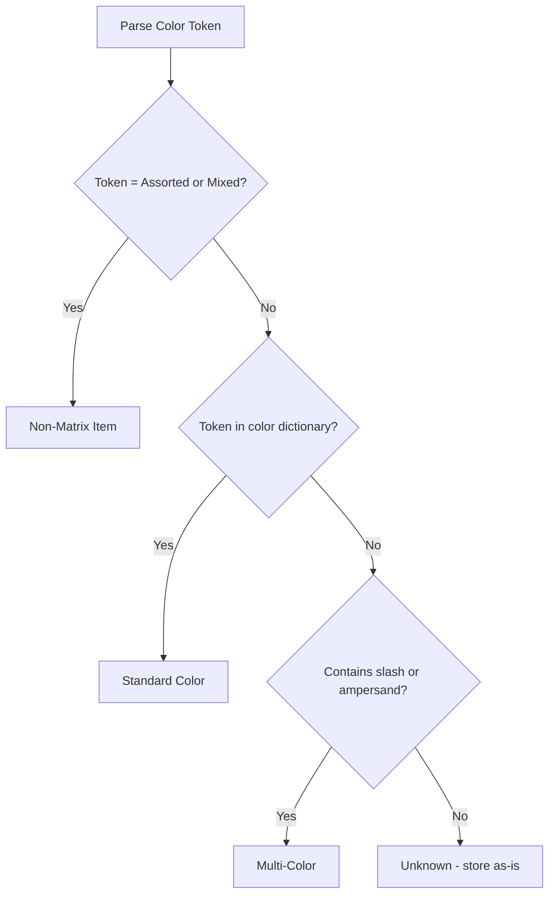

Colors are the other half of the variant equation. When your connector encounters "Polo Tee **Blue** M" or "Denim Jeans **Indigo** 32", it needs to recognize that token as a color. Here's your comprehensive reference.

## Full Color Names

The standard palette you'll encounter in Indian garment wholesale:

| Color | Frequency | Notes |
|-------|-----------|-------|
| Black | Very high | Staple across all categories |
| White | Very high | |
| Blue | Very high | Often needs disambiguation (light/dark/navy) |
| Navy | High | Sometimes called "Navy Blue" |
| Red | High | |
| Grey / Gray | High | Both spellings used |
| Pink | High | Especially women's wear |
| Green | High | |
| Maroon | High | Very popular in Indian wear |
| Beige | Medium | |
| Brown | Medium | |
| Cream | Medium | |
| Yellow | Medium | |
| Orange | Medium | |
| Purple | Medium | |
| Wine | Medium | Close to maroon |
| Teal | Low | |
| Olive | Low | |
| Khaki | Low | |
| Rust | Low | |
| Peach | Low | Women's wear |
| Coral | Low | Women's wear |
| Mint | Low | |
| Lavender | Low | |
| Mustard | Low | |

## Common Abbreviations

Many stockists abbreviate colors in item names to save space:

| Abbreviation | Full Color |
|-------------|-----------|
| BLK | Black |
| WHT | White |
| BLU | Blue |
| RED | Red |
| NVY | Navy |
| GRN | Green |
| GRY | Grey |
| PNK | Pink |
| YLW | Yellow |
| MRN | Maroon |
| BGE | Beige |
| BRN | Brown |
| CRM | Cream |
| ORG | Orange |
| PUR | Purple |
| WNE | Wine |
| TL | Teal |
| OLV | Olive |
| KHK | Khaki |

:::tip
Build a bidirectional normalization dictionary. When you see `BLU`, normalize to `Blue`. When displaying, use the full name. Store both the raw and normalized values.
:::

## Fabric-Specific Colors (Denim / Jeans)

Denim has its own color vocabulary that doesn't map cleanly to standard colors:

| Token | What It Means |
|-------|--------------|
| Indigo | Classic dark denim blue |
| Dark Wash | Deep blue |
| Medium Wash | Standard blue |
| Light Wash | Faded blue |
| Stone Wash | Weathered, lighter blue |
| Raw | Unwashed, dark |
| Acid Wash | Heavily faded, patchy |
| Rinsed | Lightly washed |
| Faded | Light, worn appearance |
| Distressed | Torn/worn look (style, not damage) |
| Ice Blue | Very light wash |
| Carbon Black | Black denim |

These are all "colors" in garment parlance, even though they're really wash treatments.

## Pattern and Print Colors

Some items are described by pattern rather than solid color:

| Token | Example |
|-------|---------|
| Striped Blue | Blue and white stripes |
| Check Red | Red checkered pattern |
| Printed Floral | Floral print |
| Solid Navy | Solid (no pattern) navy |
| Plaid | Scottish-style pattern |
| Paisley | Curved droplet pattern |
| Abstract | Non-specific print |
| Geometric | Geometric print |

:::caution
Pattern tokens like "Striped Blue" contain a color token ("Blue") that your parser might extract. Decide whether to store the full pattern description or just the base color. For matrix display purposes, "Striped Blue" and "Solid Blue" should probably be separate colors.
:::

## Multi-Color Values

When an item has multiple colors:

| Token | Meaning |
|-------|---------|
| `Blue/White` | Two-tone (slash separated) |
| `Black & Red` | Two-tone (ampersand) |
| `Red-Blue` | Two-tone (dash separated) |
| `Multicolor` | Multiple colors, unspecified |
| `Assorted` | Mixed colors in a lot |

### The "Assorted" Problem

"Assorted" is a special case that breaks the matrix:

```
"T-Shirt Assorted Colors L"
```

This means the lot contains multiple colors, but they're not individually tracked. You **cannot** decompose this into a color-size matrix.



:::danger
Never try to create matrix entries for "Assorted" items. They represent bulk lots where individual variant tracking was skipped. Treat them as flat items with a note that the color is mixed.
:::

## Normalization Dictionary

Here's the complete normalization map your connector should use:

```python
COLOR_NORMALIZE = {
    # Standard mappings
    "BLK": "Black", "BLACK": "Black",
    "WHT": "White", "WHITE": "White",
    "BLU": "Blue",  "BLUE": "Blue",
    "RED": "Red",
    "NVY": "Navy",  "NAVY": "Navy",
    "NAVY BLUE": "Navy",
    "GRN": "Green", "GREEN": "Green",
    "GRY": "Grey",  "GRAY": "Grey",
    "GREY": "Grey",
    "PNK": "Pink",  "PINK": "Pink",
    "YLW": "Yellow","YELLOW": "Yellow",
    "MRN": "Maroon","MAROON": "Maroon",
    "BGE": "Beige", "BEIGE": "Beige",
    "BRN": "Brown", "BROWN": "Brown",
    "CRM": "Cream", "CREAM": "Cream",
    "ORG": "Orange","ORANGE": "Orange",
    "PUR": "Purple","PURPLE": "Purple",
    "WNE": "Wine",  "WINE": "Wine",

    # Fabric-specific
    "INDIGO": "Indigo",
    "DK WASH": "Dark Wash",
    "LT WASH": "Light Wash",
    "STN WASH": "Stone Wash",
    "RAW": "Raw",

    # Multi
    "MULTI": "Multicolor",
    "MULTICOLOR": "Multicolor",
    "ASST": "Assorted",
    "ASSORTED": "Assorted",
    "MIXED": "Assorted",
}
```

## Extraction Strategy

When parsing an item name suffix for color:

1. **Check against full dictionary** (case-insensitive)
2. **Handle multi-word colors**: "Navy Blue", "Dark Wash", "Light Grey"
3. **Try abbreviation lookup** if full name doesn't match
4. **Handle multi-color separators**: Split on `/`, `&`, `-`
5. **Flag "Assorted"/"Mixed"** as non-matrix

## Color Sort Order

Unlike sizes, colors don't have a universal sort order. Common approaches:

- **Alphabetical**: Simple but not intuitive
- **Popularity**: Sort by frequency of sales (requires data)
- **Light to dark**: White, Cream, Beige, ... Black
- **Category grouping**: All blues together, all reds together

For the connector, store colors as-is and let the front-end app decide sort order based on user preference.
