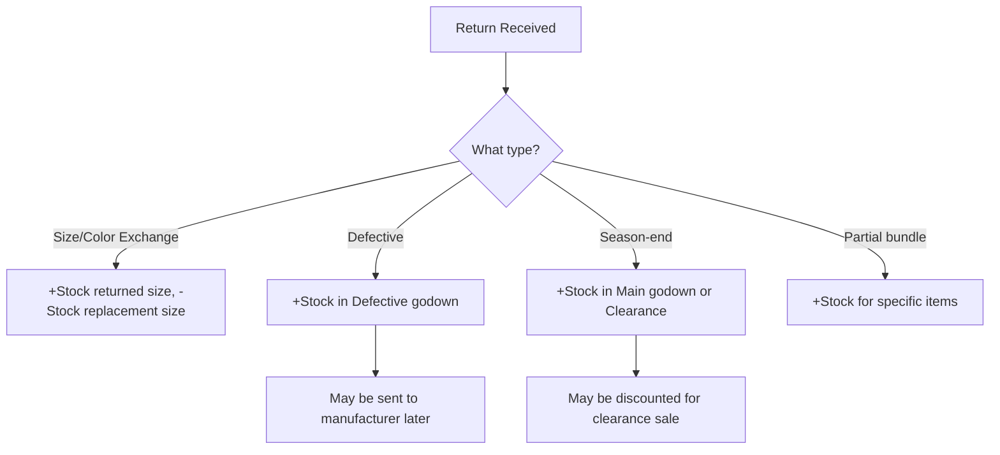

Returns in garments are a whole different beast compared to pharma. The return rate is higher, the reasons are more varied, and the voucher patterns are more complex. Let's walk through every type your connector will encounter.

## Why Garment Returns Are Harder

| Dimension | Pharma Returns | Garment Returns |
|-----------|---------------|----------------|
| Return rate | 2-5% | 10-25% |
| Common reason | Expiry, damage | Wrong size/color, unsold stock |
| Timing | Ad-hoc | Seasonal waves |
| Complexity | Simple reversal | Often involves exchange |
| Volume | Low | High (especially season-end) |

## Return Type 1: Size Exchange

The most common garment return. Customer bought Medium, needs Large.

### How It Appears in Tally

Two approaches:

**Option A: Credit Note + New Sale**
```xml
<!-- Credit Note (return of M) -->
<VOUCHER VCHTYPE="Credit Note">
  <PARTYLEDGERNAME>Retailer ABC</PARTYLEDGERNAME>
  <ALLINVENTORYENTRIES.LIST>
    <STOCKITEMNAME>Polo Tee Blue M</STOCKITEMNAME>
    <ACTUALQTY>5 Pcs</ACTUALQTY>
    <RATE>350.00/Pcs</RATE>
    <AMOUNT>1750.00</AMOUNT>
  </ALLINVENTORYENTRIES.LIST>
</VOUCHER>

<!-- Sales Invoice (sale of L) -->
<VOUCHER VCHTYPE="Sales">
  <PARTYLEDGERNAME>Retailer ABC</PARTYLEDGERNAME>
  <ALLINVENTORYENTRIES.LIST>
    <STOCKITEMNAME>Polo Tee Blue L</STOCKITEMNAME>
    <ACTUALQTY>5 Pcs</ACTUALQTY>
    <RATE>350.00/Pcs</RATE>
    <AMOUNT>1750.00</AMOUNT>
  </ALLINVENTORYENTRIES.LIST>
</VOUCHER>
```

**Option B: Rejections In + Delivery Note**
```xml
<!-- Rejections In (goods returned) -->
<VOUCHER VCHTYPE="Rejections In">
  <ALLINVENTORYENTRIES.LIST>
    <STOCKITEMNAME>Polo Tee Blue M</STOCKITEMNAME>
    <ACTUALQTY>5 Pcs</ACTUALQTY>
  </ALLINVENTORYENTRIES.LIST>
</VOUCHER>

<!-- Delivery Note (replacement sent) -->
<VOUCHER VCHTYPE="Delivery Note">
  <ALLINVENTORYENTRIES.LIST>
    <STOCKITEMNAME>Polo Tee Blue L</STOCKITEMNAME>
    <ACTUALQTY>5 Pcs</ACTUALQTY>
  </ALLINVENTORYENTRIES.LIST>
</VOUCHER>
```

:::caution
Size exchanges are TWO transactions -- an inward (return) and an outward (replacement). Your connector must treat them as separate events. The stock of the returned size increases, and the stock of the replacement size decreases.
:::

## Return Type 2: Color Exchange

Same pattern as size exchange, but swapping colors:

```
Return: Polo Tee Blue M (5 pcs)
Replace: Polo Tee Red M (5 pcs)
```

Stock impact: Blue M increases by 5, Red M decreases by 5.

## Return Type 3: Defective Returns

Goods returned due to manufacturing defect, stitching issues, or damage in transit.

```xml
<VOUCHER VCHTYPE="Credit Note">
  <PARTYLEDGERNAME>Retailer ABC</PARTYLEDGERNAME>
  <NARRATION>Defective goods return</NARRATION>
  <ALLINVENTORYENTRIES.LIST>
    <STOCKITEMNAME>Formal Shirt White 40</STOCKITEMNAME>
    <ACTUALQTY>3 Pcs</ACTUALQTY>
    <GODOWNNAME>Defective</GODOWNNAME>
  </ALLINVENTORYENTRIES.LIST>
</VOUCHER>
```

Note the **godown**: defective returns typically go to a "Defective" or "Damaged" godown, not back to regular stock. The wholesaler may then:
- Send them back to the manufacturer (Debit Note)
- Sell at clearance price
- Write off (Stock Journal with loss)

## Return Type 4: Season-End Bulk Returns

The big one. At the end of a season, retailers return all unsold stock in bulk. This can be **hundreds of pieces across dozens of designs**.

```xml
<!-- Single Credit Note with many lines -->
<VOUCHER VCHTYPE="Credit Note">
  <DATE>20260115</DATE>
  <PARTYLEDGERNAME>Retailer XYZ</PARTYLEDGERNAME>
  <NARRATION>
    Season-end return - Diwali 2025
  </NARRATION>
  <!-- Line 1 -->
  <ALLINVENTORYENTRIES.LIST>
    <STOCKITEMNAME>Kurta Blue M</STOCKITEMNAME>
    <ACTUALQTY>15 Pcs</ACTUALQTY>
  </ALLINVENTORYENTRIES.LIST>
  <!-- Line 2 -->
  <ALLINVENTORYENTRIES.LIST>
    <STOCKITEMNAME>Kurta Blue L</STOCKITEMNAME>
    <ACTUALQTY>8 Pcs</ACTUALQTY>
  </ALLINVENTORYENTRIES.LIST>
  <!-- ... 50+ more lines -->
</VOUCHER>
```

:::tip
Season-end returns create a burst of Credit Notes in January-March (end of festive/winter season). Your sync engine should handle the increased voucher volume during this period.
:::

## Return Type 5: Partial Bundle Returns

A retailer bought a bundle of 100 mixed pieces and returns 15 of them -- but the returned items are specific sizes and colors.

```
Original sale: 100 pcs assorted sizes/colors
Return: 3 x Blue M, 5 x Red L, 7 x White XL
```

This requires the Credit Note to specify exact items, even if the original sale was loosely tracked.

## Impact on Stock

Each return type affects stock differently:



## The Phantom Inventory Problem

:::danger
When a retailer exchanges size M for size L but the billing clerk only records the sale of L (forgetting the return of M), the stock record for M is wrong -- it shows fewer than actual. This "phantom inventory" is a common data quality issue in garment businesses. Your connector can help detect it by flagging exchanges where only one leg of the transaction exists.
:::

## Voucher Types for Returns

| Voucher Type | When Used | Stock Impact |
|-------------|-----------|-------------|
| Credit Note | Sales return with accounting | Stock IN + reduce receivable |
| Debit Note | Purchase return with accounting | Stock OUT + reduce payable |
| Rejections In | Sales return (stock only) | Stock IN only |
| Rejections Out | Purchase return (stock only) | Stock OUT only |

## What Your Connector Should Track

1. **All Credit Notes and Rejections In** -- these are your inward returns
2. **Link returns to original sales** where possible (via reference number)
3. **Godown allocations** -- distinguish regular returns from defective
4. **Return reasons** (if captured in narration or UDF)
5. **Return volume trends** -- high return rates signal quality or sizing issues
