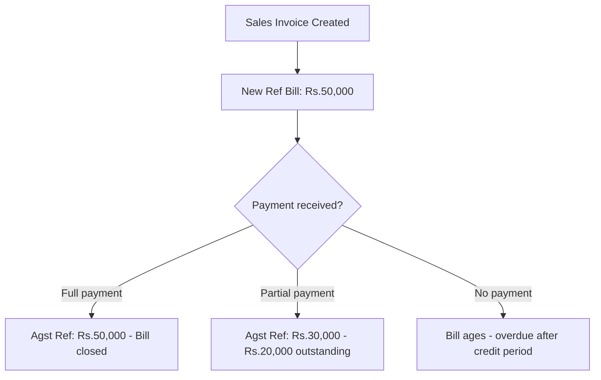

Garment wholesale runs on credit. Almost every transaction is "buy now, pay later." Understanding how credit flows through Tally is essential for your connector, because the sales app needs to answer a critical question before every order: *"Can this retailer afford to buy more?"*

## Credit Terms in Garment Wholesale

| Typical Terms | Who Gets Them |
|--------------|--------------|
| Cash / COD | New or small retailers |
| 15 days | Small retailers with history |
| 30 days | Regular retailers |
| 45-60 days | Larger retail chains |
| 90 days | Large accounts, seasonal |

Compare this with pharma (typically 15-30 days) -- garment credit terms are significantly longer, which ties up more working capital.

## What Is Hundi?

A **Hundi** (also called a trade bill or promissory note) is an informal payment instrument common in Indian garment trade:

1. Buyer purchases goods on credit
2. Instead of immediate payment, buyer signs a **Hundi** -- a promise to pay on a future date
3. The Hundi is essentially a post-dated cheque equivalent, but less formal
4. On the due date, the seller presents the Hundi for payment

In Tally, Hundis appear as bill allocations with future due dates.

## How Credit Tracking Works in Tally

### Bill Allocations

Every credit sale in Tally creates a "bill" (a receivable) tracked via the Bill Allocation system:

```xml
<VOUCHER VCHTYPE="Sales">
  <ALLLEDGERENTRIES.LIST>
    <LEDGERNAME>Retailer ABC</LEDGERNAME>
    <AMOUNT>-50000.00</AMOUNT>
    <BILLALLOCATIONS.LIST>
      <BILLTYPE>New Ref</BILLTYPE>
      <NAME>INV/2025-26/042</NAME>
      <AMOUNT>-50000.00</AMOUNT>
      <BILLCREDITPERIOD>30 Days</BILLCREDITPERIOD>
    </BILLALLOCATIONS.LIST>
  </ALLLEDGERENTRIES.LIST>
</VOUCHER>
```

When payment is received:

```xml
<VOUCHER VCHTYPE="Receipt">
  <ALLLEDGERENTRIES.LIST>
    <LEDGERNAME>Retailer ABC</LEDGERNAME>
    <AMOUNT>50000.00</AMOUNT>
    <BILLALLOCATIONS.LIST>
      <BILLTYPE>Agst Ref</BILLTYPE>
      <NAME>INV/2025-26/042</NAME>
      <AMOUNT>50000.00</AMOUNT>
    </BILLALLOCATIONS.LIST>
  </ALLLEDGERENTRIES.LIST>
</VOUCHER>
```

### Bill Types

| Type | Meaning |
|------|---------|
| `New Ref` | New bill created (sale on credit) |
| `Agst Ref` | Payment against existing bill |
| `On Account` | Advance payment, not linked to a specific bill |

## Outstanding and Ageing Analysis

The `trn_bill` table in your connector's cache gives you everything needed for ageing:

```
For each party:
  Fetch all bills where:
    bill_type = "New Ref" (sales)
  Subtract matching:
    bill_type = "Agst Ref" (payments)
  Remaining = Outstanding

  Group by age:
    0-30 days:   Rs.1,50,000
    31-60 days:  Rs.  85,000
    61-90 days:  Rs.  42,000
    90+ days:    Rs.  18,000
    TOTAL:       Rs.2,95,000
```



## Party Credit Limits

Tally ledgers can have credit limits and default credit periods:

```xml
<LEDGER NAME="Retailer ABC">
  <CREDITPERIOD>30</CREDITPERIOD>
  <CREDITLIMIT>200000.00</CREDITLIMIT>
  <BILLCREDITPERIOD>30</BILLCREDITPERIOD>
</LEDGER>
```

Your connector should extract these and expose them to the sales app for pre-order validation:

```
Before placing an order for Retailer ABC:
  Credit limit:  Rs.2,00,000
  Outstanding:   Rs.1,75,000
  Available:     Rs.   25,000
  Overdue:       Rs.   42,000 (61-90 day bucket)

→ WARNING: Only Rs.25,000 available.
  Order value Rs.60,000 exceeds limit.
  Rs.42,000 is overdue.
```

:::caution
Credit limits in Tally are often loosely enforced -- the billing clerk can override them. But your sales app should flag these situations to prevent field reps from over-committing credit to risky accounts.
:::

## The Bills Receivable Report

Tally has a built-in Bills Receivable report that your connector can extract directly:

```xml
<ENVELOPE>
  <HEADER>
    <TALLYREQUEST>Export</TALLYREQUEST>
    <TYPE>Data</TYPE>
    <ID>Bills Receivable</ID>
  </HEADER>
  <BODY><DESC><STATICVARIABLES>
    <SVEXPORTFORMAT>
      $$SysName:XML
    </SVEXPORTFORMAT>
  </STATICVARIABLES></DESC></BODY>
</ENVELOPE>
```

This gives you a pre-computed outstanding report that's useful for cross-validation.

## Practical Impact for Garment Integration

1. **Pre-order credit check**: The most valuable use of credit data. The sales app should warn before placing orders that exceed credit limits.

2. **Collection tracking**: Field reps can see overdue amounts for their territory and prioritize collection visits.

3. **Hundi/bill maturity alerts**: When a trade bill is coming due, alert the relevant salesman for follow-up.

4. **Party risk scoring**: Parties with chronically overdue bills are higher risk. Flag them.

:::tip
The garment business runs on relationships and trust. Credit data doesn't replace the personal judgment of the salesman or owner -- but it gives them the numbers to make informed decisions. Present credit data as advisory, not blocking.
:::
