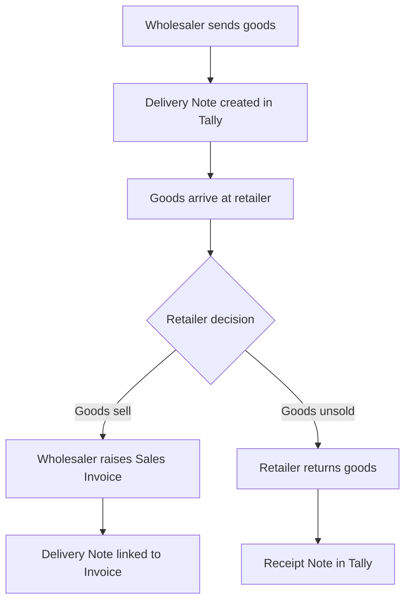

Garment wholesale runs heavily on consignment. A wholesaler sends goods to a retailer *without invoicing* -- the retailer checks the stock, keeps what sells, and returns the rest. This "send now, invoice later" pattern is tracked through **Delivery Challans** in Tally.

## What Is a Delivery Challan?

A Delivery Challan (or Delivery Note in Tally terminology) records the physical movement of goods without creating a financial transaction. The goods leave your warehouse, but no sale has happened yet.

| Aspect | Delivery Note (Challan) | Sales Invoice |
|--------|------------------------|---------------|
| Stock impact | Yes (goods move out) | Yes |
| Accounting impact | No | Yes (revenue + receivable) |
| GST impact | No (not a supply) | Yes |
| Purpose | Track physical dispatch | Record the sale |

## How It Works in Practice



### The Timeline

1. **Day 1**: Wholesaler creates Delivery Note for 100 shirts sent to Retailer ABC
2. **Day 1-30**: Retailer displays and sells the shirts
3. **Day 15**: Retailer confirms 70 shirts sold, returns 30
4. **Day 15**: Wholesaler creates Sales Invoice for 70 shirts (linked to Delivery Note)
5. **Day 15**: Wholesaler creates Receipt Note for 30 shirts returned

## How Challans Appear in Tally XML

A Delivery Note is a voucher of type `Delivery Note`:

```xml
<VOUCHER VCHTYPE="Delivery Note">
  <DATE>20260301</DATE>
  <VOUCHERNUMBER>DN/2025-26/042</VOUCHERNUMBER>
  <PARTYLEDGERNAME>Retailer ABC</PARTYLEDGERNAME>
  <NARRATION>
    Goods on approval - 15 day return
  </NARRATION>
  <TRACKINGNUMBER>CH-042</TRACKINGNUMBER>
  <ALLINVENTORYENTRIES.LIST>
    <STOCKITEMNAME>
      Polo Tee Blue M
    </STOCKITEMNAME>
    <ACTUALQTY>50 Pcs</ACTUALQTY>
    <RATE>350.00/Pcs</RATE>
    <AMOUNT>17500.00</AMOUNT>
  </ALLINVENTORYENTRIES.LIST>
  <ALLINVENTORYENTRIES.LIST>
    <STOCKITEMNAME>
      Polo Tee Blue L
    </STOCKITEMNAME>
    <ACTUALQTY>30 Pcs</ACTUALQTY>
    <RATE>350.00/Pcs</RATE>
    <AMOUNT>10500.00</AMOUNT>
  </ALLINVENTORYENTRIES.LIST>
</VOUCHER>
```

The `TRACKINGNUMBER` field is the challan number that links the Delivery Note to the eventual Sales Invoice.

## The Inventory Impact

Here's the critical accounting:

```
Before Delivery Note:
  Warehouse stock: 200 Polo Tee Blue M

After Delivery Note (50 sent on challan):
  Warehouse stock: 150 Polo Tee Blue M
  In-transit / On approval: 50 Polo Tee Blue M

Available for new orders:
  200 - 50 = 150 (NOT 200!)
```

:::danger
Tally's stock summary shows the warehouse stock as 150 (goods are OUT). But the sale hasn't happened yet. Your connector must track unresolved Delivery Notes separately so the sales app can show:
- **Closing stock**: What Tally shows (warehouse physical stock)
- **On challan**: Goods out on Delivery Notes, not yet invoiced
- **Available to sell**: Closing stock only (challan goods are committed)
:::

## Tracking Unresolved Challans

To know which challans are still open:

```
1. Fetch all Delivery Notes
2. Fetch all Sales Invoices that reference
   those Delivery Notes (via tracking number)
3. Unresolved = Delivery Notes without
   matching Sales Invoice
```

In Tally, the Sales Invoice references the Delivery Note via `ORDER_NUMBER` or `TRACKINGNUMBER` field in the inventory entry:

```xml
<!-- Sales Invoice referencing a challan -->
<ALLINVENTORYENTRIES.LIST>
  <STOCKITEMNAME>Polo Tee Blue M</STOCKITEMNAME>
  <ACTUALQTY>35 Pcs</ACTUALQTY>
  <TRACKINGNUMBER>DN/2025-26/042</TRACKINGNUMBER>
  <ORDERNUMBER>DN/2025-26/042</ORDERNUMBER>
</ALLINVENTORYENTRIES.LIST>
```

## Partial Fulfillment

A single Delivery Note of 100 pieces might be invoiced in parts:

```
DN/042: 100 Polo Tee Blue M sent on challan
INV/101: 35 pieces invoiced (week 1)
INV/108: 40 pieces invoiced (week 2)
Receipt: 25 pieces returned (unsold)
```

Your connector needs to track the **remaining balance** on each challan.

## Challan Ageing

Just like bill ageing, challans have their own ageing concern:

| Age | Status | Action |
|-----|--------|--------|
| 0-15 days | Normal | Expected return window |
| 15-30 days | Overdue | Follow up with retailer |
| 30-60 days | Concerning | Push for invoice or return |
| 60+ days | Problem | Risk of loss/damage |

:::tip
Your central system should generate a "Challan Ageing" report showing all unresolved Delivery Notes with their age. This is a high-value feature for garment wholesalers -- it directly impacts cash flow and inventory accuracy.
:::

## Connector Implementation Notes

1. **Extract all Delivery Notes** as part of voucher sync
2. **Track the `TRACKINGNUMBER`** on both Delivery Notes and Sales Invoices
3. **Compute unresolved balance** per challan in the central system
4. **Expose "Available Stock"** = Closing Stock (excluding challan goods) to the sales app
5. **Generate challan ageing reports** for the wholesaler
