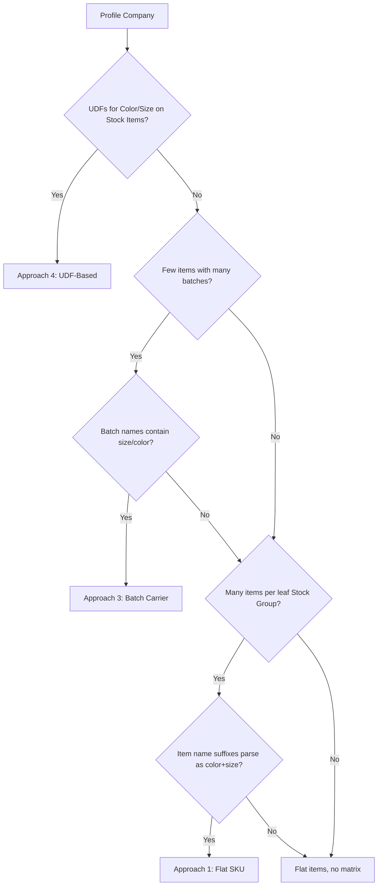

Tally has no native variant model, so garment businesses have invented workarounds. You'll encounter four distinct approaches across different stockists, and your connector needs to handle all of them.

## Approach 1: Flat SKU Explosion

**The most common approach.** Every size-color combination is a separate Stock Item. The Stock Group encodes the "design."

### How It Looks in Tally

```
Stock Groups:
├── Men's Wear
│   └── Shirts
│       └── Cotton Shirt Design-A  ← Design
│           ├── Cotton Shirt Blue S
│           ├── Cotton Shirt Blue M
│           ├── Cotton Shirt Blue L
│           ├── Cotton Shirt Red S
│           ├── Cotton Shirt Red M
│           └── Cotton Shirt Red L
```

### XML Example

```xml
<STOCKGROUP NAME="Cotton Shirt Design-A">
  <PARENT>Shirts</PARENT>
</STOCKGROUP>

<STOCKITEM NAME="Cotton Shirt Blue S">
  <PARENT>Cotton Shirt Design-A</PARENT>
  <BASEUNITS>Pcs</BASEUNITS>
  <OPENINGBALANCE>50 Pcs</OPENINGBALANCE>
</STOCKITEM>

<STOCKITEM NAME="Cotton Shirt Blue M">
  <PARENT>Cotton Shirt Design-A</PARENT>
  <BASEUNITS>Pcs</BASEUNITS>
  <OPENINGBALANCE>75 Pcs</OPENINGBALANCE>
</STOCKITEM>
```

### Detection Strategy

```
1. Find Stock Groups at the leaf level
   (groups that contain items, not sub-groups)
2. If a leaf group has 5+ items and item names
   share a common prefix → likely Approach 1
3. Parse suffixes for size/color tokens
```

### Connector Implication

Each size-color in an order becomes a **separate inventory entry** line in the Tally voucher. An order for 3 colors x 4 sizes = 12 voucher lines.

---

## Approach 2: Stock Category Dimension

Stock Group = product type. Stock Category = another dimension like season, price range, or color family.

### How It Looks in Tally

```
Stock Groups:        Stock Categories:
├── Shirts          ├── Summer 2025
├── Trousers        ├── Winter 2025
├── Kurtas          ├── Festive Collection
└── Jeans           └── Clearance
```

An item belongs to BOTH a group AND a category:

```xml
<STOCKITEM NAME="Blue Denim Jeans 32">
  <PARENT>Jeans</PARENT>
  <CATEGORY>Winter 2025</CATEGORY>
  <BASEUNITS>Pcs</BASEUNITS>
</STOCKITEM>
```

### Detection Strategy

```
1. Check if Stock Categories exist and are
   actively used (items assigned to categories)
2. If categories have season/collection names
   → Approach 2 for seasonal tracking
3. Items are still flat SKUs within this scheme
```

### Connector Implication

Stock Categories add a useful filtering dimension (season, collection) but don't solve the size-color matrix on their own. You'll typically see Approach 2 **combined** with Approach 1.

---

## Approach 3: Batch as Size-Color Carrier

The Stock Item is the **design**. Size and color are encoded in the **batch name**. This is the approach used by garment-specific TDL addons.

### How It Looks in Tally

```
Stock Item: "Cotton Shirt Design-A"
  (single item, not 30!)
Batches:
  "Blue-S"   qty: 50
  "Blue-M"   qty: 75
  "Blue-L"   qty: 40
  "Red-S"    qty: 30
  "Red-M"    qty: 60
  "Red-L"    qty: 25
```

### XML Example

```xml
<STOCKITEM NAME="Cotton Shirt Design-A">
  <MAINTAININBATCHES>Yes</MAINTAININBATCHES>
  <BASEUNITS>Pcs</BASEUNITS>
</STOCKITEM>

<!-- In a voucher: -->
<BATCHALLOCATIONS.LIST>
  <BATCHNAME>Blue-S</BATCHNAME>
  <GODOWNNAME>Showroom</GODOWNNAME>
  <ACTUALQTY>50 Pcs</ACTUALQTY>
</BATCHALLOCATIONS.LIST>
<BATCHALLOCATIONS.LIST>
  <BATCHNAME>Blue-M</BATCHNAME>
  <GODOWNNAME>Showroom</GODOWNNAME>
  <ACTUALQTY>75 Pcs</ACTUALQTY>
</BATCHALLOCATIONS.LIST>
```

### Batch Name Parsing

The batch name encodes size and color, but formats vary:

| Batch Name | Parsed |
|-----------|--------|
| `Blue-S` | color: Blue, size: S |
| `RED/M` | color: RED, size: M |
| `BLU S` | color: BLU, size: S |
| `32-Black` | size: 32, color: Black |
| `L-WHT` | size: L, color: WHT |
| `BLUE_S_MRP450` | color: BLUE, size: S |

:::caution
`B-S` is ambiguous -- is B = Blue? Black? Brown? When batch names use single-letter abbreviations, reliable parsing becomes very difficult. Fall back to the company's color dictionary if possible.
:::

### Detection Strategy

```
1. Stock Items with batches enabled
2. Few items but many batches per item
3. Batch names contain recognizable
   size/color tokens
```

### Connector Implication

The `trn_batch` table becomes the size-color-quantity matrix. Write-back orders need multiple batch allocation lines per inventory entry.

---

## Approach 4: UDF-Based Variants

TDL customizations add explicit Color, Size, and Design Number fields as UDFs on the Stock Item or voucher inventory entry.

### How It Looks in XML

```xml
<STOCKITEM NAME="Cotton Shirt Blue M">
  <COLOUR.LIST TYPE="String" Index="30">
    <COLOUR>Blue</COLOUR>
  </COLOUR.LIST>
  <SIZE.LIST TYPE="String" Index="31">
    <SIZE>M</SIZE>
  </SIZE.LIST>
  <DESIGNNO.LIST TYPE="String" Index="32">
    <DESIGNNO>DSN-2025-042</DESIGNNO>
  </DESIGNNO.LIST>
</STOCKITEM>
```

### Size-Wise Billing UDFs

Some garment TDLs add per-size quantity fields to voucher inventory entries:

```xml
<ALLINVENTORYENTRIES.LIST>
  <STOCKITEMNAME>Cotton Shirt Blue</STOCKITEMNAME>
  <ACTUALQTY>50 Pcs</ACTUALQTY>
  <SIZEQTY_S.LIST TYPE="Number" Index="40">
    <SIZEQTY_S>5</SIZEQTY_S>
  </SIZEQTY_S.LIST>
  <SIZEQTY_M.LIST TYPE="Number" Index="41">
    <SIZEQTY_M>15</SIZEQTY_M>
  </SIZEQTY_M.LIST>
  <SIZEQTY_L.LIST TYPE="Number" Index="42">
    <SIZEQTY_L>20</SIZEQTY_L>
  </SIZEQTY_L.LIST>
  <SIZEQTY_XL.LIST TYPE="Number" Index="43">
    <SIZEQTY_XL>10</SIZEQTY_XL>
  </SIZEQTY_XL.LIST>
</ALLINVENTORYENTRIES.LIST>
```

### Detection Strategy

```
1. Run UDF discovery on Stock Items
2. Look for UDFs named Colour/Color,
   Size, DesignNo/StyleNo/ArticleNo
3. On vouchers, look for SIZEQTY_* pattern
```

### Connector Implication

UDFs give you structured data -- no need to parse names or batch strings. But UDFs depend on the TDL being loaded. If it's removed, data becomes `UDF_STRING_30` format.

---

## Detection Priority

When profiling a new company, check in this order:



:::tip
A single company may use **multiple approaches**. Their main product lines might be Approach 1 (flat SKU), while a TDL handles new entries with Approach 3 (batch-based). Profile all item groups, not just the first few.
:::
