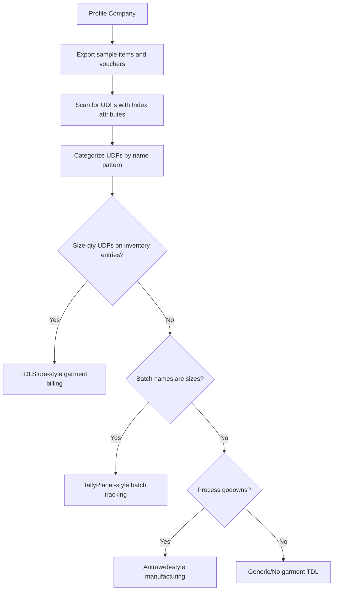

Garment-specific TDL addons are common in the Indian market. They extend Tally's functionality for garment billing, and each one changes the XML output in different ways. Your connector needs to know what to look for.

## TDLStore Garment Billing

**The most popular garment TDL.** Adds size-wise quantity columns directly to Sales and Purchase vouchers.

### What It Adds

- Size-wise quantity entry in invoice view (S, M, L, XL columns)
- Size-wise stock reports
- Design number field on stock items
- Barcode support for garments

### How It Changes XML

Instead of creating separate inventory entries per size, this TDL adds **aggregate UDFs** for each size on a single inventory line:

```xml
<ALLINVENTORYENTRIES.LIST>
  <STOCKITEMNAME>
    Polo T-Shirt Blue
  </STOCKITEMNAME>
  <ACTUALQTY>50 Pcs</ACTUALQTY>
  <RATE>350.00/Pcs</RATE>
  <AMOUNT>17500.00</AMOUNT>

  <!-- Size-wise breakdown as UDFs -->
  <SIZEQTY_S.LIST TYPE="Number" Index="40">
    <SIZEQTY_S>5</SIZEQTY_S>
  </SIZEQTY_S.LIST>
  <SIZEQTY_M.LIST TYPE="Number" Index="41">
    <SIZEQTY_M>15</SIZEQTY_M>
  </SIZEQTY_M.LIST>
  <SIZEQTY_L.LIST TYPE="Number" Index="42">
    <SIZEQTY_L>20</SIZEQTY_L>
  </SIZEQTY_L.LIST>
  <SIZEQTY_XL.LIST TYPE="Number" Index="43">
    <SIZEQTY_XL>10</SIZEQTY_XL>
  </SIZEQTY_XL.LIST>
  <!-- 5 + 15 + 20 + 10 = 50 total -->
</ALLINVENTORYENTRIES.LIST>
```

### Detection Strategy

Look for UDFs on inventory entries matching these patterns:

```
/SIZEQTY_\w+/i
/QTY_[SMLX]+/i
/SIZE.*QTY/i
```

If the TDL is unloaded, the same data appears as:

```xml
<UDF_NUMBER_40.LIST Index="40">
  <UDF_NUMBER_40>5</UDF_NUMBER_40>
</UDF_NUMBER_40.LIST>
```

:::tip
The total of all size quantity UDFs should equal the `ACTUALQTY` on the inventory line. Use this as a validation check.
:::

### Connector Implication

With this TDL, the stock item represents a design+color combination (not design+color+size). The size breakdown is in the UDFs. Your matrix reconstruction is simpler -- one item row per color, with size quantities directly available.

---

## TallyPlanet Garment Module

Uses Tally's **batch mechanism** to track sizes. Each size becomes a batch.

### What It Adds

- Batch-wise stock tracking where batch = size
- Size-wise columnar stock report
- Automatic batch creation for common sizes

### How It Changes XML

The stock item represents a design (or design+color). Batches hold the per-size data:

```xml
<BATCHALLOCATIONS.LIST>
  <BATCHNAME>S</BATCHNAME>
  <GODOWNNAME>Showroom</GODOWNNAME>
  <ACTUALQTY>5 Pcs</ACTUALQTY>
</BATCHALLOCATIONS.LIST>
<BATCHALLOCATIONS.LIST>
  <BATCHNAME>M</BATCHNAME>
  <GODOWNNAME>Showroom</GODOWNNAME>
  <ACTUALQTY>15 Pcs</ACTUALQTY>
</BATCHALLOCATIONS.LIST>
<BATCHALLOCATIONS.LIST>
  <BATCHNAME>L</BATCHNAME>
  <GODOWNNAME>Showroom</GODOWNNAME>
  <ACTUALQTY>20 Pcs</ACTUALQTY>
</BATCHALLOCATIONS.LIST>
```

### Detection Strategy

```
1. Stock items with batches enabled
2. Batch names are single-token sizes
   (S, M, L, XL, 32, 34, etc.)
3. Many batches per item, all sizes
4. No manufacturing/expiry dates on batches
   (pharma batches have dates; garment batches don't)
```

### Connector Implication

The `trn_batch` table IS the size-quantity matrix. Extraction is straightforward -- just parse the batch name as a size token.

---

## Antraweb Textile ERP

Heavy-duty customization for textile **manufacturers** (not just traders). Adds significant complexity.

### What It Adds

- **Process-wise godowns**: Cutting, Stitching, Finishing, QC, Packed
- **Lot/Bale tracking** via batches
- **Yarn count** and **fabric width** UDFs on stock items
- **Quality grade** UDF (A, B, C / First, Second quality)
- **Piece-wise inventory** within bales

### Process Godowns

```
Godown Hierarchy:
├── Raw Material Store
├── Cutting Section
├── Stitching Floor
├── Finishing / QC
├── Packed Goods
├── Dispatch Area
├── Rejected / Defective
└── Job Work - External
```

Movement between godowns tracks the manufacturing process. A Stock Journal moves fabric from "Raw Material" to "Cutting Section" when cutting starts.

### Quality Grade UDFs

```xml
<STOCKITEM NAME="Cotton Shirt Blue M">
  <QUALITYGRADE.LIST TYPE="String" Index="45">
    <QUALITYGRADE>A</QUALITYGRADE>
  </QUALITYGRADE.LIST>
</STOCKITEM>
```

| Grade | Meaning |
|-------|---------|
| A / First Quality | Meets all standards |
| B / Second Quality | Minor defects, sold at discount |
| C / Export Reject | Rejected from export order |
| D / Damaged | Significant defects |

### Fabric-Specific UDFs

```xml
<STOCKITEM NAME="Cotton Cambric White 58inch">
  <YARNCOUNT.LIST TYPE="String" Index="46">
    <YARNCOUNT>40s</YARNCOUNT>
  </YARNCOUNT.LIST>
  <FABRICWIDTH.LIST TYPE="String" Index="47">
    <FABRICWIDTH>58 inch</FABRICWIDTH>
  </FABRICWIDTH.LIST>
  <GSM.LIST TYPE="Number" Index="48">
    <GSM>180</GSM>
  </GSM.LIST>
</STOCKITEM>
```

### Detection Strategy

```
1. Godown names match manufacturing stages
   (Cutting, Stitching, Finishing)
2. UDFs for QualityGrade, YarnCount,
   FabricWidth, GSM on stock items
3. Heavy use of Stock Journals for
   inter-godown transfers
```

---

## Common UDFs Across All Garment TDLs

| UDF | Object | Type | Typical Values |
|-----|--------|------|---------------|
| DesignNo | Stock Item | String | "DSN-042" |
| Colour | Stock Item | String | "Blue" |
| Size | Stock Item | String | "M" |
| Fabric | Stock Item | String | "Cotton" |
| Brand | Stock Item | String | "Allen Solly" |
| Season | Stock Item | String | "Summer 2025" |
| QualityGrade | Stock Item | String | "A", "B" |
| BrokerName | Voucher | String | "Ramesh Shah" |
| ChallanNo | Voucher | String | "CH/2025/042" |

## How to Handle Unknown TDLs

You won't always know which TDL is installed. Follow this approach:



:::tip
Store all discovered UDFs regardless of whether you recognize them. A future version of your connector may understand additional TDLs, and having the raw data means you won't need to re-sync.
:::
