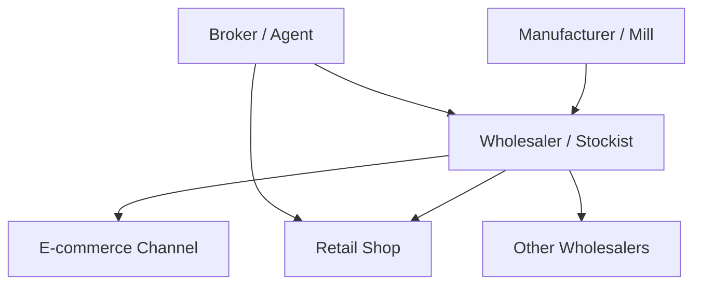

If pharma is a steady stream, garments is a tidal wave. Garment businesses hit Tally with more SKUs, wilder transaction spikes, and data patterns that push the connector to its limits. This vertical demands everything your integration can give -- and then some.

Let's understand why.

## The Garment Business Model

A garment wholesaler or stockist sits between manufacturers and retailers, just like in pharma. But the dynamics are wildly different:



The **broker** (dalal) is a key player in garments -- they connect buyers and sellers, earn commission, and often control the relationships. More on that in the [Brokers & Agents](/tally-integartion/vertical-garments/brokers-agents/) chapter.

## The SKU Explosion Problem

This is the headline number that defines garment integration:

| Vertical | Typical SKU Count |
|----------|------------------|
| Pharma stockist | 2,000 - 10,000 |
| **Garment wholesaler** | **10,000 - 100,000+** |

Why so many? Because a single shirt "design" explodes into dozens of SKUs:

```
1 design x 5 colors x 6 sizes = 30 SKUs
100 designs = 3,000 SKUs
Add seasonal collections = 10,000+ SKUs
```

And Tally has **no native size-color matrix**. Each combination is a separate Stock Item. This is the fundamental challenge that drives everything in this vertical. See [Size-Color Matrix](/tally-integartion/vertical-garments/size-color-matrix/) for the full story.

## Seasonal Cycles

Garments are intensely seasonal. The buying and selling cycle follows a predictable pattern:

```
Jan-Feb:  Purchase Spring/Summer stock
Mar-May:  Sell Spring/Summer
Jun-Jul:  Purchase Monsoon + Early Winter
Aug-Oct:  PEAK SEASON (Diwali + Weddings)
Nov-Dec:  Sell Winter collection
Jan-Mar:  Year-end clearance + returns
```

### The October-November Spike

During Diwali and wedding season, transaction volume jumps **3-5x** above normal. A wholesaler doing 100 invoices per day in March might do 300-500 per day in October.

:::caution
Your sync engine must handle this burst gracefully. Batch sizes, polling intervals, and Tally's memory usage all need to be tuned for peak season. If you only test during off-season, you'll get a nasty surprise in October.
:::

## Garments vs Pharma: The Key Differences

| Dimension | Pharma | Garments |
|-----------|--------|----------|
| SKU count | 2K-10K | 10K-100K+ |
| Batch tracking | Mandatory (regulatory) | Optional (lot/size) |
| Expiry dates | Critical | Not applicable |
| GST model | Fixed per HSN | Price-dependent slab |
| Seasonality | Mild | Extreme (3-5x peak) |
| Returns rate | Low-moderate | High |
| Credit terms | 15-30 days | 30-90 days |
| Broker usage | Rare | Very common |
| Consignment | Rare | Very common (challans) |
| Price levels | 1-2 (MRP, PTR) | 4-6 (MRP, Wholesale, Retail, etc.) |

## Typical Company Profile

| Dimension | Typical Range |
|-----------|--------------|
| Stock items | 10,000 - 100,000+ |
| Parties (retailers) | 500 - 5,000 |
| Daily transactions | 50 - 500 (off-peak), 200 - 1,500 (peak) |
| Godowns | 3 - 10 |
| Salespeople / Brokers | 5 - 50 |
| Annual turnover | Rs.2 Cr - Rs.500 Cr |

## Tally Features Used

Garment stockists typically enable:

- Inventory ON (integrated with accounting)
- Multiple Godowns (showroom, warehouse, transit)
- Stock Categories (season, collection, price range)
- Price Levels (MRP, Wholesale, Retailer, etc.)
- Cost Centres (salesman or broker tracking)
- Bill-wise details (credit tracking)
- Order processing (PO and SO)

### TDL Addons

Garment-specific TDLs are common. See [Garment TDL Addons](/tally-integartion/vertical-garments/garment-tdl-addons/) for details on:

- **TDLStore Garment Billing** -- size-wise quantity columns
- **TallyPlanet Garment Module** -- batch-as-size tracking
- **Antraweb Textile ERP** -- process godowns, lot tracking

## What Makes Garment Integration Hard

1. **No native variant model** -- reconstructing the size-color matrix from flat items is an art, not a science
2. **Price-dependent GST** -- the same item can have two different tax rates based on selling price
3. **High return volume** -- size exchanges, color swaps, season-end bulk returns
4. **Consignment/challan tracking** -- goods out but not sold, creating complex inventory states
5. **Broker commission** -- an extra party and calculation on many transactions
6. **Multiple naming patterns** -- designs, article numbers, style codes, all mixed together

Each of these challenges has its own chapter in this section. Let's dig in.
