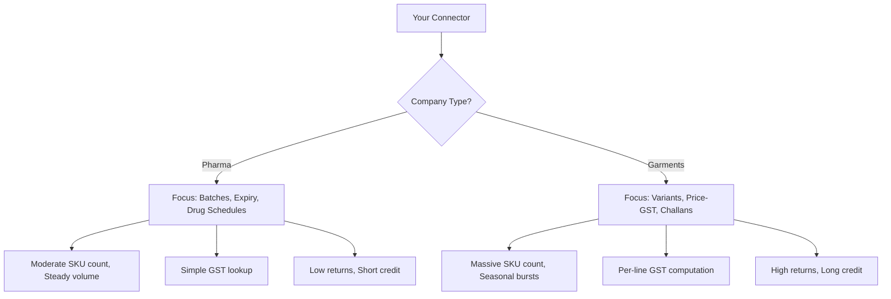

If you're building a connector that handles both pharma and garment companies, this comparison will save you from assuming what works for one vertical works for the other. They're fundamentally different businesses that happen to use the same software.

## The 14-Dimension Comparison

### 1. SKU Count

| | Pharma | Garments |
|---|--------|----------|
| Typical range | 2,000 - 10,000 | 10,000 - 100,000+ |
| Growth pattern | Gradual (new drugs) | Seasonal (new collections) |
| Churn | Low (drugs stay for years) | High (seasonal turnover) |

### 2. Naming Patterns

| | Pharma | Garments |
|---|--------|----------|
| Structure | Generic + Strength + Form | Design + Color + Size |
| Example | "Paracetamol 500mg Tab" | "Polo Tee Blue M" |
| Parsing difficulty | Moderate (strength units) | High (ambiguous tokens) |

### 3. GST Model

| | Pharma | Garments |
|---|--------|----------|
| Rate determination | Fixed per HSN code | **Price-dependent** |
| Typical rates | 5%, 12%, 18% | 5% (under Rs.1K) or 12% (over Rs.1K) |
| Complexity | Low (look up HSN) | High (compute per line item) |

:::danger
This is the single biggest technical difference. Pharma GST is a simple lookup. Garment GST requires per-line computation based on selling price. See [Price-Dependent GST](/tally-integartion/gst-compliance/price-dependent-gst/).
:::

### 4. Seasonality

| | Pharma | Garments |
|---|--------|----------|
| Pattern | Mild seasonal variation | Extreme peaks and valleys |
| Peak period | Monsoon (infections) | Oct-Nov (Diwali/weddings) |
| Peak multiplier | 1.3-1.5x | 3-5x |
| Off-season | Steady baseline | Very quiet |

### 5. Returns Rate

| | Pharma | Garments |
|---|--------|----------|
| Rate | 2-5% | 10-25% |
| Common reasons | Expiry, damage | Wrong size/color, unsold stock |
| Season-end returns | Minimal | Massive bulk returns |
| Complexity | Simple reversal | Exchanges, partial returns |

### 6. Credit Terms

| | Pharma | Garments |
|---|--------|----------|
| Typical terms | 15-30 days | 30-90 days |
| Payment instrument | Cheque, NEFT | Hundi, post-dated cheques |
| Credit risk | Moderate | Higher (longer exposure) |

### 7. Batch Usage

| | Pharma | Garments |
|---|--------|----------|
| Purpose | Regulatory (traceability) | Variant tracking (size/color) |
| Mandatory | Yes (Drug License) | No (but common with TDLs) |
| Expiry dates | Critical | Not applicable |
| MRP per batch | Common | Rare |

### 8. Godown Patterns

| | Pharma | Garments |
|---|--------|----------|
| Typical count | 2-5 | 3-10 |
| Types | Main, Counter, Damaged | Showroom, Warehouse, Transit, Defective |
| Special godowns | Cold chain storage | Consignment/On-approval, Free Goods |

### 9. Voucher Types

| | Pharma | Garments |
|---|--------|----------|
| Primary | Sales, Purchase | Sales, Purchase, Delivery Note |
| Returns | Credit Note (occasional) | Credit Note (frequent), Rejections In |
| Special | -- | Stock Journal (set splitting) |
| Consignment | Rare | Delivery Challans (very common) |

### 10. TDL Addons

| | Pharma | Garments |
|---|--------|----------|
| Common addons | Medical billing, Drug schedule | Size-wise billing, Design tracking |
| UDF focus | Drug info, Patient/Doctor | Size, Color, Design, Broker |
| Complexity | Moderate (flat UDFs) | High (aggregate size UDFs) |

### 11. Sync Volume

| | Pharma | Garments |
|---|--------|----------|
| Masters | 5K-15K items | 20K-100K+ items |
| Daily vouchers | 50-500 | 50-1500 (peak) |
| Lines per voucher | 5-20 | 20-100+ |
| Data volume | Moderate | Heavy |

### 12. Peak Periods

| | Pharma | Garments |
|---|--------|----------|
| When | Jul-Sep (monsoon) | Oct-Nov (festivals) |
| Duration | 3 months | 2 months |
| Impact | 30-50% higher volume | 200-400% higher volume |

### 13. Regulatory Requirements

| | Pharma | Garments |
|---|--------|----------|
| Drug License | Mandatory | Not applicable |
| Batch tracking | Legally required | Business choice |
| Schedule compliance | H, H1, X classifications | None |
| Record keeping | Strict (H1 register) | Standard |

### 14. Special Challenges

| | Pharma | Garments |
|---|--------|----------|
| Primary challenge | Batch/expiry management | Size-color matrix reconstruction |
| Secondary | Drug schedule compliance | Price-dependent GST |
| Tertiary | Scheme/free goods detection | Broker commission tracking |
| Operational | FEFO picking logic | Challan/consignment tracking |

## Summary Matrix

## Practical Implications

### For Connector Development

1. **Config-driven behavior**: The connector should detect the vertical (from Stock Group patterns and UDF presence) and adjust its behavior
2. **Batch extraction**: Always extract batches, but interpret them differently (pharma = traceability, garments = variants)
3. **GST calculation**: Pharma can use item-level defaults; garments MUST compute per-line
4. **Sync tuning**: Garments need larger batch windows, more aggressive caching, and burst-mode handling

### For the Central System

1. **Different data models**: Pharma needs batch/expiry views; garments need matrix views
2. **Different reports**: Pharma wants expiry alerts and drug schedule reports; garments want size-color availability and challan ageing
3. **Different workflows**: Pharma orders are item-based; garment orders are matrix-based (select sizes and quantities across a grid)

:::tip
If you're building one connector to handle both verticals, design the core extraction to be comprehensive (extract everything) and let the central system's vertical-specific modules interpret the data differently. Don't build vertical assumptions into the connector itself.
:::
