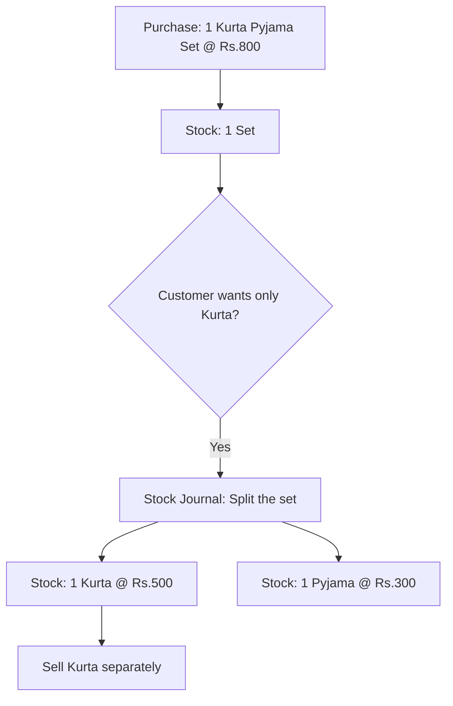

Garment businesses frequently deal in "sets" -- items that are purchased together but may be sold separately. The classic example is the kurta-pyjama set, but it applies to three-piece suits, twin sets, and other bundled products.

## The Problem

A stockist buys a "Kurta Pyjama Set" as a single unit at Rs.800. But a customer walks in and wants just the kurta. To sell it separately, the set must be **split** in Tally first.



## How Set Splitting Works in Tally

Tally uses a **Stock Journal** to record the split. It's essentially a consumption + production entry:

### The Stock Journal

```xml
<VOUCHER VCHTYPE="Stock Journal">
  <DATE>20260315</DATE>
  <NARRATION>
    Split Kurta Pyjama Set for retail sale
  </NARRATION>

  <!-- CONSUMPTION (set goes OUT) -->
  <INVENTORYENTRIESIN.LIST>
    <STOCKITEMNAME>Kurta Pyjama Set Blue M</STOCKITEMNAME>
    <ISDEEMEDPOSITIVE>No</ISDEEMEDPOSITIVE>
    <ACTUALQTY>1 Sets</ACTUALQTY>
    <RATE>800.00/Sets</RATE>
    <AMOUNT>800.00</AMOUNT>
  </INVENTORYENTRIESIN.LIST>

  <!-- PRODUCTION (pieces come IN) -->
  <INVENTORYENTRIESOUT.LIST>
    <STOCKITEMNAME>Kurta Blue M</STOCKITEMNAME>
    <ISDEEMEDPOSITIVE>Yes</ISDEEMEDPOSITIVE>
    <ACTUALQTY>1 Pcs</ACTUALQTY>
    <RATE>500.00/Pcs</RATE>
    <AMOUNT>500.00</AMOUNT>
  </INVENTORYENTRIESOUT.LIST>
  <INVENTORYENTRIESOUT.LIST>
    <STOCKITEMNAME>Pyjama Blue M</STOCKITEMNAME>
    <ISDEEMEDPOSITIVE>Yes</ISDEEMEDPOSITIVE>
    <ACTUALQTY>1 Pcs</ACTUALQTY>
    <RATE>300.00/Pcs</RATE>
    <AMOUNT>300.00</AMOUNT>
  </INVENTORYENTRIESOUT.LIST>
</VOUCHER>
```

:::caution
The amount must balance! The value of components (Rs.500 + Rs.300 = Rs.800) must equal the value of the set (Rs.800). Tally enforces this.
:::

## Common Set Types

| Set Type | Components | Typical Split Ratio |
|----------|-----------|-------------------|
| Kurta Pyjama | Kurta + Pyjama | 60:40 or 65:35 |
| 3-Piece Suit | Blazer + Vest + Trouser | 50:20:30 |
| Salwar Suit | Kurta + Salwar + Dupatta | 50:25:25 |
| Twin Set | Top + Bottom | 55:45 |
| Shirt Trouser | Shirt + Trouser | 50:50 |

## Bill of Materials (BOM)

Some organized businesses set up a **BOM** in Tally to formalize the split ratios:

```xml
<STOCKITEM NAME="Kurta Pyjama Set Blue M">
  <BOMCOMPONENTS.LIST>
    <STOCKITEMNAME>Kurta Blue M</STOCKITEMNAME>
    <QUANTITY>1 Pcs</QUANTITY>
    <RATE>500.00/Pcs</RATE>
  </BOMCOMPONENTS.LIST>
  <BOMCOMPONENTS.LIST>
    <STOCKITEMNAME>Pyjama Blue M</STOCKITEMNAME>
    <QUANTITY>1 Pcs</QUANTITY>
    <RATE>300.00/Pcs</RATE>
  </BOMCOMPONENTS.LIST>
</STOCKITEM>
```

If BOM is defined, a Manufacturing Journal can automate the split instead of a manual Stock Journal.

## Impact on Stock Tracking

### Before Split

```
Kurta Pyjama Set Blue M:  10 Sets
Kurta Blue M:              0 Pcs
Pyjama Blue M:             0 Pcs
```

### After Splitting 5 Sets

```
Kurta Pyjama Set Blue M:   5 Sets
Kurta Blue M:               5 Pcs
Pyjama Blue M:              5 Pcs
```

Your connector sees three separate stock items with interrelated movements. The Stock Journal creates negative quantity for the set and positive quantities for the components.

## Detection for the Connector

Stock Journals with this pattern are identifiable:

```
1. Voucher type = "Stock Journal"
   (or "Manufacturing Journal")
2. Has BOTH inward and outward entries
3. One item going OUT, multiple items coming IN
4. Values balance (out total = in total)
```

## What Your Connector Should Do

1. **Track Stock Journals** -- they affect inventory significantly
2. **Understand the relationship** -- a set item has component items
3. **Surface both states** -- show available sets AND available individual pieces
4. **Handle BOM data** -- if present, extract the component relationships

:::tip
The sales app can use BOM data to show: "We have 5 complete Kurta Pyjama Sets + 3 loose Kurtas + 2 loose Pyjamas." This gives the field rep full visibility into what's available for both set and individual sales.
:::

## The Reverse: Set Assembly

Sometimes it goes the other way -- loose items are assembled into sets for bulk sale. The Stock Journal runs in reverse (individual pieces OUT, set IN). Your connector should handle both directions.
