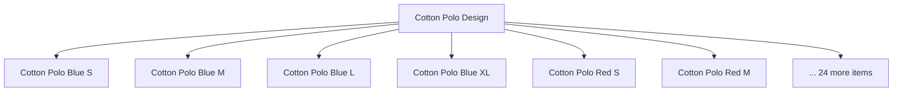

This is THE fundamental problem for garment integration with Tally. Understanding it is essential before you touch a single line of connector code.

## The Core Issue

**Tally has no native size-color matrix.** There is no built-in concept of "variants" like you'd find in Shopify, WooCommerce, or modern ERP systems.

A shirt design called "Cotton Polo" in 5 colors and 6 sizes isn't stored as 1 product with 30 variants. It's stored as **30 completely separate Stock Items**.



## The Scale of the Problem

Let's do the math for a mid-size garment wholesaler:

```
Shirts:     50 designs x 5 colors x 6 sizes = 1,500
Trousers:   30 designs x 4 colors x 7 sizes =   840
Kurtas:     40 designs x 6 colors x 5 sizes = 1,200
T-Shirts:   60 designs x 5 colors x 5 sizes = 1,500
Sarees:     100 designs x 1 "size" x 5 colors =  500
                                    TOTAL = 5,540 SKUs
```

And that's just one season. Add winter collection, festive collection, and clearance stock, and you're looking at **10,000 to 100,000+ stock items** in Tally.

## Why This Matters for Integration

When a field sales rep wants to show a retailer what's available in the "Cotton Polo" design, they need to see a **matrix view**:

| | S | M | L | XL | XXL |
|---|---|---|---|---|---|
| **Blue** | 50 | 75 | 40 | 20 | 10 |
| **Red** | 30 | 60 | 25 | 15 | 5 |
| **White** | 0 | 45 | 35 | 10 | 0 |

But Tally only gives you a flat list of 15 items with individual stock quantities. Your connector must **reconstruct** this matrix from the flat data.

## How Garment Businesses Cope

Over the years, garment businesses and TDL developers have evolved four different approaches to manage this chaos. Each approach stores data differently in Tally, and your connector encounters all of them.

The [Four Approaches](/tally-integartion/vertical-garments/four-approaches/) chapter covers each in detail, but here's the quick overview:

| Approach | How It Works | Prevalence |
|----------|-------------|-----------|
| Flat SKU Explosion | Every combo = separate item | Most common |
| Stock Category | Category adds a dimension | Moderate |
| Batch as Carrier | Batch name = size-color | TDL-based shops |
| UDF-Based | Custom fields for size/color | Advanced TDL setups |

## The Reconstruction Challenge

Even in the most common approach (flat SKUs), reconstructing the matrix is non-trivial:

### The Good Case

```
Stock Group: "Cotton Polo Design-A"
  ├── Cotton Polo Design-A Blue S
  ├── Cotton Polo Design-A Blue M
  ├── Cotton Polo Design-A Red S
  └── Cotton Polo Design-A Red M
```

Here, the Stock Group is the design. Items share a common prefix. Suffixes are cleanly `{color} {size}`.

### The Messy Case

```
Stock Group: "Men's Shirts"
  ├── Polo Blue S
  ├── PT-BLU-M
  ├── polo tee | blue | L
  ├── Formal White 40
  └── Blue Mountain Shirt M
```

Is "Blue Mountain" a color or a design name? Is "40" a size or a price? Is "PT" an abbreviation? Welcome to real-world garment data.

:::danger
Name parsing alone is unreliable for matrix reconstruction. Always use the Stock Group hierarchy as the primary design boundary, and treat name parsing as secondary confirmation. See [Variant Detection](/tally-integartion/vertical-garments/variant-detection/) for the recommended algorithm.
:::

## The "Assorted" Wrench

Garment wholesale frequently deals in assorted lots:

```
"T-Shirt Assorted Colors L"   -- mixed colors
"Kurti Mixed Sizes Blue"      -- mixed sizes
"Lot-42 Mixed Items"           -- mixed everything
```

"Assorted" means the seller doesn't track individual variants. This completely breaks the size-color matrix. These items must be treated as non-matrix items that can't be decomposed.

## Impact on Sync Volume

The sheer number of stock items affects your sync strategy:

| Metric | Pharma | Garments |
|--------|--------|----------|
| Stock items to sync | 2K-10K | 10K-100K+ |
| Initial full sync time | 5-15 min | 30-120 min |
| Voucher lines per invoice | 5-20 | 20-100+ |
| Data volume per sync | Moderate | Heavy |

:::tip
For garment companies with 50K+ items, consider day-by-day voucher batching and limit stock item exports to 5,000 per HTTP request. Tally can freeze on very large exports.
:::

## What the Sales App Needs

The whole point of solving the matrix problem is to give field reps a useful view. The target API response looks like:

```json
{
  "design": "Cotton Polo",
  "colors": ["Blue", "Red", "White"],
  "sizes": ["S", "M", "L", "XL", "XXL"],
  "matrix": {
    "Blue":  {"S":50, "M":75, "L":40},
    "Red":   {"S":30, "M":60, "L":25}
  },
  "prices": {
    "MRP": 599,
    "Wholesale": 350
  }
}
```

Getting from Tally's 30 flat stock items to this clean matrix view is the core challenge. The chapters that follow in this section explain exactly how.
