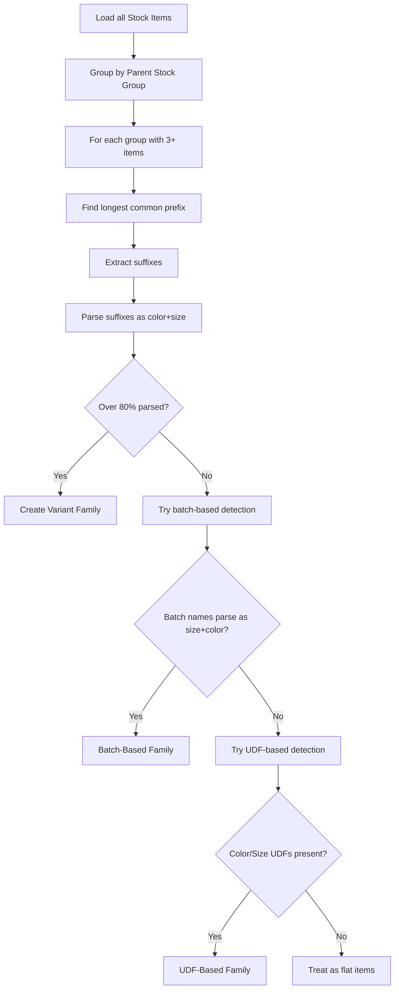

Given Tally's flat data, how does your connector figure out which items are variants of the same design? This chapter walks through the detection algorithm step by step.

## The Goal

**Input**: A flat list of stock items from Tally.

**Output**: Grouped variant families with parsed size-color data.

```
INPUT:
  "Polo Tee Blue S"     qty: 50
  "Polo Tee Blue M"     qty: 75
  "Polo Tee Red S"      qty: 30
  "Polo Tee Red M"      qty: 60

OUTPUT:
  Family: "Polo Tee"
  Matrix:
    Blue: {S: 50, M: 75}
    Red:  {S: 30, M: 60}
```

## Step-by-Step Algorithm

### Step 1: Group Items by Parent Stock Group

This is the most reliable signal. Items under the same leaf-level Stock Group are likely variants of the same design.

```
Stock Group: "Polo T-Shirt Design-A"
  Items:
    "Polo T-Shirt Design-A Blue S"
    "Polo T-Shirt Design-A Blue M"
    "Polo T-Shirt Design-A Blue L"
    "Polo T-Shirt Design-A Red S"
    "Polo T-Shirt Design-A Red M"
    "Polo T-Shirt Design-A Red L"
```

### Step 2: Find the Longest Common Prefix

For all item names within the group, find the longest string they all share:

```
Items:
  "Polo T-Shirt Design-A Blue S"
  "Polo T-Shirt Design-A Blue M"
  "Polo T-Shirt Design-A Red S"

Common prefix: "Polo T-Shirt Design-A "
```

:::tip
Trim the common prefix at a word boundary (space or separator). Don't split in the middle of a word.
:::

### Step 3: Extract Differentiating Suffixes

Strip the common prefix to get suffixes:

```
Suffixes:
  "Blue S"
  "Blue M"
  "Blue L"
  "Red S"
  "Red M"
  "Red L"
```

### Step 4: Parse Each Suffix

Try to split each suffix into (color, size) tokens:

```
"Blue S" → color: Blue, size: S    ✓
"Blue M" → color: Blue, size: M    ✓
"Red S"  → color: Red,  size: S    ✓
```

The parsing strategy:

```
1. Check last token against size dictionary
   (S, M, L, XL, 28, 32, etc.)
2. Check first token against color dictionary
   (Blue, Red, BLK, NVY, etc.)
3. If both match → success
4. Try reversed order (some put size first)
5. If neither works → mark as unparseable
```

### Step 5: Validate the Family

If **80% or more** of items parse successfully, declare this group a variant family:

```
6 out of 6 items parsed = 100% → ✓ Variant family!
```

If less than 80% parse, the group might not be size-color variants (could be just related products in the same category).

## The Complete Flow



## Pseudocode

```python
def detect_variants(items_by_group):
    families = []

    for group, items in items_by_group:
        if len(items) < 3:
            continue

        # Find common prefix
        names = [i.name for i in items]
        prefix = longest_common_prefix(names)
        prefix = trim_to_word_boundary(prefix)

        # Extract and parse suffixes
        parsed = []
        for item in items:
            suffix = item.name[len(prefix):]
            result = parse_color_size(suffix)
            if result:
                parsed.append((item, result))

        # Check threshold
        ratio = len(parsed) / len(items)
        if ratio >= 0.8:
            families.append(
                VariantFamily(
                    design=prefix.strip(),
                    group=group,
                    variants=parsed
                )
            )

    return families
```

## The Size and Color Dictionaries

Parsing relies on comprehensive token dictionaries:

**Size tokens** (see [Size Tokens](/tally-integartion/vertical-garments/size-tokens/)):
```
Letter: XS, S, M, L, XL, XXL, 2XL-5XL
Numeric: 26-48 (waist/chest)
Kids: 1-2Y, 2-3Y, ... 12-14Y
Special: FS, Free Size, One Size
```

**Color tokens** (see [Color Tokens](/tally-integartion/vertical-garments/color-tokens/)):
```
Full: Black, Blue, Red, Navy, Maroon...
Abbreviated: BLK, BLU, RED, NVY, MRN...
Fabric: Indigo, Dark Wash, Stone Wash...
```

## Edge Cases

### Ambiguous Tokens

The number `32` could be a waist size or a chest size. `L` could be "Large" or part of a word. Context helps:

- If the group is "Trousers", `32` is waist
- If the group is "Shirts", `40` is chest
- If `L` is the last standalone token, it's a size

### The "Blue Mountain" Problem

```
"Blue Mountain Shirt L"
```

Is "Blue" the color or part of the design name "Blue Mountain"? The common prefix approach handles this -- if other items in the group are "Blue Mountain Shirt S", "Blue Mountain Shirt M", then "Blue Mountain Shirt" is the prefix and "L" is the size. There's no color to parse.

### Mixed Formats in Same Group

```
"Polo Tee BLU S"
"Polo Tee Blue M"
"Polo Tee BLUE L"
```

Your color dictionary should normalize these: BLU = Blue = BLUE = Blue.

### Pipe or Dash Separators

```
"Polo Tee | Blue | S"
"Polo-Tee-Blue-S"
"Polo Tee/Blue/S"
```

Before parsing, normalize separators to spaces.

## Fallback: Batch-Based Detection

If name parsing fails, check for Approach 3:

```
1. Item has batches enabled
2. Relatively few items but many batches per item
3. Batch names match size/color patterns:
   "Blue-S", "Red-M", "BLK/L"
4. If yes → batch-based variant family
```

## Fallback: UDF-Based Detection

If batches don't work either:

```
1. Check for Color/Size UDFs on stock items
2. If present with consistent values → UDF family
3. Group items by DesignNo UDF value
```

## Final Fallback

If none of the above work, treat items as flat (non-variant). Don't force a matrix where one doesn't exist -- it's better to show flat items accurately than a broken matrix.

:::caution
The detection algorithm should run during initial profiling and cache the results. Don't re-detect on every sync -- variant families are stable. Only re-run detection when new stock groups appear or the item count changes significantly.
:::
