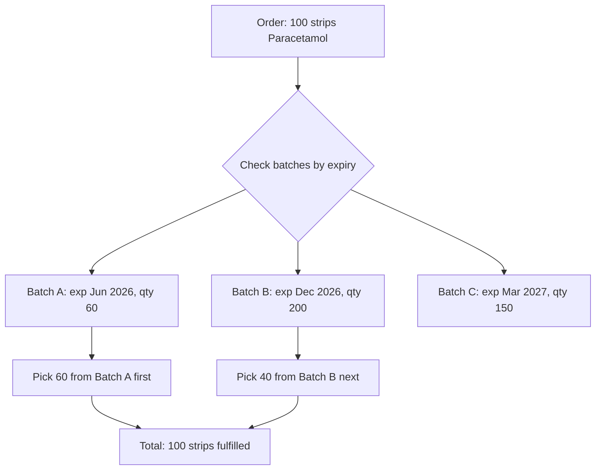

In pharma distribution, batch tracking isn't optional -- it's the law. Every medicine has a batch number, a manufacturing date, and an expiry date. Your connector must capture all of this faithfully, because the downstream sales app depends on it for compliance and smart inventory management.

## Why Batches Matter in Pharma

When a medical shop buys "Paracetamol 500mg Strip" from your stockist, they're not just buying a product -- they're buying a *specific batch* with a *specific expiry date*. If something goes wrong (a recall, a quality issue), the batch number traces the problem back to the manufacturer.

| Batch Field | Why It Matters |
|-------------|---------------|
| Batch Name | Traceability (recall, quality) |
| Mfg Date | Age of product |
| Expiry Date | Legal sales cutoff |
| MRP | Can vary per batch |
| Quantity | Stock per batch |

## How Tally Stores Batch Data

Batch information lives in two places: the stock item master (batch-enabled flag) and the voucher (actual batch allocations).

### Stock Item Master

```xml
<STOCKITEM NAME="Paracetamol 500mg Strip">
  <MAINTAININBATCHES>Yes</MAINTAININBATCHES>
  <HASMFGDATE>Yes</HASMFGDATE>
  <HASEXPIRYDATE>Yes</HASEXPIRYDATE>
</STOCKITEM>
```

### Batch Allocations in Vouchers

Every transaction (purchase, sale, transfer) includes batch-level detail:

```xml
<BATCHALLOCATIONS.LIST>
  <BATCHNAME>BATCH-2026-001</BATCHNAME>
  <GODOWNNAME>Main Location</GODOWNNAME>
  <ACTUALQTY>100 Strip</ACTUALQTY>
  <BILLEDQTY>100 Strip</BILLEDQTY>
  <AMOUNT>5000.00</AMOUNT>
  <MFGDATE>20260101</MFGDATE>
  <EXPIRYDATE>20271231</EXPIRYDATE>
</BATCHALLOCATIONS.LIST>
```

A single invoice can have multiple batches for the same item:

```xml
<!-- Same item, two batches -->
<BATCHALLOCATIONS.LIST>
  <BATCHNAME>BATCH-2025-042</BATCHNAME>
  <ACTUALQTY>60 Strip</ACTUALQTY>
  <EXPIRYDATE>20260630</EXPIRYDATE>
</BATCHALLOCATIONS.LIST>
<BATCHALLOCATIONS.LIST>
  <BATCHNAME>BATCH-2026-008</BATCHNAME>
  <ACTUALQTY>40 Strip</ACTUALQTY>
  <EXPIRYDATE>20270630</EXPIRYDATE>
</BATCHALLOCATIONS.LIST>
```

## Near-Expiry Alerts

One of the most valuable features your integration can provide is near-expiry alerts. The logic is simple:

```
For each batch in stock:
  days_to_expiry = expiry_date - today
  IF days_to_expiry <= 30:  → CRITICAL
  IF days_to_expiry <= 60:  → WARNING
  IF days_to_expiry <= 90:  → WATCH
```

### Alert Windows

| Window | Action | Who Cares |
|--------|--------|-----------|
| 90 days | Flag for push sales | Field reps |
| 60 days | Discount/return to C&F | Stockist owner |
| 30 days | Stop selling, return/destroy | Compliance |
| 0 days | Expired -- quarantine immediately | Regulatory |

:::danger
Selling expired medicine is a criminal offense in India. Your connector must flag expired batches clearly, and the downstream app should prevent field reps from placing orders against expired stock.
:::

## FEFO: First Expiry, First Out

The standard picking logic for pharma is **FEFO** (First Expiry, First Out) -- not FIFO. You always sell the batch that expires soonest.



When your central system generates a Sales Order for write-back to Tally, you should allocate batches in FEFO order. This means:

1. Query all batches for the item
2. Sort by expiry date (ascending)
3. Allocate from nearest-expiry first
4. Generate batch allocation lines accordingly

:::tip
Tally itself supports FIFO costing method, but FEFO is a business practice, not a Tally feature. Your connector/central system handles the FEFO logic and passes explicit batch allocations in the write-back voucher.
:::

## The Batch Summary Report

Tally has a built-in Batch Summary report that shows stock position per batch with expiry dates. This is a goldmine for your connector:

```xml
<ENVELOPE>
  <HEADER>
    <TALLYREQUEST>Export</TALLYREQUEST>
    <TYPE>Data</TYPE>
    <ID>Batch Summary</ID>
  </HEADER>
  <BODY><DESC><STATICVARIABLES>
    <SVEXPORTFORMAT>
      $$SysName:XML
    </SVEXPORTFORMAT>
    <SVCURRENTCOMPANY>
      ##CompanyName##
    </SVCURRENTCOMPANY>
  </STATICVARIABLES></DESC></BODY>
</ENVELOPE>
```

This report gives you the current stock per batch, per item, per godown -- including expiry dates. It's the most efficient way to build your expiry alert system.

## Batch MRP Tracking

In pharma, the MRP (Maximum Retail Price) can vary by batch. The same drug at the same strength might have different MRPs across batches if the manufacturer revised pricing:

```
Paracetamol 500mg Strip:
  Batch 2025-042: MRP Rs.25.50
  Batch 2026-008: MRP Rs.28.00
```

Some pharma TDLs add a "Batch MRP" UDF to the batch allocation. Your connector should check for this.

## What Your Connector Must Capture

For every batch allocation in every voucher, extract:

| Field | XML Tag | Store As |
|-------|---------|---------|
| Batch name | `BATCHNAME` | `batch_name` |
| Godown | `GODOWNNAME` | `godown` |
| Actual quantity | `ACTUALQTY` | `quantity` (parse number) |
| Manufacturing date | `MFGDATE` | `mfg_date` |
| Expiry date | `EXPIRYDATE` | `expiry_date` |
| Amount | `AMOUNT` | `amount` |

:::caution
The `ACTUALQTY` field contains the unit embedded in the string (e.g., "100 Strip"). You need to parse out the numeric value. See the [parsing quantities](/tally-integartion/parsing-responses/parsing-quantities/) section for details on quantity string parsing.
:::

## Edge Cases to Watch

1. **Missing expiry date**: Some non-pharma items have batches enabled but no expiry tracking. Don't crash -- just store NULL for expiry.

2. **Batch name formats**: Manufacturers use wildly different batch naming: "BATCH001", "B-2026-A42", "LOT/25/MAR", "MFG260101". Don't try to parse them -- just store as-is.

3. **Same batch, multiple godowns**: A batch can be split across godowns. The combination of (item, batch, godown) is the unique key for stock position.

4. **Negative batch quantities**: If a billing clerk sells from a batch that doesn't have enough stock, Tally allows it (unless explicitly blocked). You'll see negative batch quantities. Don't reject them.

5. **Expired batches with stock**: It's common to find expired batches still showing stock in Tally. These are pending return or destruction. Flag them but don't delete them.
