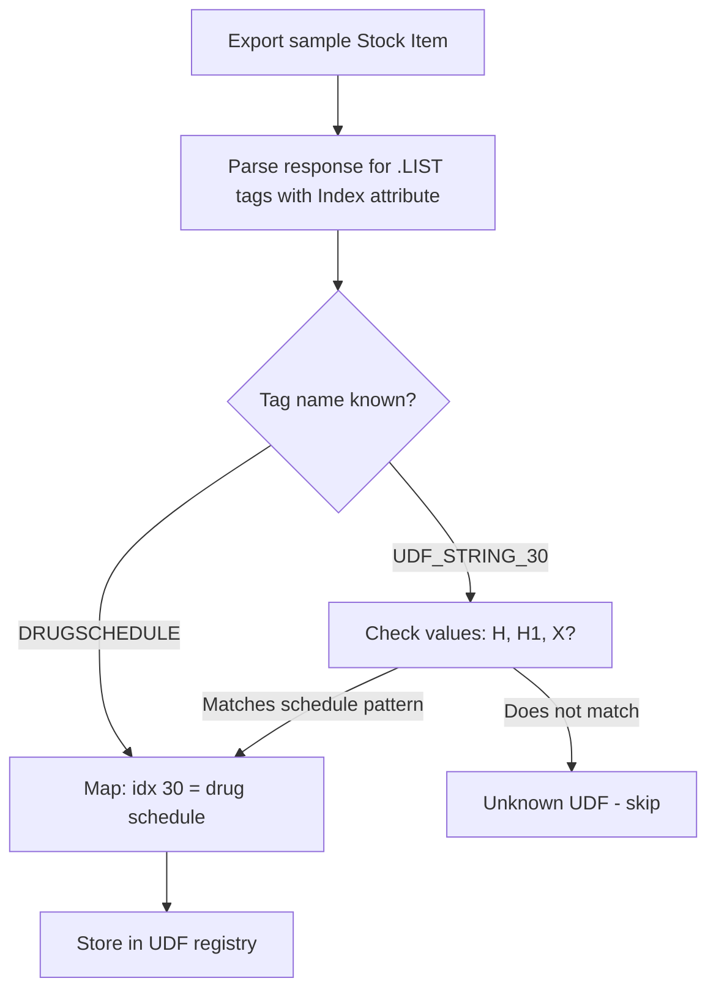

Not all medicines are created equal in the eyes of the law. India classifies drugs into schedules that determine how they can be sold, stored, and tracked. If your connector integrates with a pharma stockist, you need to capture this classification data -- it drives compliance workflows downstream.

## The Three Schedules That Matter

| Schedule | What It Means | Examples |
|----------|--------------|---------|
| **Schedule H** | Prescription only | Most antibiotics, antihypertensives |
| **Schedule H1** | Stricter -- requires maintaining records | Some antibiotics, sedatives, anti-TB drugs |
| **Schedule X** | Narcotics -- strictest controls | Morphine, codeine, controlled substances |

### Schedule H

The most common restricted category. These drugs:
- Can only be sold against a valid prescription
- Must be sold by a licensed pharmacist
- The label says "Schedule H Drug" with a warning

### Schedule H1

A tighter version of Schedule H, introduced to combat antibiotic resistance:
- Everything in Schedule H, plus...
- The seller must maintain a **register** recording: patient name, doctor name, drug name, quantity
- Monthly returns to drug authorities

### Schedule X

The strictest category:
- Requires separate register and separate storage
- Records must be maintained for 2 years
- Regular inspection by drug authorities
- Very few items (mainly narcotics and psychotropic substances)

## How Schedules Are Tracked in Tally

Tally doesn't have a built-in "drug schedule" field. This is handled via **UDFs** (User Defined Fields) added by pharma billing TDLs.

### When the TDL Is Loaded

```xml
<STOCKITEM NAME="Amoxicillin 500mg Cap">
  <DRUGSCHEDULE.LIST TYPE="String" Index="30">
    <DRUGSCHEDULE>H</DRUGSCHEDULE>
  </DRUGSCHEDULE.LIST>
</STOCKITEM>
```

### When the TDL Is NOT Loaded

If the TDL has been removed or expired (many are license-locked), the data is still there but the tag name changes:

```xml
<STOCKITEM NAME="Amoxicillin 500mg Cap">
  <UDF_STRING_30.LIST Index="30">
    <UDF_STRING_30>H</UDF_STRING_30>
  </UDF_STRING_30.LIST>
</STOCKITEM>
```

:::caution
Your connector must handle both formats. When you see `Index="30"`, it's the same field whether the tag says `DRUGSCHEDULE` or `UDF_STRING_30`. Map by index, not by name.
:::

## UDF Discovery for Drug Data

The connector can't hardcode UDF indices -- they vary by installation. Use the UDF discovery algorithm:



:::tip
Export a few stock items with `EXPLODEFLAG=Yes` to see all available UDFs. Items known to be pharma products (from their Stock Group hierarchy) are good candidates for sampling.
:::

## Storage Conditions

Pharma stockists track storage requirements, often as another UDF:

| Condition | What It Means |
|-----------|--------------|
| Room Temperature | Standard storage (15-30 C) |
| Cool & Dry | Below 25 C, low humidity |
| Cold Chain (2-8 C) | Refrigerated (vaccines, insulin) |
| Frozen (-20 C) | Deep freeze (some biologics) |
| Protected from Light | Amber/opaque storage |

In Tally XML:

```xml
<STORAGETEMP.LIST TYPE="String" Index="32">
  <STORAGETEMP>Cold Chain</STORAGETEMP>
</STORAGETEMP.LIST>
```

This data is valuable for the sales app -- field reps need to know which items require cold chain delivery so they can coordinate logistics.

## Manufacturer Tracking

Pharma stockists buy from dozens of manufacturers. The manufacturer name is often a UDF on the stock item:

```xml
<MANUFACTURER.LIST TYPE="String" Index="31">
  <MANUFACTURER>Cipla Ltd</MANUFACTURER>
</MANUFACTURER.LIST>
```

Or sometimes tracked via a "Company/Brand" UDF:

```xml
<COMPANYBRAND.LIST TYPE="String" Index="33">
  <COMPANYBRAND>Sun Pharma</COMPANYBRAND>
</COMPANYBRAND.LIST>
```

Manufacturer tracking enables:
- Filtering items by manufacturer for ordering
- Tracking manufacturer-wise sales for incentive calculations
- Managing returns by manufacturer

## Drug License (DL) Number

Every pharma business operates under a Drug License. The DL number is:
- Stored at the **company level** in Tally (often as a UDF)
- Printed on every invoice
- Required for regulatory reporting

```xml
<COMPANY>
  <DLNUMBER.LIST TYPE="String" Index="25">
    <DLNUMBER>GJ/25D/20B-12345</DLNUMBER>
  </DLNUMBER.LIST>
</COMPANY>
```

Some stockists have **multiple DL numbers** (one for each Drug License type -- retail, wholesale, etc.). Each may be tracked as a separate UDF.

## Common Pharma UDFs Summary

Here's a reference table of UDFs you'll commonly encounter:

| UDF Name | Object | Values |
|----------|--------|--------|
| DrugSchedule | Stock Item | H, H1, X, (blank) |
| StorageTemp | Stock Item | Room Temp, Cold Chain, etc. |
| Manufacturer | Stock Item | Company name |
| PackOf | Stock Item | "Strip of 10", "Bottle of 100ml" |
| CompanyBrand | Stock Item | Brand/division name |
| DLNumber | Company | Drug License number |
| PatientName | Voucher | Patient name (for H1/X) |
| DoctorName | Voucher | Prescribing doctor |

## What Your Connector Should Do

1. **Run UDF discovery** on first sync to identify pharma-specific fields
2. **Map by index** -- store the index-to-name mapping in your profile
3. **Handle both named and unnamed UDF formats** -- TDL may or may not be loaded
4. **Extract schedule data** for every stock item -- the sales app needs it for compliance
5. **Flag Schedule H1/X items** prominently -- they have special handling requirements

:::danger
Missing drug schedule data isn't just an inconvenience -- it's a compliance risk. If your downstream app allows ordering of Schedule H1 drugs without proper record-keeping, your client could face regulatory action. Extract and surface this data reliably.
:::
