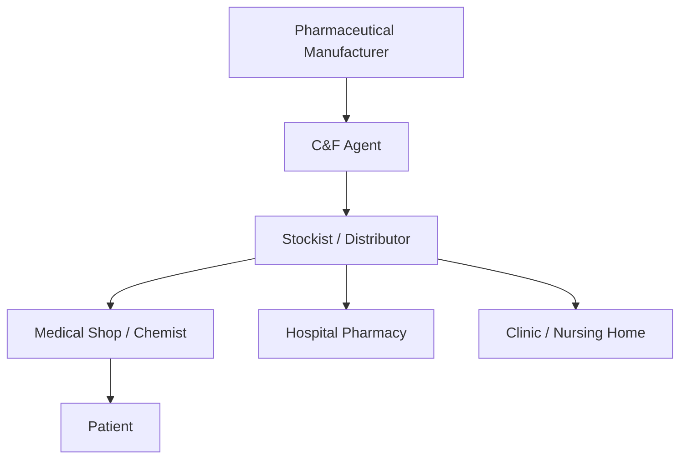
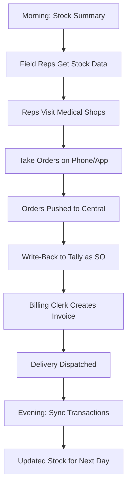

The pharma stockist is our primary integration target, and for good reason. These businesses are the backbone of India's medicine distribution network. They sit right in the middle of the supply chain, handling thousands of SKUs with strict regulatory requirements -- and they desperately need real-time data.

Let's understand the business.

## The Pharma Supply Chain

### The Players

| Role | What They Do | Examples |
|------|-------------|---------|
| **Manufacturer** | Makes the drugs | Cipla, Sun Pharma, Dr. Reddy's |
| **C&F Agent** | Carry & Forward -- regional warehouse | One per state/zone per manufacturer |
| **Stockist** | Local distributor (YOUR CLIENT) | Covers a city/district |
| **Medical Shop** | Retail chemist | The corner pharmacy |

The **stockist** (also called distributor or wholesaler) is the key link. They buy from multiple manufacturers via C&F agents and sell to hundreds of medical shops in their territory.

## Why Integration Matters

A typical pharma stockist has a **field sales fleet** -- 5 to 20 salespeople who visit medical shops daily to take orders. These field reps need:

- **Real-time stock levels**: "Do we have Paracetamol 500mg in stock right now?"
- **Batch and expiry info**: "Which batches are near expiry? Push those first."
- **Pricing data**: "What's the PTR (Price to Retailer) for this item?"
- **Party outstanding**: "How much does this shop owe us? Can we take a new order?"
- **Scheme information**: "Any buy-10-get-1-free running on Crocin?"

Without integration, field reps call the office, wait on hold, and get stale information. With a Tally connector pushing data to a central system, they get answers on their phone in seconds.

## Typical Company Profile

Here's what a pharma stockist's Tally installation looks like:

| Dimension | Typical Range |
|-----------|--------------|
| Stock items (SKUs) | 2,000 - 10,000 |
| Parties (medical shops) | 500 - 5,000 |
| Daily transactions | 50 - 500 invoices |
| Godowns | 2 - 5 |
| Salespeople | 5 - 20 |
| Annual turnover | Rs.5 Cr - Rs.100 Cr |

### Tally Features Typically Enabled

- Inventory ON (accounts with inventory)
- Batch-wise details ON (mandatory for pharma)
- Expiry dates ON (non-negotiable)
- Multiple Godowns (main warehouse, counter, damaged)
- Bill-wise details ON (for ageing analysis)
- Order processing ON (purchase/sales orders)
- GST with e-invoicing (if turnover > Rs.5 Cr)

### Common TDL Customizations

Pharma stockists almost always have extra TDLs:

| TDL Type | What It Adds |
|----------|-------------|
| Medical billing | Patient Name, Doctor Name, DL No. on invoices |
| Pack Of / Brand | UDFs on stock items ("Strip of 10", "Cipla") |
| Salesman tracking | Salesman name on vouchers |
| Drug schedule | H, H1, X classification UDF |
| Near-expiry alerts | Custom report for items expiring within N days |
| Discount structures | Trade discount, cash discount, scheme management |

## The Data Flow

Here's how data flows through a pharma stockist's day:

## Two Companies, One Tally

:::caution
Pharma distributors often maintain **two companies** in a single Tally instance: one for "Ethical" (prescription drugs) and one for "OTC/FMCG" (over-the-counter products). Sometimes this split is by Drug License Number. Your connector must handle multi-company within a single Tally installation.
:::

## What Makes Pharma Special

Compared to other trading verticals, pharma has unique requirements:

1. **Batch tracking is mandatory** -- every strip, bottle, and vial has a batch number. Regulatory compliance demands it.

2. **Expiry dates are life-or-death** -- selling expired medicine is illegal and dangerous. Near-expiry management is a daily concern.

3. **Drug schedules restrict sales** -- Schedule H, H1, and X drugs have specific handling and record-keeping requirements.

4. **Schemes are complex** -- free goods, bonus quantities, and discount structures vary by manufacturer and change frequently.

5. **Salesman performance matters** -- field sales teams are measured by territory coverage, order value, and collection.

6. **Credit is tight** -- 15-30 day terms with strict follow-up on overdue amounts.

Each of these areas has its own chapter in this section. Dive in to understand the details your connector needs to handle.
