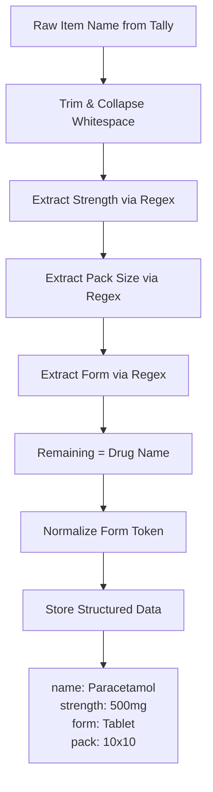

Pharma stock item names in Tally follow certain patterns, but "follow" is a strong word. Every stockist has their own naming convention, shaped by years of data entry by different clerks. Understanding these patterns is essential for your connector to normalize and match items across systems.

## The Five Naming Patterns

### Pattern 1: Generic + Strength + Form

The most structured and common pattern:

```
Paracetamol 500mg Tablet
Amoxicillin 250mg Capsule
Metformin 500mg SR Tab
Azithromycin 500mg Tab
Cefixime 200mg DT
Omeprazole 20mg Cap
```

**Structure**: `{generic_name} {strength} {form}`

### Pattern 2: Brand Name + Form

When the stockist uses brand names instead of generics:

```
Crocin Tablet
Augmentin 625 Tab
Dolo 650 Tab
Azee 500 Tab
Pan 40 Tab
```

**Structure**: `{brand_name} [{strength}] {form}`

### Pattern 3: Brand + Manufacturer

Adding manufacturer for disambiguation:

```
Crocin - GSK
Paracetamol Tab - Cipla
Azithromycin 500 - Alkem
Metformin SR 500 - USV
```

**Structure**: `{name} - {manufacturer}`

### Pattern 4: Generic + Strength + Pack

Including the pack configuration:

```
Paracetamol 500mg 10x10
Amoxicillin 250mg 1x15
Cefixime 200mg 10x6
Metformin 500mg 10x10
Pantoprazole 40mg 10x10
```

**Structure**: `{name} {strength} {pack_size}`

The pack size `10x10` means 10 strips of 10 tablets each = 100 tablets per box.

### Pattern 5: HSN Prefix + Name

Some organized stockists prefix with HSN code:

```
30049099 Paracetamol Tab
30042099 Amoxicillin 500mg Cap
30039090 Ashwagandha Churna
```

**Structure**: `{hsn_code} {name} [{form}]`

## Token Normalization Dictionary

Real-world names use inconsistent abbreviations. Here's a normalization map your connector should apply:

### Form/Dosage Tokens

| Variants | Normalized |
|----------|-----------|
| Tab, Tablet, Tablets, TAB | Tablet |
| Cap, Capsule, Capsules, CAP | Capsule |
| Syp, Syrup, SYR | Syrup |
| Inj, Injection, INJ | Injection |
| Drops, Drop, DRP | Drops |
| Susp, Suspension | Suspension |
| Oint, Ointment | Ointment |
| Gel, GEL | Gel |
| Cream, CRM | Cream |
| SR, Sustained Release | SR |
| DT, Dispersible Tab | DT |
| XR, Extended Release | XR |

### Strength Tokens

| Variants | Normalized |
|----------|-----------|
| 500mg, 500 mg, 500MG | 500mg |
| 250ml, 250 ml, 250ML | 250ml |
| 5gm, 5 gm, 5g, 5GM | 5g |
| 100mcg, 100 mcg | 100mcg |
| 10000IU, 10000 IU | 10000IU |

## Regex Extractors

### Strength Extraction

```
/(\d+(?:\.\d+)?)\s*(mg|gm|g|ml|mcg|iu|%)/i
```

Examples:
```
"Paracetamol 500mg Tab" → 500mg
"Metformin 500 mg SR"   → 500mg
"Betadine 5% Solution"  → 5%
"Vitamin D3 60000IU"    → 60000IU
"Cough Syrup 100ml"     → 100ml
```

### Pack Size Extraction

```
/(\d+)\s*[xX×]\s*(\d+)/
```

Examples:
```
"Paracetamol 500mg 10x10" → 10x10
"Amoxicillin 250mg 1x15"  → 1x15
"Cefixime 200mg 10×6"     → 10x6
```

### Form Extraction

```
/\b(Tab(?:let)?s?|Cap(?:sule)?s?|
  Syp|Syrup|Inj(?:ection)?|
  Drop?s?|Susp(?:ension)?|
  Oint(?:ment)?|Gel|Cream|
  SR|DT|XR|XL|MR|CR)\b/i
```

## Real-World Edge Cases

### 1. Multiple Strengths

Some drugs are combinations with multiple active ingredients:

```
"Amoxicillin 250mg + Clavulanic 125mg"
"Paracetamol 325mg + Aceclofenac 100mg"
```

Your regex will match the *first* strength. For combination drugs, you may need to extract all strengths.

### 2. Names with Numbers That Aren't Strengths

```
"Vitamin B12 Tab"        → B12 is NOT 12mg
"Crocin 650 Tab"         → 650 IS the strength
"Dolo 650 Tab"           → 650 IS the strength
"Liv 52 DS Tab"          → 52 is NOT the strength
```

:::caution
Not every number in a drug name is a strength. Brand names like "Liv 52" or "Vitamin B12" contain numbers that are part of the name. Context matters -- if the number is followed by a unit (mg, ml), it's a strength. If not, it's probably part of the brand name.
:::

### 3. Pack Size vs Quantity

```
"Paracetamol 500mg 10x10"
```

Here, `10x10` is the pack configuration (strips x tablets). But in the Stock Item's base unit, the item might be tracked as:
- **Per Strip**: 1 unit = 1 strip of 10 tablets
- **Per Tablet**: 1 unit = 1 tablet
- **Per Box**: 1 unit = 1 box of 10x10 = 100 tablets

The pack size in the name doesn't always match the base unit. Cross-reference with the item's `BASEUNITS` field.

### 4. Duplicate Items with Different Names

The same drug might exist under multiple names:

```
"Paracetamol 500mg Tab"
"Crocin 500mg Tab"           (same drug, brand name)
"PCM 500 Tab"                (abbreviation)
"PARACETAMOL TAB 500MG"      (ALL CAPS, reordered)
```

These are different stock items in Tally (different GUIDs) but represent the same active ingredient. Your connector should store them as-is but flag potential duplicates using normalized generic names.

### 5. Inconsistent Casing and Spacing

```
"paracetamol 500mg tab"
"PARACETAMOL 500MG TAB"
"Paracetamol  500mg  Tab"    (double spaces)
"Paracetamol500mg Tab"       (no space before strength)
```

Always normalize: trim, collapse spaces, and do case-insensitive comparison when matching.

## Practical Extraction Pipeline



## Why This Matters for Integration

The sales app needs to:
- **Search by generic name** (even if Tally uses brand names)
- **Group by drug category** for browsing
- **Show strength clearly** for dosage verification
- **Display pack info** for ordering quantity decisions

Your connector's parsing pipeline feeds directly into the search and display experience. The more structured data you can extract from Tally's free-text item names, the better the user experience downstream.
