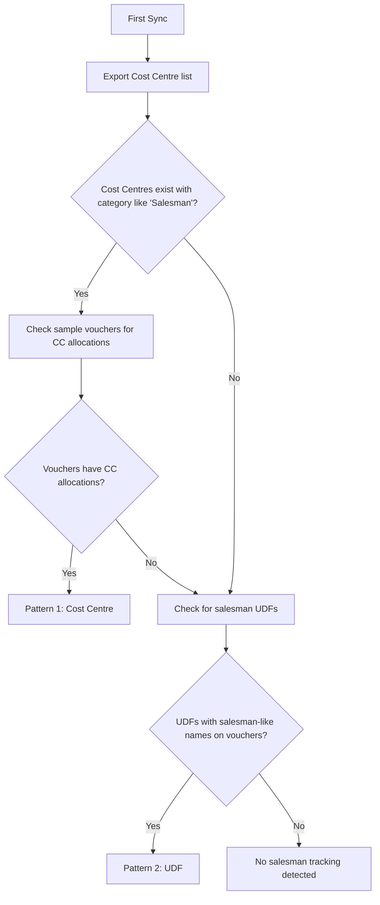

Field sales teams are the lifeblood of pharma distribution. Tracking which salesman covers which territory, takes which orders, and generates how much revenue -- that's critical business intelligence. Tally supports salesman tracking, but in two completely different patterns. Your connector needs to detect which one the company uses and extract accordingly.

## Pattern 1: Cost Centre Allocations

The most "Tally-native" approach. Each salesman is set up as a **Cost Centre**, and voucher entries are allocated to cost centres.

### How It's Set Up

```
Cost Centre Category: Salesmen
  ├── Rajesh Kumar
  ├── Amit Patel
  ├── Suresh Sharma
  └── Priya Mehta
```

### How It Appears in Voucher XML

```xml
<VOUCHER VCHTYPE="Sales">
  <PARTYLEDGERNAME>
    Medical Shop ABC
  </PARTYLEDGERNAME>
  <ALLLEDGERENTRIES.LIST>
    <LEDGERNAME>Sales Account</LEDGERNAME>
    <AMOUNT>10000.00</AMOUNT>
    <COSTCENTREALLOCATIONS.LIST>
      <NAME>Rajesh Kumar</NAME>
      <AMOUNT>10000.00</AMOUNT>
    </COSTCENTREALLOCATIONS.LIST>
  </ALLLEDGERENTRIES.LIST>
</VOUCHER>
```

The cost centre allocation sits **inside** the accounting entry, linked to the Sales Account ledger.

### Connector Extraction

```
1. Parse trn_accounting entries
2. For each entry, check COSTCENTREALLOCATIONS.LIST
3. Extract cost centre name
4. Match against known cost centre category
   (usually "Salesmen" or "Salesman")
5. Store as: voucher.salesman = cost_centre_name
```

## Pattern 2: UDFs on Voucher Header

The TDL-based approach. A pharma billing TDL adds a "Salesman" field directly to the voucher:

### How It Appears in Voucher XML

```xml
<VOUCHER VCHTYPE="Sales">
  <PARTYLEDGERNAME>
    Medical Shop ABC
  </PARTYLEDGERNAME>
  <SALESMANNAME.LIST TYPE="String" Index="35">
    <SALESMANNAME>Rajesh Kumar</SALESMANNAME>
  </SALESMANNAME.LIST>
</VOUCHER>
```

Or if the TDL isn't loaded:

```xml
<VOUCHER>
  <UDF_STRING_35.LIST Index="35">
    <UDF_STRING_35>Rajesh Kumar</UDF_STRING_35>
  </UDF_STRING_35.LIST>
</VOUCHER>
```

### Connector Extraction

```
1. During UDF discovery, identify the
   salesman UDF index on vouchers
2. For each voucher, extract the UDF value
3. Store as: voucher.salesman = udf_value
```

## Detecting Which Pattern a Company Uses

Your connector can't know in advance. Here's the detection strategy:



:::tip
Some companies use BOTH patterns -- cost centres for formal accounting reports and UDFs for quick salesman identification on invoices. When both are present, prefer the cost centre data (it's more structured) but extract both.
:::

## Territory/Route Tracking

Related to salesman tracking, some TDLs add territory or route information:

### On the Party Ledger

```xml
<LEDGER NAME="Medical Shop ABC">
  <TERRITORY.LIST TYPE="String" Index="40">
    <TERRITORY>Ahmedabad West</TERRITORY>
  </TERRITORY.LIST>
  <ROUTE.LIST TYPE="String" Index="41">
    <ROUTE>Route-7</ROUTE>
  </ROUTE.LIST>
</LEDGER>
```

### On the Voucher

```xml
<VOUCHER>
  <BEATNAME.LIST TYPE="String" Index="36">
    <BEATNAME>Monday Beat - CG Road</BEATNAME>
  </BEATNAME.LIST>
</VOUCHER>
```

This data maps salespeople to territories and helps plan coverage.

## Extracting Salesman Performance Data

Once you have salesman data on vouchers, you can compute performance metrics in your central system:

| Metric | How to Compute |
|--------|---------------|
| Sales value | Sum of voucher amounts by salesman |
| Order count | Count of vouchers by salesman |
| Unique parties covered | Distinct party names per salesman |
| Average order value | Total sales / order count |
| Collection | Payment receipts allocated to salesman |
| Outstanding | Open bills for salesman's parties |

### Party-Salesman Mapping

The territory UDF on party ledgers creates a natural mapping:

```
Salesman: Rajesh Kumar
Territory: Ahmedabad West
Parties:
  - Medical Shop ABC (outstanding: Rs.15,000)
  - Health Plus Pharmacy (outstanding: Rs.8,500)
  - City Medicals (outstanding: Rs.22,000)
```

This mapping lets the sales app show each rep only *their* parties and track their collection performance.

## Cost Centre Hierarchy

Some companies have multi-level cost centre hierarchies for reporting:

```
All Salesmen
├── Zone - West Gujarat
│   ├── Rajesh Kumar
│   └── Amit Patel
├── Zone - East Gujarat
│   ├── Suresh Sharma
│   └── Priya Mehta
└── Zone - Rajasthan
    └── Vikram Singh
```

Your connector should extract the hierarchy so the central system can generate zone-wise and overall sales reports.

## Edge Cases

1. **Salesman name changes**: If a cost centre is renamed, the GUID stays the same but the name changes. Match by GUID when possible.

2. **Multiple salesmen per voucher**: Some transactions involve two salesmen (e.g., one who took the order and one who delivered). Cost centre allocations can split the amount between them.

3. **Missing salesman data**: Not every voucher will have a salesman. Counter sales (walk-in customers) typically don't. Don't require it.

4. **Salesman as party**: In rare setups, the salesman is a ledger under Sundry Debtors (tracking advances/expenses). Don't confuse these with customer ledgers.

:::caution
Salesman tracking data is sensitive -- it directly affects commission calculations and performance reviews. Make sure your extraction is accurate and complete. A missing cost centre allocation could mean a salesman doesn't get credit for a sale.
:::
