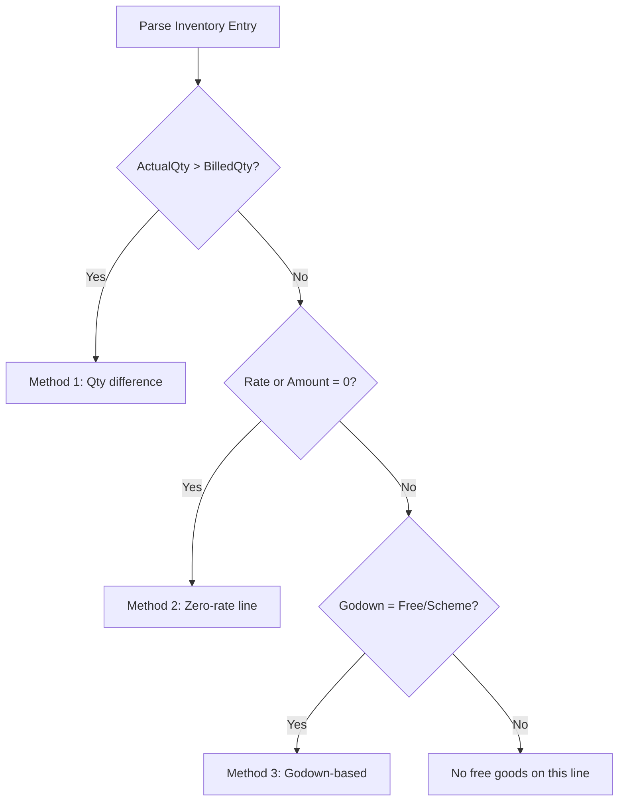

Pharma manufacturers love schemes. "Buy 10, get 2 free." "Buy 100 strips, get 1 bottle free." These schemes drive purchasing decisions and are a critical data point for field sales reps. The tricky part? There are **three completely different ways** pharma stockists record free goods in Tally, and your connector must detect and handle all of them.

## The Three Methods

### Method 1: ActualQty vs BilledQty Difference

The most elegant approach. The invoice line shows a higher actual quantity than the billed quantity. The difference is the free goods.

```xml
<ALLINVENTORYENTRIES.LIST>
  <STOCKITEMNAME>
    Paracetamol 500mg Strip
  </STOCKITEMNAME>
  <ACTUALQTY>12 Strip</ACTUALQTY>
  <BILLEDQTY>10 Strip</BILLEDQTY>
  <RATE>25.00/Strip</RATE>
  <AMOUNT>250.00</AMOUNT>
  <!-- Customer gets 12, pays for 10 -->
  <!-- Free goods = 12 - 10 = 2 strips -->
</ALLINVENTORYENTRIES.LIST>
```

**How to detect**: `ACTUALQTY > BILLEDQTY`

**Free quantity** = `ACTUALQTY - BILLEDQTY`

:::tip
This is the most common method and the easiest to parse. The free goods are implicit in the quantity difference. The amount is always based on the billed quantity.
:::

### Method 2: Separate Zero-Rate Line Items

Some companies add a separate line item for the free goods at zero rate:

```xml
<!-- Paid goods -->
<ALLINVENTORYENTRIES.LIST>
  <STOCKITEMNAME>
    Crocin Advance Tab
  </STOCKITEMNAME>
  <ACTUALQTY>10 Strip</ACTUALQTY>
  <BILLEDQTY>10 Strip</BILLEDQTY>
  <RATE>45.00/Strip</RATE>
  <AMOUNT>450.00</AMOUNT>
</ALLINVENTORYENTRIES.LIST>

<!-- Free goods (same item, zero rate) -->
<ALLINVENTORYENTRIES.LIST>
  <STOCKITEMNAME>
    Crocin Advance Tab
  </STOCKITEMNAME>
  <ACTUALQTY>2 Strip</ACTUALQTY>
  <BILLEDQTY>0 Strip</BILLEDQTY>
  <RATE>0.00/Strip</RATE>
  <AMOUNT>0.00</AMOUNT>
</ALLINVENTORYENTRIES.LIST>
```

**How to detect**: A line with `RATE = 0` or `AMOUNT = 0` for the same item that also has a paid line.

:::caution
The free goods line may reference a *different* item than the paid line. For example, "Buy 10 Paracetamol, get 2 Crocin free." Always pair free lines with their associated paid lines using the voucher context.
:::

### Method 3: Separate "Free Goods" Godown

Some stockists use a dedicated godown to track free goods. The free items are allocated to a "Free Goods" or "Scheme Goods" godown:

```xml
<ALLINVENTORYENTRIES.LIST>
  <STOCKITEMNAME>
    Amoxicillin 500mg Cap
  </STOCKITEMNAME>
  <ACTUALQTY>12 Strip</ACTUALQTY>
  <BILLEDQTY>10 Strip</BILLEDQTY>
  <RATE>50.00/Strip</RATE>
  <AMOUNT>500.00</AMOUNT>
  <BATCHALLOCATIONS.LIST>
    <GODOWNNAME>Main Location</GODOWNNAME>
    <BATCHNAME>BATCH-001</BATCHNAME>
    <ACTUALQTY>10 Strip</ACTUALQTY>
  </BATCHALLOCATIONS.LIST>
  <BATCHALLOCATIONS.LIST>
    <GODOWNNAME>Free Goods</GODOWNNAME>
    <BATCHNAME>BATCH-001</BATCHNAME>
    <ACTUALQTY>2 Strip</ACTUALQTY>
  </BATCHALLOCATIONS.LIST>
</ALLINVENTORYENTRIES.LIST>
```

**How to detect**: Look for godown names containing "Free", "Scheme", "Bonus", or "FOC" (Free of Cost) in batch allocations.

## Detection Strategy

Your connector should check for all three methods:



## Scheme Types in Pharma

| Scheme | Example | How It Appears |
|--------|---------|---------------|
| Buy X Get Y Free | Buy 10, get 2 free | Method 1 or 2 |
| Buy X Get Z Free | Buy Paracetamol, get Crocin | Method 2 (different item) |
| Flat Discount | 20% off on 100+ | Discount in accounting entry |
| Trade Discount | 10% trade + 5% cash | Separate discount line |
| Quantity Slab | 1-50: Rs.25, 51-100: Rs.22 | Rate varies by qty |

## What Your Connector Should Extract

For each inventory line, compute and store:

| Field | How to Compute |
|-------|---------------|
| `actual_qty` | Parse from `ACTUALQTY` |
| `billed_qty` | Parse from `BILLEDQTY` |
| `free_qty` | `actual_qty - billed_qty` |
| `is_free_line` | `rate == 0 or amount == 0` |
| `effective_rate` | `amount / actual_qty` |
| `godown_type` | Normal vs Free Goods |

## Impact on Stock Calculations

Free goods affect stock but not revenue. When computing:

- **Stock movement**: Use `ACTUALQTY` (total goods moved)
- **Revenue**: Use `BILLEDQTY * RATE` (only paid goods)
- **Effective cost**: Use `AMOUNT / ACTUALQTY` (spread cost over all goods)

:::tip
Field reps love scheme information. When your central system shows available schemes alongside stock data, it directly drives sales. "Hey, there's a 10+2 running on Paracetamol this month" is a powerful selling point at the medical shop counter.
:::

## Edge Cases

1. **Zero-valued transaction error**: If Tally has `Enable zero-valued transactions = No`, pushing a voucher with a zero-amount free goods line will fail. The connector must check this setting before write-back.

2. **Scheme changes mid-month**: Manufacturers change schemes frequently. The same item may have different scheme structures in the same month. Don't assume consistency.

3. **Free goods from different manufacturer**: Sometimes "buy X from Cipla, get Y from Sun Pharma free" is offered by the stockist (not the manufacturer) as a bundle deal. The free line references a completely different product.

4. **Negative billed quantity**: Rare but possible -- represents a return scenario within a scheme. Handle gracefully.
